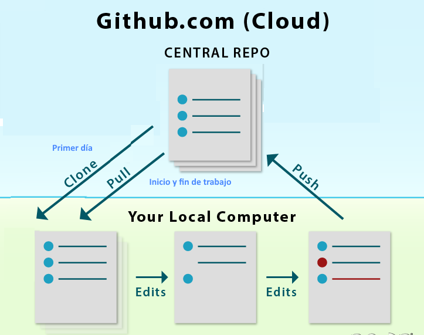
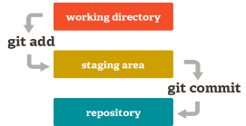
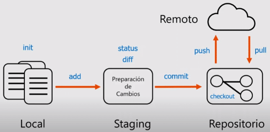
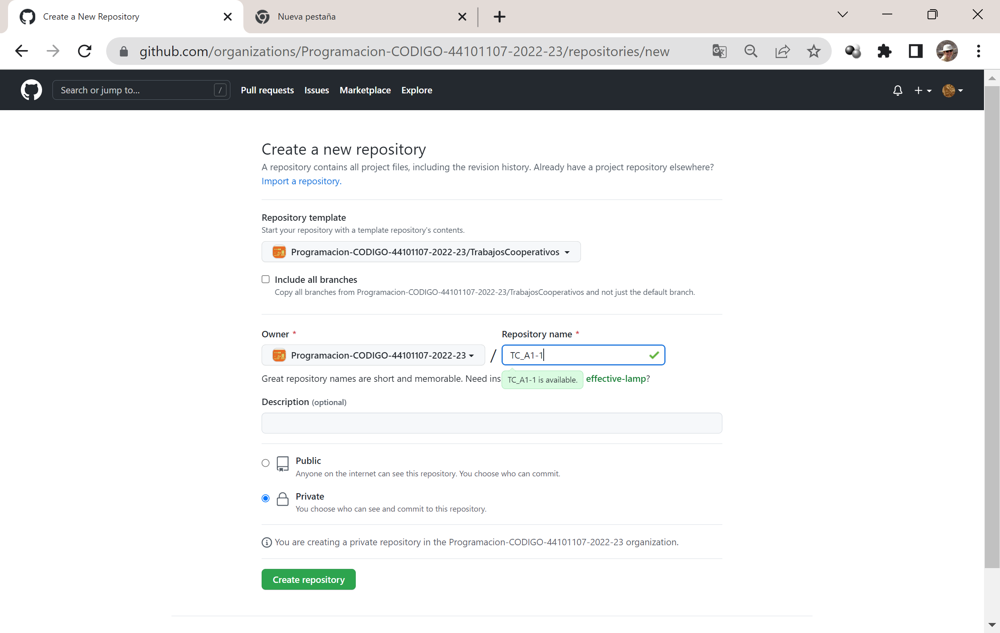
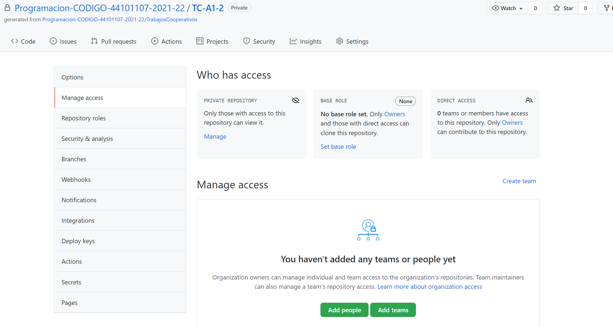
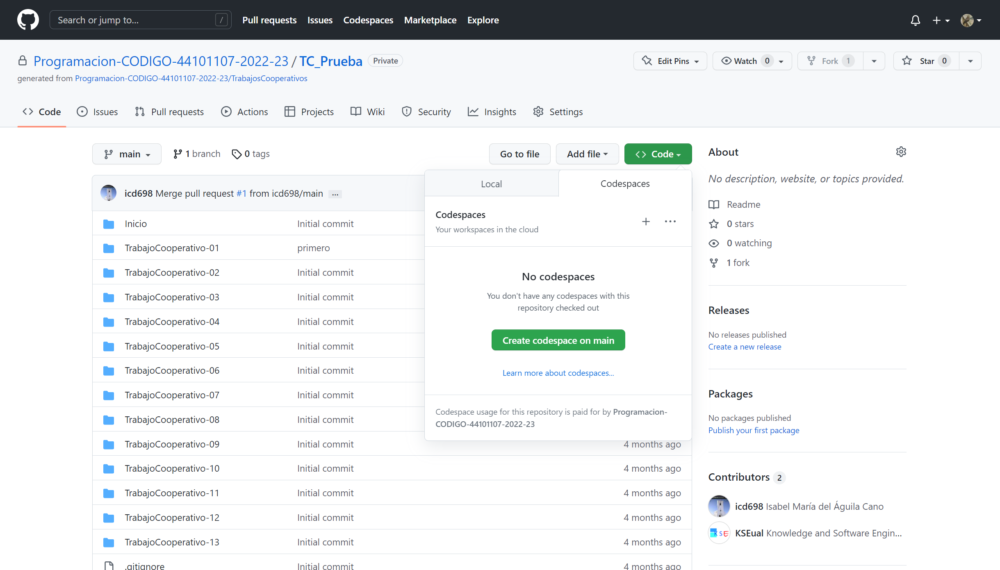
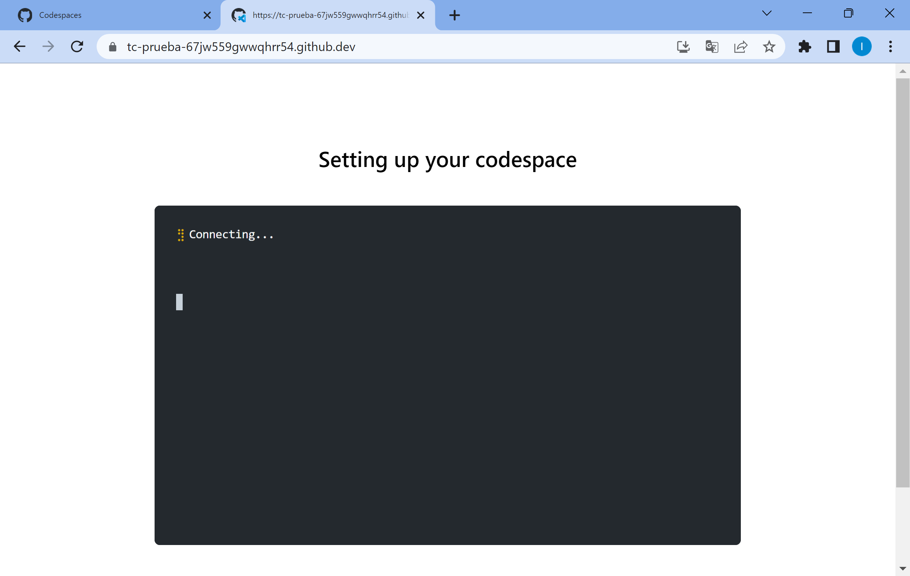
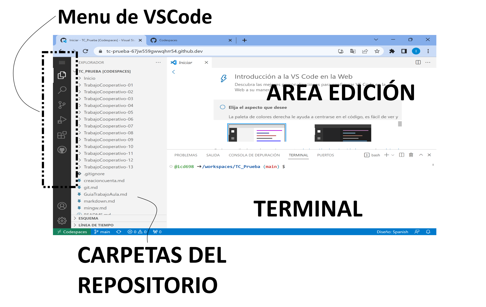

<link rel="stylesheet" type="text/css" href="Inicio/estilo.css" media="screen" />

# Prácticas de laboratorio de la asignatura PROGRAMACIÓN

- [Prácticas de laboratorio de la asignatura PROGRAMACIÓN](#prácticas-de-laboratorio-de-la-asignatura-programación)
  - [Tareas a realizar](#tareas-a-realizar)
  - [Introducción a GitHub](#introducción-a-github)
    - [Repositorios en GitHub](#repositorios-en-github)
  - [Formación del equipo de trabajo - Aprendizaje Cooperativo](#formación-del-equipo-de-trabajo---aprendizaje-cooperativo)
    - [Había una vez...](#había-una-vez)
  - [PASOS PARA LA INICIALIZACIÓN DEL TRABAJO](#pasos-para-la-inicialización-del-trabajo)
    - [Prerequisitos:](#prerequisitos)
    - [1.- Creación de un repositorio nuevo para el equipo de trabajo clonando ```TrabajosCooperativos```](#1--creación-de-un-repositorio-nuevo-para-el-equipo-de-trabajo-clonando-trabajoscooperativos)
    - [2.- Dar acceso al resto de los miembros del equipo de trabajo al repositorio creado](#2--dar-acceso-al-resto-de-los-miembros-del-equipo-de-trabajo-al-repositorio-creado)
      - [Dar acceso al *team* **teachers** al repositorios](#dar-acceso-al-team-teachers-al-repositorios)
  - [PASOS PARA LA INICIALIZACIÓN DEL TRABAJO DESDE EL EQUIPO PERSONAL](#pasos-para-la-inicialización-del-trabajo-desde-el-equipo-personal)
  - [PASOS PARA LA INICIALIZACIÓN DEL ESPACIO DE TRABAJO PERSONAL. CODESPACE](#pasos-para-la-inicialización-del-espacio-de-trabajo-personal-codespace)
 
   


______________


Antes de comenzar con el trabajo de la asignatura propiamente dicho se debe desplegar e inicializar el entorno de desarrollo de los ejercicios de la asignatura sobre la organización ```Programacion-CODIGO-44101107-2021-22``` en la plataforma GitHub


<div id='id2' />

## Tareas a realizar 	

Prerequisitos: Haber realizado la inscripción en la organización asociada a la asignatura 

- Clonar el repositorio para los trabajos individuales si no se hecho previamente
- Formar el equipo de trabajo, clonar el repositorio de trabajos cooperativos y dar acceso a todos los miembros del equipo
- Crear dos "Codespace", espacios de codificación 

<div id='id3' />

## Introducción a GitHub

GitHub es el mayor proveedor de alojamiento de repositorios de código, y es el punto de encuentro para que millones de desarrolladores colaboren en el desarrollo de sus proyectos. Un gran porcentaje de los repositorios de código se almacenan en GitHub, y muchos proyectos de código abierto lo utilizan para hospedar su trabajo, realizar su seguimiento de fallos, hacer revisiones de código y otras cosas. Por tanto, aunque no sea parte directa del proyecto de código abierto, es muy probable que durante tu carrera profesional necesites interactuar con GitHub en algún momento.

<div id='id4' />


### Repositorios en GitHub

Un repositorio no es más que una carpeta donde se almacena tu código. Un repositorio de Git es un almacenamiento virtual de tu proyecto (además de los archivos de código tiene una carpeta oculta *".git"* que almacena información de control y que no se debe manipular). Te permite guardar versiones del código a las que puedes acceder cuando lo necesites. Un repositorio git puede ser local, si lo almacenamos en la máquina sobre la que trabajamos, o remoto, si se aloja, además de a nivel local, sobre un servidor en la nube (remoto).
 
En la siguiente figura se muestra el esquema básico con el que habitualmente se trabajo en gihub, el repositorio remoto será compartido por todos los miembros del equipo de trabajo, y cada uno de vosotros trabajará en su propio directorio local, o bien sobre el espacio de codificación  "Codespace", esta última sera la opción preferente. 




Las ordenes que nos permiten trabajar con las diferentes copias de los repositorios son las siguientes:

- *git init* - convierte la carpeta en un directorio git, es decir, define las tres áreas de trabajo que permiten controlar las versiones de un proyecto, creando esa carpeta oculta *".git"*.




- *git add* - Mientras estamos editando, se trabaja en la "working area" y en cierto momento podemos añadir ciertos archivos al "area staged". Git ADD añade archivos a la staged área, es decir los habilita como una versión a dar por definitiva.

- *git commit* - Hace definitivos los archivos previamente añadidos. Es necesario incluir un mensaje siempre.

	Para el control de trabajo se incluirá como mensaje "user-TCx" y cualquier comentario que desee el alumno, por ejemplo para la versión final del ejercicio 3 del Trabajo colaborativo 4  hecho por  *imaguila* el mensaje debería ser

		imaguila TC4 ejercicio 3 - Finalizado


- *git pull*  y  *git push* son los dos comandos que permiten sincronizar el escritorio remoto.

  Para el control del trabajo del estudiante al menos debería hacerse un pull-push por cada vez que se trabaja en alguno de los respositorios. Si se desea registrar un control de las horas concretas se debe hacer  un pull-push al principio de cada tiempo de trabajo (presencial o no) y al final se hará otro pull-push para registrar el tiempo final. 





<div id='id6' />

## Formación del equipo de trabajo - Aprendizaje Cooperativo

Nótese que esta competencia es transversal a la competencia específica de la asignatura (programación), por lo que un indicador importante a tener en cuenta será el nivel competencial alcanzado por cada miembro del equipo en esta última, el cual es evaluado de forma individual mediante una prueba escrita, utilizándose las calificaciones de dichas pruebas como un indicador cuantitativo de los objetivos de la competencia de trabajo en equipo de acuerdo con la siguiente fórmula:  ``` Mínimo(nota1,nota2,nota3,nota4)/5```

¿Qué es el aprendizaje cooperativo?
>Es una forma de trabajo en grupo basado en la construcción colectiva del conocimiento y el desarrollo de habilidades mixtas (aprendizaje y desarrollo personal y social), donde cada miembro del grupo es responsable tanto de su aprendizaje como del de los restantes miembros del grupo.

Los 5 ingredientes del aprendizaje cooperativo son:

**Interdependencia positiva**. Las tareas están estructuradas de manera que los estudiantes se necesitan entre sí para completarlas

        “O nos salvamos todos o nos hundimos juntos”	

**Responsabilidad individual**. Cada estudiante debe ser responsable de su trabajo y del resto de sus compañeros

    	¡No vale descansar en el trabajo de otros!

**Interacción cara a cara**. Para que los miembros promuevan las explicaciones y discusiones

    	“Cuando enseñas aprendes dos veces”

**Habilidades interpersonales y de grupo**.    Conocer y confiar en el otro, comunicarse acertadamente, resolver conflictos constructivamente	

        “Pagaré más por la capacidad de tratar con la gente que por cualquier otra habilidad que exista”

**Reflexión del grupo**. ¿Qué fue útil? ¿Qué se puede mejorar?>


<div id='id7' />

### Había una vez...

>Un equipo de alumnos tenía cuatro miembros. Se llamaban **Todo el Mundo**, **Alguien**, **Cualquiera** y **Nadie**. Había un trabajo importante por hacer. **Todo el Mundo** estaba seguro de que **Alguien** lo haría. **Cualquiera** podría haberlo hecho, pero al final **Nadie** lo hizo. **Alguien** se molestó ante este hecho, pues era un deber de **Todo el Mundo**. **Todo el Mundo** pensó que **Cualquiera** podía hacerlo, pero **Nadie** comprendió que al final **Todo el Mundo** no lo haría. En conclusión, **Todo el Mundo** culpó a **Alguien** cuando Nadie hizo lo que **Cualquiera** podía haber hecho.

  G. Gibbs, “Aprendiendo en Equipos”


<div id='id8' />

## PASOS PARA LA INICIALIZACIÓN DEL TRABAJO

<div id='id9' />

### Prerequisitos:
Estos dos pasos ya deben estar ejecutados
- Creación de cuenta en github
- Realizar la inscripción en el curso

https://github.com/Programacion-CODIGO-44101107-2022-23/inscripcion-estudiantes

- Tener creado el repositorio de trabajos individuales

https://classroom.github.com/a/dw4ZpZix

 <div id='id12' />

 ### 1.- Creación de un repositorio nuevo para el equipo de trabajo clonando ```TrabajosCooperativos```

 Solo uno de los miembros del equipo que ha designado al principio de la clase el profesor creará un nuevo repositorio clonando 

 - Utilizar como plantilla (template) ```Programacion-CODIGO-44101107-2022-23/TrabajosCooperativos```
- Asignar el nombre "TC_" + nombre del grupo de trabajo + Id del equipo proporcionado por el profesor. Por ejemplo:
  - "TC_A1-2" , para los alumnos del grupo de trabajo que el profesor les ha asignado el número 2.

 

 <div id='id12' />
  
  ### 2.- Dar acceso al resto de los miembros del equipo de trabajo al repositorio creado

Entrar en el repositorio y seleccionar la opción **Settings**  y dentro de esta la opción **Manage access** para incorporar a los miembros del equipo,

   


Pulsar el botón **Add people** y uno a uno incluir los nombres de usuario o correos del resto de los miembros del equipo.

Ellos deben comprobar que tienen acceso al repositorio refrescando su usuario de github, si no, se debe comprobar la cuenta de correo para validar en su caso el acceso al repositorio.


  #### Dar acceso al *team* **teachers** al repositorios

  - Seleccionar la opción **Settings**
  - Pulsar sobre **Collaborators and teams**
  - Pulsar el botón **Add teams**. 
  - Sobre la ventana seleccionar el equipo **teachers**


<div id='id13' />


## PASOS PARA LA INICIALIZACIÓN DEL TRABAJO DESDE EL EQUIPO PERSONAL

Es posible trabajar de forma totalmente local con las herramientas desplegadas en un ordenador personal, pero en esta asignatura recomendamos la utilización de espacios de codificación en la nube cuya inicialización se muestra en el siguiente apartado. 

No obstante si el alumno desea trabajar "desconectado" puede seguir los pasos descritos en el siguiente enlace

[pasos detallados](local.md)

pero lo desaconsejamos, es mejor si se trabaja sobre un espacio de codificación.

<div id='id14' />

## PASOS PARA LA INICIALIZACIÓN DEL ESPACIO DE TRABAJO PERSONAL. CODESPACE


Gracias al programa Campus de GitHub es posible crear una máquina virtual sobre la que el trabajo de cada alumno esta disponible siempre que haya conexión a internet.

Se van a construir dos codespaces una sobre uno de los repositorios, TC y TI.

- Para ello sobre en el menu code del repositorio sobre el que crear el codespace
- Se seleccionará "Create codespace on main" 


   


Con esto se inicia el despliegue de la maquina virtual donde podrás trabajar, que puede tardar un tiempo.


   


Una vez desplegado, el editor visual studio code es accesible de modo remoto sobre la máquina virtual (codespace) desplegada.


   

````mermaid
flowchart TB
subgraph alumno4
 c9(Codespace TC)
 c8(Codespace TI)
end
 
subgraph alumno2
    c1(Codespace TI)
    c2(Codespace TC)
    end
    subgraph alumno1
    c5(Codespace TC)
    c4(Codespace TI)
     end
    
subgraph alumno3
 c6(Codespace TI)
  c7(Codespace TC)
end

    subgraph Github
    TI4[TI_alumno4]
    TC[TC_grupo]
    TI1[TI_alumno1]
    TI2[TI_alumno2]
    TI3[TI_alumno3]

end
  c1 -->TI1
  c2 -->TC
  TI1 -->c1
  TC --> c2
  c4 -->TI2
  c5 -->TC
  TI2 -->c4
  TC --> c5

  c6 -->TI3
  c7 -->TC
  TI3 -->c6
  TC --> c7
  c8 -->TI4
  c9 -->TC
  TI4 -->c8
  TC --> c9

````


Repetir para trabajos individuales y trabajos cooperativos.
