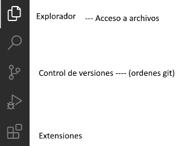
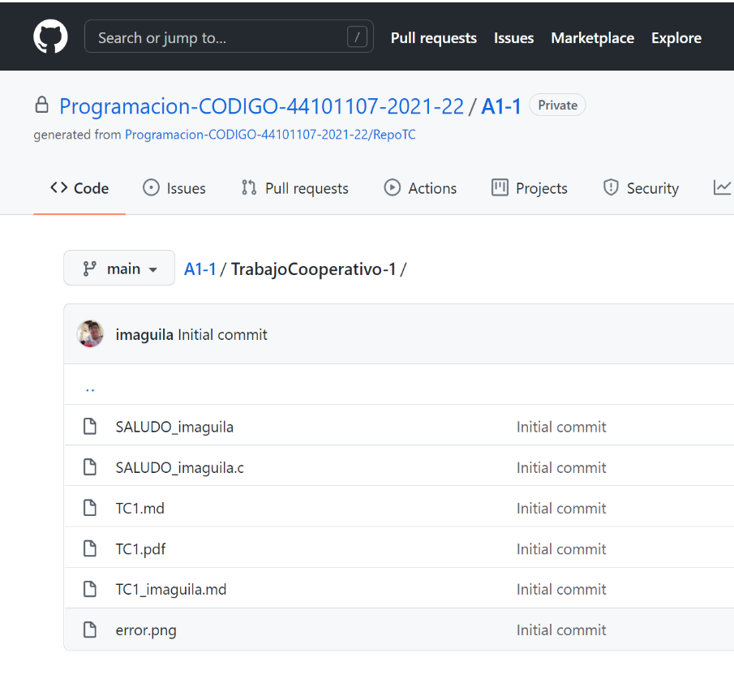
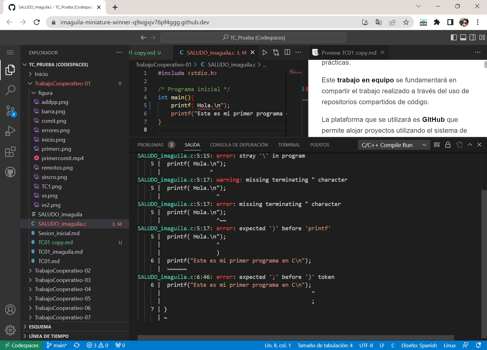

<link rel="stylesheet" type="text/css" href="../Inicio/estilo.css" media="screen" />

# Entorno de programación integrados

En esta asignatura se **aprenderá a programar**, pero además trabajaremos de forma cooperativa para desarrollar todos los ejercicios de las prácticas.

Este **trabajo en equipo** se fundamentará en compartir el trabajo realizado a través del uso de repositorios compartidos de código.

La plataforma que se utilizará es **GitHub** que permite alojar proyectos utilizando el sistema de control de versiones Git para la creación de código fuente de programas de ordenador.

## Temporización

2 horas (1.5 Presenciales + 0.5 No presenciales)


## Miembros del equipo

GRUPO DE PRACTICAS:  XXXXX

| Alumno      | Apellidos y  nombre    | usuario github |
| ----------- | ---------------------- |----------- |
| 1 |   |   |
| 2 |   |   |
| 3 |   |   |
| 4 |   |   |

## Objetivo
-   Conectarse a la plataforma colaborativa para el desarrollo de código GitHub
-	Manejar un editor de programas en lenguaje C (Visual Studio Code) y usarlo para desarrollar programas.
-   Sincronizar el trabajo realizado sobre el repositorio del equipo de trabajo. 
-	Ejecutar los programas desarrollados bien desde el sistema operativo o bien desde el soporte de ejecución del entorno integrado.
-	Conocer las principales prestaciones del editor integrado.
-   Conocer como sincronizar los repositorios de código compartido en GitHub.
-	Identificar algunos elementos sintácticos del lenguaje de programación C y corregir errores en la fase de compilación.
-	Presentar adecuadamente los resultados de salida de un programa mediante el formateo de salida de datos numéricos y textuales.

## Competencias a desarrollar

- [X]	RD1: Poseer y comprender conocimientos
- [X]	RD2: Aplicación de conocimientos
- [X]	UAL1: Conocimientos básicos de la profesión
- [X]	UAL3: Capacidad para resolver problemas
- [X]	UAL6: Trabajo en equipo
- [X]	FB3: Conocimientos básicos sobre el uso y programación de los ordenadores, sistemas operativos, bases de datos y programas informáticos con aplicación en la ingeniería.

## Tareas a realizar 	

- Realizar las operaciones básicas sobre los repositorios git.
- Revisar y probar los ejemplos incluidos
- Realizar los ejercicios 1 al 6 de esta ficha y dejar los resultados en el repositorio creado. 
- Sincronizar el trabajo hecho sobre GitHub

---

## Entorno edición, compilación y ejecución

**Visual Studio Code** es un editor de código fuente desarrollado por Microsoft para Windows, Linux y macOS. Incluye soporte para la depuración, control integrado de Git, resaltado de sintaxis, finalización inteligente de código, fragmentos y refactorización de código. También es personalizable, por lo que los usuarios pueden cambiar el tema del editor, los atajos de teclado y las preferencias. 

Es compatible con varios lenguajes de programación y un conjunto de características que pueden o no estar disponibles para un lenguaje dado, pero existen numerosas extesiones que permiten incorporar nuevas funcionalidades. Hay que tener claro que es solamente un editor y require tener instalado el compilador.

Facilita la utilización de los comandos git puesto que los tiene integrados en el entorno. Además del la herramienta local se puede trabajar con despliegues web que no requieren de ninguna instalación. Si bien es personalizable a continuación incluimos la barra de herramientas con las opciones que más vamos a utilizar de VSCode.

No obstante la combinación de teclas que siempre te facilitará el trabajo con VSCode es CTRL-ALT-P, que da acceso a la PALETA (conjunto de operaciones permitidas)




### Conjunto de extensiones que hay que instalar 

Para el correcto funcionamiento necesitamos instalar diversas extensiones en VSCode sobre el codespace

- Extensiones para C
- Extensiones para Markdown
- Extensiones para PDF
  

### Mi primer pull push - Sincronización

Para comprobar el funcionamiento del proceso pull-push vamos a realizar una primera tarea sobre el repositorio del codespace. Este proceso debe repetirse cada vez que se trabaje en los trabajos de la asignatura.

Actualmente el pull push clasico de git se simplifica utilizando la opcción de sincronización. 

**Al inicio del trabajo**
- Iniciamos el trabajo el codespace. Si no esta abierto se selecciona en el boton *code* del repositorio.
- **Pull/sincronizar** del repositorio del grupo para traer el trabajo hecho por los demás o en otro computador. 
  -  Se debe utilizar el boton de recarga (flecha circular) para comprobar si hay algo a sincronizar.
  -  Pulsar el boton sincronizar si es preciso
  

**Trabajamos en los ejercicios en C o lo que vayamos a editar**

**Al final del trabajo**

- **Pull/sincroniza** del repositorio del grupo para traer el trabajo hecho por los demás o en otro computador.

- **Commit** donde en el mensaje de incluye la fecha, (aunque no es estrictamente necesario porque se registra automáticamente), pero si es necesario poner un mensaje.
	- Aparecen en un circulo el número de archivos que se han cambiado y que requieren commit 
	- Se seleccionan los que se quieren cambiar. 
    	- Se pulsa + para incluirlos o *descartar* para no incluirlos
  	- Los incluidos pasan al "staged changes"
  	- Poner un mensaje y pulsar botón **Commit**


- **Push/sincroniza changes** Con esto subimos (hacemos visible sobre la organización el trabajo hecho en el codespace) En el mensaje ponemos brevemente que hemos hecho por ejemplo: "ejercicio 1 y 2 TC1" o "corrección errores TC1 ejer 1" o "Cambio TC1 ejer 1.1"

**Ejercicio**

- Iniciamos el trabajo el codespace. Si no esta abierto se selecciona en el boton *code* del repositorio.
  
- **Pull/sincroniza**   

- Copiamos el archivo ```TC1.md``` de la carpeta ```TrabajoCooperativo-1``` 
- Cambiarmos el nombre de forma que se incluya el nombre de usuario. ```TC1_imaguila.md```.
- Editaremos la tabla con los nombres de los miembros del equipo incluyendo los datos de todos los componentes.

````
Nota: si sobre el archivo se pulsa usa el boton derecho del ratón y se selecciona previsualizar se vera en formato de visualización el documento
````

- El resultado se recogerá sobre github, dentro de la organización 'Programacion-CODIGO-44101107-2022-23', hay un nuevo archivo

Tras esto se puede ver sobre el repositorio los distintos commits realizados por los alumnos y la fecha y hora en la que se hacen




--------

## Edición, compilación y ejecución de un programa 

Abrir el archivo de nombre SALUDO.c

Completarlo para que su contenido sea:
``` c
#include <stdio.h>
/* Programa inicial */

int main(){
    printf(Hola.\n");
    printf("Este es mi primer programa\n");
    printf("escrito en C de la carrera.\n");
    printf("Adios.\n");
    printf("\n\n\nPulse una tecla para finalizar");
    getchar();
    return 0;
}
```
Compilar el programa
   Se pulsa ```CTRL+6``` sobre la ventana del código para compilar y ejecutar

---

Cuidado aparecen los errores en la parte inferior de la consola.

Donde se describe que faltan unas comillas *missing terminating \"* 



Incluya los cambios y ejecute el programa.
Si se desea se pueden sincronizar los cambios sobre el repositorio remoto mientras se está trabajando, pero lo realmente importante es hacerlo antes de dejar de trabajar, para que en remoto siempre esté la versión actualizada.

## Ejercicios a completar 

### **Ejercicio 1.** Modificación del archivo de Saludo

 Cargar en el editor el programa SALUDO.C creado en el ejemplo de sesión de trabajo. Modificar el mensaje de salida, de forma que ahora escriba:

    Aquí estoy de nuevo.
    Este es mi segundo programa de la asignatura.
    Me he limitado a cambiar el texto de una orden de escritura.

- Grabar dicha modificación en un archivo con el nombre ejercicio1.c, 
- Compilar dicho archivo creando un archivo ejecutable en disco. 
- Descargar el archivo ejercicio1.exe si trabaja con el IDE online.
- Ejecutar desde el sistema operativo dicho programa.

### **Ejercicio 2.** Saludo Formal

Copie lo siguiente en el editor del IDE y guárdelo en el disco de prácticas con el nombre ejercicio2.c; tras comprobar que es ejecutable, realice los pasos que se indican al final del ejercicio

``` c
/* Ejercicio 2 del Trabajo cooperativo 1 */
#include <stdio.h>
int main(){
    char nombre[30];
    printf("Por favor, introduzca su nombre: ");
    scanf(" %[^\n]s",nombre);
    printf("\n\nSaludos D. %s", nombre);
    printf("\nBienvenido al fantastico mundo de la programacion");
    printf("\n\nPulse una tecla para finalizar");
    getchar();
    return 0;
}
```

-	Seleccione como bloque las líneas 5 y 6 del programa.
-	Copie el bloque inmediatamente debajo.
-	Cambie el identificador  nombre, por apellidos en la copia.
-	Seleccione como bloque la 4 línea del programa.
-	Cópielo inmediatamente debajo (queda como línea 5).
-	Cambie el identificador nombre, por apellidos en la nueva línea.
-	Elimine la línea 10 utilizando una única orden. 
-	Inserte una nueva línea en la posición que tenía la que acaba de borrar:
```c
printf("\n\nSaludos D. %s %s", nombre, apellidos);
```

Compruebe que la nueva versión del programa funciona correctamente y grábela.

### **Ejercicio 3.** Calculadora básica

Entrar en el editor del IDE y copiar las siguientes líneas:

``` c
/* Ejercicio 3  */

#include <stdio.h>
#include <stdlib.h>
#include <ctype.h>

int main(){
	int a, b;
	char operacion, c;

	do{ 
		printf("Vamos a realizar una operacion aritmetica simple:\n\n");
		printf("Introduzca el primer valor con que vamos a operar: ");
		scanf(" %d",&a);
		printf("Introduzca el segundo valor con que vamos a operar: ")
		scanf(" %d",&b);
		printf("\n");
		printf("Introduzca + para sumar, - para restar o * para multiplicar: ");
		scanf(" %c",&operacion);
		switch(operacion){
		case '+': printf("El resultado es: %d\n", a+b);
			      break;
		case '-': printf("El resultado es: %d\n", a-b);
                  break;
		case '*': printf("El resultado es: %d\n", a*b);
                  break;
		default:  printf("Operacion incorrecta\n");
		          break;
		}
		printf("\nDesea efectuar una nueva operacion (S/N)? ");
	              scanf(" %c",&c);   
	}while ((c!='N') && (c!='n'));
	return 0;
}
```

Compile el programa anterior, que se habrá almacenado previamente como ejercicio3. Aparecerá un error al compilarlo: 
   
 
 En este caso, se trata de que en la línea 18, una antes del punto en que encuentra el error, falta un punto y coma. Corrija el error, colocando el punto y coma al final de la instrucción: 
```
printf("Introduzca el segundo valor con que vamos a operar: ");
```

Vuelva a compilarlo y una vez que esté sin errores, ejecútelo. Pruebe con los valores que se le indican a continuación la corrección del programa y anote en la siguiente tabla los valores de prueba utilizados y el resultado obtenido. 


|Valor 1| Valor 2	|Código de operación	|Resultado|
| ----- | --------- |---------------------- |---------|
| 10	| 10		| +						|	      |
| 10	| 10		| *						|	      |
| -50	| 50		| *						|	      |
| -50	| 0 		| *						|	      |
| 0	 	| 0			| -						|	      |
| 0		| 0			| *						|	      |
| 10	| 10		| +						|	      |
| 20000	| 20000		| +						|	      |
| 50000	| 50000		| *						|	      |
		

¿Ha observado algún resultado anómalo? ¿Cuál puede ser la causa del mismo? 

	RESPUESTA:

### **Ejercicio 4.**  Teclee el programa siguiente en el editor

``` c
/* Ejercicio 4 */

#include <stdio.h>

int main(){
    int edad;
    
    printf("Por favor, introduzca su edad: ");
    scanf(" %d", &edad);
    printf("\nPara una edad de %d años\n",edad)
    printf("una lectura adecuada puede ser: ");
    if(edad>60)
        printf("\"La historia de Roma\"\n");
    else if(edad>40)
             printf("El nombre de la rosa\n");
         else if(edad>18)
                  printf("Fundamentos de Programacion\n);
		      else if(edad>15)
             	       printf("Aventuras en los mares del sur\n");
                   else if(edad>10)
                            printf("Harry Potter\n");
                        else printf("Cuentos\n");
    printf("\n\nPulse una tecla para finalizar");
    getch();
    return 0;
}
```

Compile el programa anterior. Si aparecen errores tendrá que corregirlos y volver a compilar el programa. Cuando el programa quede sin errores, ejecútelo desde el entorno integrado. Seguidamente genere un ejecutable y ejecútelo desde el sistema operativo.

 Realice un listado de todos los errores sintácticos que haya detectado en los programas fuente de esta práctica y anótelos en la siguiente tabla, indicando cómo los ha corregido:

Error sintáctico	Corrección del error

|  Error sintáctico | Corrección propuesta |
|  ---------------- |--------------------- |
|                   |                      |
|                   |                      |
|                   |                      |

	
### **Ejercicio 5.** Teclee el siguiente programa en el editor y analice los resultados que aparecen en la pantalla
	
``` c
/* Ejercicio 5 */

#include <stdio.h>

int main(){
	char nombre[30];

	printf("Pruebas de formatos de salida\n");
	printf("=============================\n");
	printf("\nDiferentes formatos de salida para el texto:\n\n");
	printf("%s\n", "Esta es una linea de texto de prueba");
	printf("%50s\n", "Esta es una linea de texto de prueba");
	printf("%-50s\n", "Esta es una linea de texto de prueba");
	printf("%-50.10s\n", "Esta es una linea de texto de prueba");
	printf("\nDiferentes formatos de salida para numeros enteros:\n");
	printf("\n1)\n%d\n%d\n%d\n%d\n",8,1234,23,12000);
	printf("\n2)\n%10d\n%10d\n%10d\n%10d\n",8,1234,23,12000);
	printf("\nDiferentes formatos de salida para numeros reales:\n");
	printf("\n1)\n%f\n%f\n%f\n",123.89,-4.0,2345.8999);
	printf("\n2)\n%15f\n%15f\n%15f\n",123.89,-4.0,2345.8999);
	printf("\n3)\n%15.2f\n%15.2f\n%15.2f\n",123.89,-4.0,2345.8999);
	printf("\n\nPulse una tecla para finalizar");
	getchar();
	return 0;
}


```
### **Ejercicio 6.** Intente averiguar el significado del control del formato de salida que se está utilizando en las diferencias instrucciones printf     
```
printf("cadena de control", lista de argumentos);
```

¿Para qué se utiliza el símbolo \n que aparece en bastantes ocasiones en la cadena de control de la instrucción printf?

	RESPUESTA:

¿Qué relación encuentra entre las secuencias de salida que aparecen en la cadena de control (secuencias de caracteres que empiezan con el símbolo % y acaban en s, d ó f) y los argumentos de la función printf? ¿Encuentra alguna relación lógica entre dichas letras y los correspondientes argumentos?

	RESPUESTA:

Explique el efecto que producen sobre el texto de salida los siguientes formatos:

%s	  

	RESPUESTA:

%50s

	RESPUESTA:

%-50s	

	RESPUESTA:

%-50.10s	

	RESPUESTA:

Explique el efecto que producen sobre la presentación de los números enteros los siguientes formatos:

%d	 

	RESPUESTA:

%10d	

	RESPUESTA:

Explique el efecto que producen sobre la presentación de los números reales los siguientes formatos:

%f	

	RESPUESTA:

%15f	

	RESPUESTA:

%15.2f	

	RESPUESTA:

¿Cuál piensa que puede ser el resultado de la ejecución de la siguiente instrucción? Pruébela copiando dicha línea en cualquiera de los programas de esta práctica y compruebe si coincide con lo que pensó.

printf("Resultado de %d + %d = %f\n",1,1,1+1);

	RESPUESTA:


