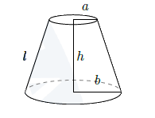
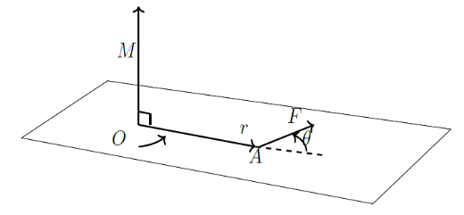
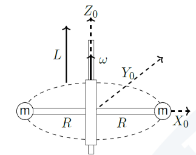

<link rel="stylesheet" type="text/css" href="../Inicio/estilo.css" media="screen" />

# Sintaxis de C. Programación Estructurada: instrucción de control secuencial

## Temporización

4 horas (1.5 Presenciales + 2.5 No presenciales).

## Seguimiento

[Enlace a autoevaluación](../Seguimientotrabajos.md)

## Objetivos
- Conocer la sintaxis básica del lenguaje de programación C: tipos de datos, constantes, variables, operadores, instrucciones de asignación y de control. Identificar algunas características genuinas de este lenguaje de programación.
- Conocer las principales funciones de la biblioteca estándar de C para la entrada/salida de información por el terminal así como para cálculos matemáticos básicos.
- Implementar algoritmos sencillos que hagan uso de las construcciones estructuradas de control (programación estructurada): secuencia, selección y repetición.
- Identificar y corregir errores sintácticos del lenguaje de programación C que surgen durante la codificación.
- Utilizar adecuadamente la función scanf para la entrada de datos al programa a través del teclado.
- Presentar adecuadamente en pantalla los resultados de salida de un programa mediante la función printf. 
- Probar con datos operacionales la correctitud de los programas desarrollados e identificar y corregir los errores lógicos que surjan.


## Competencias a desarrollar

- [X]	RD1: Poseer y comprender conocimientos
- [X]	RD2: Aplicación de conocimientos
- [X]	UAL1: Conocimientos básicos de la profesión
- [X]	UAL3: Capacidad para resolver problemas
- [X]	UAL6: Trabajo en equipo
- [X]	FB3: Conocimientos básicos sobre el uso y programación de los ordenadores, sistemas operativos, bases de datos y programas informáticos con aplicación en la ingeniería.

## Tareas a realizar

Desarrollar los programas correspondientes a los 6 ejercicios propuestos en esta ficha de trabajo 

## Plan de trabajo

**Lectura** individual de la ficha de trabajo por parte del alumno. 
Estudio, codificación y prueba (individual o por parejas) de los ejemplos presentados en teoría de la instrucción de control secuencial (el código fuente en C se encuentra en esta ficha de trabajo).

**Diseño e implementación en C**: Realización individual (o por parejas) de los 6 ejercicios propuestos previa distribución del trabajo entre los miembros del equipo de acuerdo con el siguiente esquema (grupos de 3 ó 4 miembros) sobre los repositorios compartidos:

- A - ejercicios 1,4                     A,B - ejercicios 1,3,5
- B - ejercicios 2,5                     C,D - ejercicios 2,4,6
- C - ejercicios 3,6

    Nota: para la implementación en lenguaje C de los programas correspondientes a los algoritmos diseñados, puede utilizar las plantillas genéricas de programas que encontrará en esta ficha de trabajo (o bien puede utilizar cualquiera de los programas de ejemplo), con el fin de optimizar la codificación en C de los archivos fuente.


**Reunión del equipo base**: cada miembro (o pareja de miembros) explica su trabajo realizado a los otros miembros del equipo y recibe la explicación del trabajo de los otros miembros. Objetivo: cada integrante del equipo debe saber resolver cualquiera de los ejercicios planteados.

**Pruebas**: los programas desarrollados serán validados de forma cruzada por los miembros del equipo utilizando como mínimo los datos de prueba suministrados, de acuerdo con el siguiente esquema:

- A - ejercicios 3,5                     A,B - ejercicios 2,4,6
- B - ejercicios 1,6                     C,D - ejercicios 1,3,5
- C - ejercicios 2,4

    Nota: en caso de detectar errores en esta fase de pruebas, estos deberán ser corregidos por los miembros del equipo que las realicen, modificando el código fuente y/o el algoritmo correspondiente. 

**Reunión del equipo base**: Configuración definitiva del repositorio. Cada miembro del equipo reproducirá en su repositorio individual el trabajo realizado por el resto de los miembros del equipo.


## Ejemplos de programas con construcción de control secuencial 

A continuación se incluyen tres problemas tipo, que se recomienda que los alumnos prueben antes de empezar con sus propias soluciones a los ejercicios.

---
#### Masa de una bola de hierro 
> Construir un programa que calcule la masa en kilogramos de una bola de hierro dado su diámetro en centímetros.

Diseño &ensp;&ensp;&ensp;  [  CalculoMasaBolaHierro.psc](https://github.com/MaterialesProgramacion/ProblemasProgramacion/blob/master/Secuencial/CalcularMasaBolaHierro.psc)
Codificación &ensp;&ensp;&ensp;  [ CalculoMasaBolaHierro.c](https://github.com/MaterialesProgramacion/ProblemasProgramacion/blob/master/Secuencial/CalcularMasaBolaHierro.c)

**DISEÑO**
```
Algoritmo calcularMasaBolaHierro
Const	
	PI=3.141593
	densidad=0.00786	// Kg/cm3
Var	
	diametro: real		// diámetro de esfera (cm) 
	radio: real		// radio de la esfera (cm)  
	volumen: real		// volumen de la esfera
	masa: real		// masa en kg

	Escribir "Introduzca el diámetro (cm): "
	Leer diametro
	radio <- diametro/2
	volumen <- 4* PI * radio * radio * radio/3
	masa <- 0.00786 * volumen
	Escribir "Masa: ", masa, " Kg"
Finalgoritmo
```


**CODIFICACIÓN**
```c
/*
 * @authors Equipo docente Programación
 * @project Creación de Materiales Didácticos en la Univer. de Almería (2021-2022)
 * Grados en Ingeniería Eléctrica, Electrónica Industrial, Mecánica y Química industrial
 * @date 2021-02-06
  calcularMasaBolaHierro: programa que calcula la masa en Kg de una bola
  esférica de hierro, a partir de su diámetro en cm
 */

	#include <stdio.h>
	#include <stdlib.h>
	#include <ctype.h>

	#define PI 3.1415
	#define densidad  0.00786   /* Kg/cm3                   */

	int main(){
		char c;
		float diametro;       /* diametro de la esfera    */
		float radio;          /* radio de la esfera (cm)  */
		float volumen;        /* volumen de la esfera     */
		float masa;           /* masa en kg               */
	
		do{ system("cls||clear");

		printf("CALCULO DE LA MASA DE UNA BOLA DE HIERRO\n");
		printf("========================================\n\n");
		printf("Introduzca el diametro (cm): ");
		scanf(" %f", &diametro);
		radio=diametro/2;
		volumen=4*PI*radio*radio*radio/3;
		masa=densidad*volumen;
		printf("\nMasa: %.2f Kg", masa);
			printf("\nDesea efectuar una nueva operacion (S/N)? ");
			scanf(" %c",&c);   
		}while ((c!='N') && (c!='n'));
	return 0;
	}

```
----
#### Producto escalar y vectorial
>  Construir un programa que lea por teclado los componentes espaciales de dos vectores y que calcule e imprima en pantalla la suma de los dos vectores, su producto escalar y  vectorial.

Diseño &ensp;&ensp;&ensp;  [calculoVectorial.psc](https://github.com/MaterialesProgramacion/ProblemasProgramacion/blob/master/Secuencial/calculoVectorial.psc)
Codificación &ensp;&ensp;&ensp;  [  calculoVectorial.c](https://github.com/MaterialesProgramacion/ProblemasProgramacion/blob/master/Secuencial/calculoVectorial.c)

**DISEÑO**
```
Algoritmo calculoVectorial
	// programa que suma dos vectores y calcula 	
	// su producto escalar y su producto vectorial	
Var 	
	v1x,v1y,v1z: real	// compon. vector1	
	v2x,v2y,v2z: real	// compon. vector2
	sx,sy,sz: real		// comp. vector suma	
	e: real			// producto escalar
	px,py,pz: real		// producto vectorial	

	Escribir "Introducir componentes v1: "
	Leer v1x,v1y,v1z
	Escribir "Introducir componentes v2:"
	Leer v2x,v2y,v2z
	sx <- v1x + v2x
	sy <- y1y +v2y
	sz <- v1z+ v2z
	e <- v1x*v2x+v1y*v2y+v1z*v2z
	px <- v1y*v2z-v1z*v2y
	py <- v1z*v2x-v1x*v2z
	pz <- v1x*v2y-v1y*v2x

	Escribir "Suma: (",sx,",",sy,",",sz,")"
	Escribir "Producto escalar: ",e
	Escribir "Prod.v:(",px,",",py,",",pz,")"
Finalgoritmo
```
**CODIFICACIÓN**
```c
#include <stdio.h>
#include <stdlib.h>
#include <conio.h>
#include <ctype.h>

int main(){
    char c;
    float v1x,v1y,v1z;  /* componentes vector1            */
    float v2x,v2y,v2z;  /* componentes vector2            */
    float sx,sy,sz;     /* componentes vector suma        */
    float e;            /* producto escalar               */
    float px,py,pz;     /* componentes producto vectorial */

    do{ system("cls||clear");
        printf("SUMA VECTORIAL, PRODUCTO ESCALAR Y VECTORIAL\n");
        printf("============================================\n\n");
        printf("Introducir componentes v1:\n");
        printf("\tv1.x: ");
        scanf(" %f",&v1x);
        printf("\tv1.y: ");
        scanf(" %f",&v1y);
        printf("\tv1.z: ");
        scanf(" %f",&v1z);
        printf("Introducir componentes v2:\n");
        printf("\tv2.x: ");
        scanf(" %f",&v2x);
        printf("\tv2.y: ");
        scanf(" %f",&v2y);
        printf("\tv2.z: ");
        scanf(" %f",&v2z);
        sx=v1x+v2x;
        sy=v1y+v2y;
        sz=v1z+v2z;
        e=v1x*v2x+v1y*v2y+v1z*v2z;
        px=v1y*v2z-v1z*v2y;
        py=v1z*v2x-v1x*v2z;
        pz=v1x*v2y-v1y*v2x;
        printf("\nSuma: (%.1f,%.1f,%.1f)",sx,sy,sz);
        printf("\nProducto escalar: %.1f",e);
        printf("\nProducto vectorial: (%.1f,%.1f,%.1f)",px,py,pz);
	    printf("\nDesea efectuar una nueva operacion (S/N)? ");
		scanf(" %c",&c);   
	}while ((c!='N') && (c!='n'));
    return 0;
}

```


----
#### Calcular número de envases 
> Una empresa de envasado automático de aceite dispone de diversos tipos de envases con capacidades de 50, 20, 10, 5, 2 y 1 litro, respectivamente. Construir un programa que dado por teclado un número entero de litros a envasar, determine el menor número de envases completos necesarios e indique el número de envases de cada tipo, presentándolos en pantalla

Diseño &ensp;&ensp;&ensp;  [ calcularNumeroEnvases.psc](https://github.com/MaterialesProgramacion/ProblemasProgramacion/blob/master/Secuencial/calcularNumeroEnvases.psc)
Codificación &ensp;&ensp;&ensp;  [ calcularNumeroEnvases.c](https://github.com/MaterialesProgramacion/ProblemasProgramacion/blob/master/Secuencial/calcularNumeroEnvases.c)

**DISEÑO**
```
Algoritmo CalcularNumeroenvases
	// programa que calcula el numero mínimo de 
	// envases completos necesarios para n litros
	// envases disponibles: 50, 20, 10, 5, 2 y 1 litros

	Var	
		n: entero		// número de litros a envasar
		n50: entero	// n. de envases de 50 litros
		n20: entero	// n. de envases de 20 litros
		n10: entero	// n. de envases de 10 litros
		n5: entero	// n. de envases de 5 litros
		n2: entero	// n. de envases de 2 litros
		n1: entero	// n. de envases de 1 litros
		resto: entero	// resto de divisiones sucesivas	
	
	Escribir "Introduzca número de litros a envasar: ";
	Leer n; 
	
	n50 <- Trunc(n / 50);    // Operacion DIV
	resto <- n MOD 50;
	n20 <- Trunc(resto / 20);
	resto <- resto MOD 20;
	n10 <- Trunc(resto / 10);
	resto <- resto MOD 10;
	n5 <- Trunc(resto / 5);
	resto <- resto MOD 5;
	n2 <- Trunc(resto / 2);
	n1 <- resto MOD 2;
	
	Escribir "Número de envases necesarios: " ;
	Escribir n50, " envases de 50 litros" ;
	Escribir n20, " envases de 20 litros" ;
	Escribir n10, " envases de 10 litros" ;
	Escribir n5, " envases de 5 litros" ;
	Escribir n2, " envases de 2 litros" ;
	Escribir n1, " envases de 1 litro" ;
Finalgoritmo
```
**CODIFICACIÓN**
```c
#include <stdio.h>
#include <stdlib.h>
#include <ctype.h>

int main(){
    char c;
    int n;      /* numero de litros a envasar    */
    int n50;    /* num. de envases de 50 litros  */
    int n20;    /* num. de envases de 20 litros  */
    int n10;    /* num. de envases de 10 litros  */
    int n5;     /* num. de envases de 5 litros   */
    int n2;     /* num. de envases de 2 litros   */
    int n1;     /* num. de envases de 1 litros   */
    int resto;  /* resto de divisiones sucesivas */

    do{ system("cls||clear");
        printf("CALCULO DEL NUMERO MINIMO DE ENVASES\n");
        printf("====================================\n\n");
        printf("Introduzca num. de litros a envasar: ");
        scanf(" %d", &n);
        n50=n/50;
        resto=n%50;
        n20=resto/20;
        resto=resto%20;
        n10=resto/10;
        resto=resto%10;
        n5=resto/5;
        resto=resto%5;
        n2=resto/2;
        n1=resto%2;
        printf("\nNumero de envases necesarios:\n");
        printf("\tEnvases de 50 litros: %4d\n",n50);
        printf("\tEnvases de 20 litros: %4d\n",n20);
        printf("\tEnvases de 10 litros: %4d\n",n10);
        printf("\tEnvases de  5 litros: %4d\n",n5);
        printf("\tEnvases de  2 litros: %4d\n",n2);
        printf("\tEnvases de  1 litro:  %4d\n",n1);
	    printf("\nDesea efectuar una nueva operacion (S/N)? ");
		scanf(" %c",&c);   
	}while ((c!='N') && (c!='n'));
    return 0;
}
```
-----

## EJERCICIOS A RESOLVER
-----
### **Ejercicio 1.**  Aceleración centrípeta
> Diseñar un programa que calcule la aceleración normal (o centrípeta) de una partícula con movimiento circular uniforme, dados por teclado la velocidad angular ω de la misma (rad/sg) y el radio R de la trayectoria (m), y que presente el resultado en pantalla. 
> Nota:  	a<sub>N</sub>=ω<sup>2</sup>R
----

**Datos de prueba**


| ω (res/sg) | R (m) | a<sub>N</sub> (m/sg<sup>2</sup>) |
| :-------: | :---: |:-----------: |
|10|1|100.00|
|15.5| 1.5| 45.38|
|0|2|0.00|

----
### **Ejercicio 2. Conversión de grados** 
> Diseñar un programa que convierta grados centígrados (Celsius) a Fahrenheit.
-----
| -|Escala Celsius |Escala Fahrenheit|  |
| ------- | --- |----------- |----------- |
| Punto de congelación del agua| 0º|32º| C/100=(F-32)/(212-32)|
| | ||C/100=(F-32)/180|
|Punto de ebullición del agua | 100º|212º|C=5*(F-32)/9|


**Datos de prueba**

| Celsius | Fahrenheit | 
| :-------: | :---: |
|0|32|
|100| 212|
|50|122|
|-50|-58|

### **Ejercicio 3.**  Masa de Tronco de cono
> Diseñar un programa que calcule e imprima la masa en kg de una pieza de hierro maciza con forma de tronco de cono circular recto, dados por teclado los valores de los radios **a** y **b** (cm), y el valor de la altura **h** (cm).



Volumen=πh(a<sup>2</sup>+ab+b<sup>2</sup>)/3

Densidad(Fe)= 7.86 g/cm<sup>3</sup>

**Datos de prueba**

|a (cm)	|b (cm)	|h (cm)	m| (Kg)|
| :-------: | :---: |:-----------: |:-----------: |
|1	|  1|	  1|	  0.025|
|10	|20|	  5	|28.808|
| 5|	20	|  5	| 21.606|


### **Ejercicio 4.**  Momento de fuerza
> Diseñar un programa que calcule el momento de una fuerza con respecto a un punto, dados por teclado las componentes de la fuerza (**F**), las coordenadas de su punto de aplicación (**A**) y las del punto respecto del cual se calcula el momento. Presentar el resultado especificando el módulo y la dirección (vector unitario) de dicho vector.

**M = r ^ F**




**Datos de prueba**

|Entrada|Salida|
|---|---|
|F = (1,0,0);  A = (1,0,0);  O = (0,0,0)|M = (0,0,0)  \|M\|=0.00|
|F = (0,1,0);  A = (1,0,0); O = (0,0,0);|	M = (0,0,1)		\|M\|=1.00 	M<sub>u</sub>=(0.00,0.00,1.00)|


### **Ejercicio 5.** Momento angular
> Diseñar un programa que calcule el momento angular del sistema de la figura con respecto al punto O, dados por teclado el valor de la masa m de cada esfera (Kg), la longitud del brazo R (metros) y la velocidad angular ω (rad/sg)

Momento angular 	L = I\*ω

Momento principal de inercia alrededor del eje Z   	I = 2\*m\*R<sup>2</sup>




**Datos de prueba**

|m (Kg)|	R (m)	|ω (rad/sg)|	I (kg\*m<sup>2</sup>)|	L (kg\*m<sup>2</sup>/sg)|
|---|---|---|---|---|
|1|	0.5|	10|	0.500|	5.000|
|0.5	|0.5|	10|	0.250|	2.500|
10|	0.5|	1	|5.000|	5.000|


### **Ejercicio 6.** Cambio de moneda
> Diseñar un programa que calcule e imprima en pantalla el cambio que se debe devolver a un cliente, utilizando el menor nº de billetes y/o monedas, por la compra un artículo, dados por teclado su precio (euros y céntimos de euro) así como el importe pagado por el cliente (euros y céntimos de euro).

**Datos de prueba**

|Precio| artículo|	Importe| pagado|	Cambio a devolver|
|---|---|---|---|----|
|Euros	|Céntimos |	Euros|	Céntimos|  |	
|28n|||B200€:     0|
|||||B100€:     0|
|||||B50€:       0|
|||||B20€:        0|
|||||B10€:        0|
|||||B5€:          0|
|||||M2€:         0|
|||||M1€:         1|
|||||M50c:       0|
|||||M20c:       2|
|||||M10c:       0|
|||||M5c:         1|
|||||M2c:         0|
|||||M1c:         0|
|99	|99|	200|	0|	B500€:     0|
|||||B200€:     0|
|||||B100€:     1|
|||||B50€:        0|
|||||B20€:        0|
|||||B10€:        0|
|||||B5€:          0|
|||||M2€:         0|
|||||M1€:         0|
|||||M50c:       0|
|||||M20c:       0|
|||||M10c:       0|
|||||M5c:         0|
|||||M2c:         0|
|||||M1c:         1|
|33	|45	|50|	50|	B500€:     0|
|||||B200€:     0|
|||||B100€:     0|
|||||B50€:        0|
|||||B20€:        0|
|||||B10€:        1|
|||||B5€:          1|
|||||M2€:         1|
|||||M1€:         0|
|||||M50c:       0|
|||||M20c:       0|
|||||M10c:       0|
|||||M5c:         1|
|||||M2c:         0|
|||||M1c:         0|

-----

## **EJERCICIOS ADICIONALES**
-----


#### **1** 
> ¿Cómo se representan en lenguaje de programación C los datos lógicos? 

	RESPUESTA:


#### **2**
>  Listar los operadores específicos de lenguaje de programación C que no hemos presentado en la notación de diseño e indicar su significado:

|Operador exclusivo de C	|  Significado|
|---------------------------|-------------|
|sustituir por lo que proceda | describirlo
|                           |             |
	
	

#### **3** 
> Calcular los rangos de los tipos de datos enteros del entorno de trabajo y anotarlos en la siguiente tabla:

|Tipo de datos|	Identificador de tipo|	Rango|	Tamaño|
|-------------|----------------------|-------|--------|
|Enteros	  |short int         |   |    |
|Enteros	  |signed short int		|   |    |
|Enteros	  |	int             |   |    |
|Enteros	  |signed int		|   |    |
|Enteros	  |	long int	|   |    |
|Enteros	  |signed long int		|   |    |
|Enteros	  |	unsigned int		|   |    |
|Enteros	  |	unsigned long int		|   |    |

Nota: utilizar el operador ```sizeof``` para calcular el tamaño en bytes de los diferentes tipos.

¿Qué diferencias encuentran con otros entornos de trabajo con tamaños de enteros de 2 bytes (```int ```y ```short```) y 4 bytes para enteros largos (```long int```)?

	RESPUESTA:


#### **4** 
> Realizar nuevas pruebas del programa correspondiente al ejercicio 3 con los siguientes datos de entrada y anotar los resultados:

|Datos de Entrada|	Resultados|
|-----------|-----|
|a = -3, b = 5, h = 10|	m =  |
|a = -3, b = 5, h = b |	m =   |

¿Han observado algún resultado erróneo? ¿Es posible resolverlo utilizando únicamente la instrucción de control secuencial? 

	RESPUESTA:

#### **5** 
> ¿Qué diferencias encuentran cuando quieren leer por teclado y escribir en pantalla datos de tipo real en simple y real en doble precisión utilizando las funciones printf y scanf de la biblioteca ```stdio.h```?

	RESPUESTA:

#### **6** 
> ¿Qué diferencias encuentran entre las funciones ```ceil``` y ```floor``` de la biblioteca math.h entre sí y  con la función interna ```trunc``` presentada en la notación de diseño?

	RESPUESTA:

#### **7** 
> Indicar como se puede calcular en lenguaje de programación C el cociente (parte entera) y el resto (parte decimal) de la división entre dos números reales. 

	RESPUESTA:
