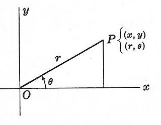

<link rel="stylesheet" type="text/css" href="../Inicio/estilo.css" media="screen" />

# Sintaxis de C. Programación Estructurada: instrucción de control condicional)

## Temporización

4 horas (1.5 Presenciales + 2.5 No presenciales)

## Seguimiento

[Enlace a autoevaluación](../Seguimientotrabajos.md)


## Objetivos

- Conocer la sintaxis básica del lenguaje de programación C: tipos de datos, constantes, variables, operadores, instrucciones de asignación y de control. Identificar algunas características genuinas de este lenguaje de programación.
- Conocer las principales funciones de la biblioteca estándar de C para la entrada/salida de información por el terminal así como para cálculos matemáticos básicos.
- Implementar algoritmos sencillos que hagan uso de las construcciones estructuradas de control (programación estructurada): secuencia, selección y repetición.
- Identificar y corregir errores sintácticos del lenguaje de programación C que surgen durante la codificación.
- Utilizar adecuadamente la función scanf para la entrada de datos al programa a través del teclado.
- Presentar adecuadamente en pantalla los resultados de salida de un programa mediante la función printf. 
- Probar con datos operacionales la correctitud de los programas desarrollados e identificar y corregir los errores lógicos que surjan.


## Competencias a desarrollar

- [X]	RD1: Poseer y comprender conocimientos
- [X]	RD2: Aplicación de conocimientos
- [X]	UAL1: Conocimientos básicos de la profesión
- [X]	UAL3: Capacidad para resolver problemas
- [X]	UAL6: Trabajo en equipo
- [X]	FB3: Conocimientos básicos sobre el uso y programación de los ordenadores, sistemas operativos, bases de datos y programas informáticos con aplicación en la ingeniería.

## Tareas a realizar

Desarrollar los programas correspondientes a los 6 ejercicios propuestos en esta ficha de trabajo 

## Plan de trabajo

**Lectura** individual de la ficha de trabajo por parte del alumno. 
Estudio, codificación y prueba (individual o por parejas) de los ejemplos presentados en teoría de la instrucción de control secuencial (el código fuente en C se encuentra en esta ficha de trabajo).

**Diseño e implementación en C**: Realización individual (o por parejas) de los 6 ejercicios propuestos previa distribución del trabajo entre los miembros del equipo de acuerdo con el siguiente esquema (grupos de 3 ó 4 miembros) sobre los repositorios compartidos:

- A - ejercicios 1,4                     A,B - ejercicios 1,3,5
- B - ejercicios 2,5                     C,D - ejercicios 2,4,6
- C - ejercicios 3,6

    Nota: para la implementación en lenguaje C de los programas correspondientes a los algoritmos diseñados, puede utilizar las plantillas genéricas de programas que encontrará en esta ficha de trabajo (o bien puede utilizar cualquiera de los programas de ejemplo), con el fin de optimizar la codificación en C de los archivos fuente.


**Reunión del equipo base**: cada miembro (o pareja de miembros) explica su trabajo realizado a los otros miembros del equipo y recibe la explicación del trabajo de los otros miembros. Objetivo: cada integrante del equipo debe saber resolver cualquiera de los ejercicios planteados.

**Pruebas**: los programas desarrollados serán validados de forma cruzada por los miembros del equipo utilizando como mínimo los datos de prueba suministrados, de acuerdo con el siguiente esquema:

- A - ejercicios 3,5                     A,B - ejercicios 2,4,6
- B - ejercicios 1,6                     C,D - ejercicios 1,3,5
- C - ejercicios 2,4

    Nota: en caso de detectar errores en esta fase de pruebas, estos deberán ser corregidos por los miembros del equipo que las realicen, modificando el código fuente y/o el algoritmo correspondiente. 

**Reunión del equipo base**: Configuración definitiva del repositorio. Cada miembro del equipo repoducirá en su repositorio individual el trabajo realizado por el resto de los miembros del equipo.


## Sintaxis de C: Construcción de control condicional 


 Selección simple (if-else).

	if(expresión)
		instrucción1;
	else
		instrucción2;

La parte **else** es opcional. Nótese que *if(expresión)* es equivalente a *if(expresión!=0). instrucción1/instrucción2* puede ser una instrucción simple ó un bloque de instrucciones; a su vez, una de las instrucciones puede ser otra selección simple. En el caso de tener varias instrucciones **if-else** anidadas, hay que tener cuidado con las posibles ambigüedades sintácticas en el caso de que alguna instrucción **if** no lleve asociada la parte **else** correspondiente (utilizar llaves para evitar errores ya que el compilador asocia el **else** al **if** más próximo).

Pseudo-código

```
Si (c1) entonces
Si (c2) entonces
    Si (c3) entonces
            instrucción3
    Fin_si
  Fin_si
Sino  instrucción1
Fin_si
```
INCORRECTA
```c
if (c1)
   if (c2) 
       if (c3) 
            instrucción3;
else  instruccion1;
/* Si c1 es falso no se ejecuta nada; instrucción1 se ejecuta cuando c1 y c2 son verdaderas y c3 falsa*/

```

CORRECTA
```c
if (c1){
   if (c2) 
       if (c3) 
            instrucción3;
}else  instruccion1;

```

Selección múltiple (switch).

```c
switch(expresión){			/* expresión entera	*/
	case cte1:			/* se admiten caracteres	*/
	case cte2:
	...
	case cteN:	instrucción;
			. . .
			instrucción;
			break;		/* para salir del switch */
	case cteN+1:
	...
	case cteM:	instrucción;
			. . .
			instrucción;
			break;
	. . .		. . . 
	default:	instrucción;	/* casos para los que no */
			...		/* hay una opción dada  */
			instrucción;
			break;
}


```


## Ejemplos de programas con construcción de control condicional 

### Avisar velocidad
> Construir un programa que lea por teclado un valor de velocidad y que escriba en pantalla un mensaje si la velocidad supera los 120 Km/h y en cuanta cantidad los supera

Diseño &ensp;&ensp;&ensp; [  excesoVelocidad.psc](https://github.com/MaterialesProgramacion/ProblemasProgramacion/blob/master/Selectiva/excesoVelocidad.psc)

Codificación &ensp;&ensp;&ensp;[ excesoVelocidad.c](https://github.com/MaterialesProgramacion/ProblemasProgramacion/blob/master/Selectiva/excesoVelocidad.c)

**DISEÑO**
```
Algoritmo excesoVelocidad
// programa que calcula el exceso de velocidad		
// con respecto a un límite dado 				
Const
 	LIMITE=120	//velocidad máxima permitida 	
Var
	v: real		// velocidad (km/h)			
	exceso: real	// exceso de velocidad 		

Escribir "Comprobacion Velocidad";
Escribir "Introducir velocidad (Km/h): ";
Leer v; 
	Si (v>LIMITE)	Entonces	
		exceso <- v-LIMITE;
		Escribir "Sobrepasado límite velocidad en  ", exceso, "Km/h";
	Finsi
Finalgoritmo
```

**CODIFICACIÓN**
```c
#include <stdio.h>
#include <stdlib.h>
#include <conio.h>
#include <ctype.h>
#include <math.h>
#define LIMITE 120  /* velocidad maxima permitida */

int main(){
    char c;
    float v;               /* velocidad (km/h)    */
    float exceso;          /* exceso de velocidad */

    do{ system("cls||clear");
        printf("COMPROBACION EXCESO VELOCIDAD\n");
        printf("=============================\n\n");
        printf("Introducir velocidad (Km/h): ");
        scanf(" %f", &v);
        if(v>LIMITE){
            exceso=v-LIMITE;
            printf("\nSobepasado limite de velocidad");
            printf(" en %.2f Km/h",exceso);
        }
        printf("\n\nDesea efectuar una nueva operacion (s/n)? ");
		  scanf(" %c",&c);   
	}while ((c!='N') && (c!='n'));
    return 0;
}

-------

```
### Mayor temperatura
> Construir un programa que lea por teclado dos valores de temperatura y que determine e imprima en pantalla el mayor valor.

Diseño &ensp;&ensp;&ensp; [  temperaturaMaximaSelectivaSimple.psc](https://github.com/MaterialesProgramacion/ProblemasProgramacion/blob/master/Selectiva/temperaturaMaximaSelectivaSimple.psc)

Codificación &ensp;&ensp;&ensp; [ temperaturaMaximaSelectivaSimple.c](https://github.com/MaterialesProgramacion/ProblemasProgramacion/blob/master/Selectiva/temperaturaMaximaSelectivaSimple.c)

**DISEÑO**

````
Algoritmo temperaturaMaximaselectivasimple
// programa que calcula el mayor valor 	
// de dos temperaturas 				
Var
	t1,t2: real 		// dos valores de temperatura 	
	tmax: real		// temperatura máxima 		
		     
	Escribir "Introduzca dos temperaturas: " ;
	Leer t1,t2;	
	Si (t1>=t2) Entonces
		tmax <- t1;
	Sino	
		tmax <- t2;
	Finsi
	
	Escribir "Temperatura máxima: ", tmax;
Fin algoritmo
````

**CODIFICACIÓN**

````c
#include <stdio.h>
#include <stdlib.h>
#include <conio.h>
#include <ctype.h>
#include <math.h>

int main(){
    char c;
    float t1,t2;    /* dos valores de temperatura */
    float tmax;     /* temperatura maxima         */

    do{  system("cls||clear");
        printf("TEMPERATURA MAXIMA\n");
        printf("==================\n\n");
        printf("Introduzca temperatura 1: ");
        scanf(" %f", &t1);
        printf("Introduzca temperatura 2: ");
        scanf(" %f", &t2);
        if(t1>=t2)
             tmax=t1;
        else tmax=t2;
        printf("\nTemperatura maxima: %.2f",tmax);
        printf("\n\nDesea efectuar una nueva operacion (s/n)? ");
		  scanf(" %c",&c);   
	}while ((c!='N') && (c!='n'));
    return 0;
}
````

-------
### Nivel de huracanes
> Construir un programa que lea por teclado el nivel de un huracán y que presente en pantalla la categoría (daño) asociada al mismo, según la clasificación de Saffir-Simpson.

Diseño &ensp;&ensp;&ensp;  [  huracanes.psc](https://github.com/MaterialesProgramacion/ProblemasProgramacion/blob/master/Selectiva/huracanes.psc)

Codificación &ensp;&ensp;&ensp;  [ huracanes1.c](https://github.com/MaterialesProgramacion/ProblemasProgramacion/blob/master/Selectiva/huracanes1.c) &ensp;&ensp;&ensp;     [ huracanesalternativa.c](https://github.com/MaterialesProgramacion/ProblemasProgramacion/blob/master/Selectiva/huracanes2.c)


**DISEÑO**

````
Algoritmo  huracanes
// programa que presenta en pantalla la categoría		
// de un huracán a partir de su nivel, según			
// clasificación de Saffir-Simpson 					
Var
	nivel: entero	// nivel del huracán: 1,2,3,4,5	

	Escribir "CLASIFICACION DE HURACANES";
	Escribir "Introduzca el nivel del huracán: "
	Leer nivel; 
	Segun nivel Hacer
		1:	Escribir "Clasificación: mínimo" ;
		2:	Escribir "Clasificación: moderado" ;
		3:	Escribir "Clasificación: extenso" ;
		4:	Escribir "Clasificación: extremo" ;
		5:	Escribir "Clasificación: catastrófico" ;
		de otro modo:	Escribir "Error: nivel no válido";
	FinSegun
Finalgoritmo
````

**CODIFICACIÓN**

````c
/*
 * @authors Equipo docente Programación
 * @project Creación de Materiales Didácticos en la Univer. de Almería (2021-2022)
 * Grados en Ingeniería Eléctrica, Electrónica Industrial, Mecánica y Química industrial
 * @date 2021-02-06
 */
/* huracanes1                                                  */
/* programa que presenta en pantalla la categoria de un huracan*/
/* a partir de su nivel, segun clasificacion de Saffir-Simpson */
#include <stdio.h>
#include <stdlib.h>
#include <conio.h>
#include <ctype.h>
#include <math.h>

int main(){
    char c;
    int nivel;   /* nivel del huracan: 1,2,3,4,5 */

    do{ system("cls||clear");
        printf("CLASIFICACION DE HURACANES\n");
        printf("==========================\n\n");
        printf("Introduzca el nivel del huracan: ");
        scanf(" %d", &nivel);
        switch(nivel){
        case 1: printf("\nClasificacion: minimo");
                break;
        case 2: printf("\nClasificacion: moderado");
                break;
        case 3: printf("\nClasificacion: extenso");
                break;
        case 4: printf("\nClasificacion: extremo");
                break;
        case 5: printf("\nClasificacion: catastrofico");
                break;
        default:printf("\nError: nivel no valido");
                break;
        }
        printf("\n\nDesea efectuar una nueva operacion (s/n)? ");
         scanf(" %c",&c);   
        }while ((c!='N') && (c!='n'));
    return 0;
}
````

````c
/*
 * @authors Equipo docente Programación
 * @project Creación de Materiales Didácticos en la Univer. de Almería (2021-2022)
 * Grados en Ingeniería Eléctrica, Electrónica Industrial, Mecánica y Química industrial
 * @date 2021-02-06
 */
/* huracanes2                                                  */
/* programa que presenta en pantalla la categoria de un huracan*/
/* a partir de su nivel, segun clasificacion de Saffir-Simpson */
#include <stdio.h>
#include <stdlib.h>
#include <conio.h>
#include <ctype.h>
#include <math.h>

int main(){
    char c;
    char nivel;   /* nivel del huracan: '1','2','3','4','5' */

    do{ system("cls||clear");
        printf("CLASIFICACION DE HURACANES\n");
        printf("==========================\n\n");
        printf("Introduzca el nivel del huracan: ");
        scanf(" %c", &nivel);
        switch(nivel){
        case '1': printf("\nClasificacion: minimo");
                  break;
        case '2': printf("\nClasificacion: moderado");
                  break;
        case '3': printf("\nClasificacion: extenso");
                  break;
        case '4': printf("\nClasificacion: extremo");
                  break;
        case '5': printf("\nClasificacion: catastrofico");
                  break;
        default:  printf("\nError: nivel no valido");
                  break;
        }
        printf("\n\nDesea efectuar una nueva operacion (s/n)? ");
		  scanf(" %c",&c);   
	}while ((c!='N') && (c!='n'));
    return 0;
}
````


### Área del triángulo
> Construir un programa que calcule el área de un triángulo dados por teclado las longitudes de sus tres lados.

Diseño &ensp;&ensp;&ensp; [calcularAreaTriangulo.psc](https://github.com/MaterialesProgramacion/ProblemasProgramacion/blob/master/Selectiva/calcularAreaTriangulo.psc)

Codificación &ensp;&ensp;&ensp;  [calcularAreaTriangulo.c](https://github.com/MaterialesProgramacion/ProblemasProgramacion/blob/master/Selectiva/calcularAreaTriangulo.c) &ensp;&ensp;&ensp; 

**DISEÑO**
````
Algoritmo calcularAreaTriangulo
// programa que calcula el área de un triángulo	
// dadas las longitudes de sus lados	
Var
	l1,l2,l3: real	// longitudes de los lados
	s: real		// semiperímetro 
	area: real		// área del triángulo

	
	Escribir "Introducir longitudes de lados: "
	Leer l1,l2,l3
	Si (l1<=0)o(l2<=0)o(l3<=0) Entonces
		Escribir "Error en datos de entrada"
	Sino       Si(l1<(l2+l3))y(l2<(l1+l3))y(l3<(l1+l2))
			Entonces
			s<-(l1+l2+l3)/2
			area<-raiz(s*(s-l1)*(s-l2)*(s-l3))
			Escribir "Area=",area
		Sino		Escribir "No es un triangulo" 
		Finsi
	Finsi
Finalgoritmo
````

**CODIFICACIÓN**

````c
/*
 * @authors Equipo docente Programación
 * @project Creación de Materiales Didácticos en la Univer. de Almería (2021-2022)
 * Grados en Ingeniería Eléctrica, Electrónica Industrial, Mecánica y Química industrial
 * @date 2021-02-06
*/
/* programa que calcula el área de un triángulo */
/* dadas las longitudes de sus lados            */

#include <stdio.h>
#include <stdlib.h>
#include <conio.h>
#include <ctype.h>
#include <math.h>

int main(){
    char c;
    float l1,l2,l3;  /* longitudes de los lados */
    float s;         /* semiperimetro           */
    float area;      /* área del triángulo      */

    do{ system("cls||clear");
        printf("CALCULO DEL AREA DE UN TRIANGULO\n");
        printf("================================\n\n");
        printf("Introducir longitudes de lados:\n");
        printf("\tl1: ");
        scanf(" %f",&l1);
        printf("\tl2: ");
        scanf(" %f",&l2);
        printf("\tl3: ");
        scanf(" %f",&l3);
        if((l1<=0)||(l2<=0)||(l3<=0))
             printf("Error en datos de entrada");
        else if((l1<(l2+l3))&&(l2<(l1+l3))&&(l3<(l1+l2))){
                   s=(l1+l2+l3)/2;
                   area=sqrt(s*(s-l1)*(s-l2)*(s-l3));
                   printf("\nArea= %.2f",area);
             }else printf("\nNo es un triangulo");
        printf("\n\nDesea efectuar una nueva operacion (s/n)? ");
		  scanf(" %c",&c);   
	}while ((c!='N') && (c!='n'));
    return 0;
}
````

### Ecuación de segundo grado
>Construir un programa que calcule las raíces de la ecuación de segundo grado: **Ax<sup>2</sup>+Bx+C=0**, dados por teclado los coeficientes A, B y C.

Diseño &ensp;&ensp;&ensp;[raicesEcuacionSegundoGrado.psc](https://github.com/MaterialesProgramacion/ProblemasProgramacion/blob/master/Selectiva/raicesEcuacionSegundoGrado.psc)

Codificación &ensp;&ensp;&ensp; [raicesEcuacionSegundoGrado.c](https://github.com/MaterialesProgramacion/ProblemasProgramacion/blob/master/Selectiva/raicesEcuacionSegundoGrado.c)  

**DISEÑO**

```
Algoritmo raicesEcuacionSegundoGrado
// programa que calcula e imprime en pantalla las 	
// soluciones de la ecuación: A*x*x+B*x+C=0		
Var
	a,b,c: real		// coeficientes polinomio
d: real		// discriminante: b*b-4*a*c	
	x1,x2: real	// raices de la ecuacion

	Escribir "Introduzca coeficientes polinomio: ";
	Leer a,b,c;
	Si (a=0) Entonces
		Si (b=0) Entonces
			Si (c=0) Entonces
				Escribir "Igualdad 0=0";
			SiNo
				Escribir "Imposible 0=",c;
			FinSi
		SiNo
			Escribir "x=",-c/b;
		FinSi
	SiNo
		d <- b*b-4*a*c;
		Si (d<0) Entonces
			Escribir "Raices imaginarias";
		SiNo
			x1 <- (-b+raiz(d))/(2*a);
			x2 <- (-b+raiz(d))/(2*a);
			Escribir "x1=",x1;
			Escribir "x2=",x2;
		FinSi
	FinSi
FinAlgoritmo
```

**CODIFICACIÓN**
```c
/* raicesEcuacionSegundoGrado                     */
/* programa que calcula e imprime en pantalla las */
/* soluciones de la ecuación: A*x*x+B*x+C=0       */
#include <stdio.h>
#include <stdlib.h>
#include <math.h>
#include <conio.h>
#include <ctype.h>

int main(){
    char c1;
    float a,b,c;      /* coeficientes polinomio   */
    float d;		  /* discriminante: b*b-4*a*c */
    float x1,x2;      /* raices de la ecuacion    */

    do{ system("cls||clear");
        printf("SOLUCIONES EC. SEGUNDO GRADO: A*x*x+B*x+C=0\n");
        printf("==========================================\n\n");
        printf("Introduzca coeficiente de x*x: ");
        scanf(" %f",&a);
        printf("Introduzca coeficiente de x: ");
        scanf(" %f",&b);
        printf("Introduzca termino independiente: ");
        scanf(" %f",&c);
        printf("\n\n");
        if(a==0)
            if(b==0)
                if(c==0)
                    printf("Igualdad 0=0");
                else printf("Imposible %f=0",c);
            else printf("Sol. ec. de primer grado: x=%f",-c/b);
        else{ d=b*b-4*a*c;
              if(d<0)
                  printf("Raices imaginarias");
              else{ x1=(-b+sqrt(d))/(2*a);
                    x2=(-b-sqrt(d))/(2*a);
                    printf("x1=%f\nx2=%f",x1,x2);
              }
        }
        printf("\n\nDesea efectuar una nueva operacion (s/n)? ");
		  scanf(" %c",&c1);   
	}while ((c1!='N') && (c1!='n'));
    return 0;
}
```

### Mayor de tres temperaturas
> Construir un programa que calcule e imprima la mayor de tres temperaturas introducidas por teclado.
 
Diseño &ensp;&ensp;&ensp; [  tresTemperaturas.psc](https://github.com/MaterialesProgramacion/ProblemasProgramacion/blob/master/Selectiva/tresTemperaturas.psc)

Codificación &ensp;&ensp;&ensp;  [ tresTemperaturas.c](https://github.com/MaterialesProgramacion/ProblemasProgramacion/blob/master/Selectiva/tresTemperaturas.c) 
 


### Tarifa de taxis
> Construir un programa que pida por teclado los kilómetros recorridos y calcule e imprima en pantalla el total a pagar según la tarifa anterior.

La tarifa de un taxi es la siguiente:
- Una cantidad fija de 30 € si no se sobrepasan los 30 km de recorrido.
- Para más de 30 km se consideran los siguientes supuestos:
- Si no se sobrepasan los 100 km, 15 € por km que exceda de los 30, además de los 30 €.
- Si se sobrepasan los 100 km, 10 € por km que exceda de los 100, 15 € por km desde los 30 a los 100, y los 30 €.

Diseño &ensp;&ensp;&ensp;  [  taxi.psc](https://github.com/MaterialesProgramacion/ProblemasProgramacion/blob/master/Selectiva/taxi.psc)

Codificación &ensp;&ensp;&ensp;  [ taxi.c](https://github.com/MaterialesProgramacion/ProblemasProgramacion/blob/master/Selectiva/taxi.c) &ensp;&ensp;&ensp; 
 


### Intersección de segmentos
> Construir un programa que determine si dos segmentos de línea recta en el plano XY se cruzan e imprima en pantalla el punto/segmento de intersección o un mensaje de texto en caso de que no se crucen, dados por teclado las coordenadas cartesianas (x,y) de dos parejas de puntos diferentes que definen cada uno de los segmentos.

Nota: Ecuación de la recta que pasa por dos puntos:

    (y-y1)/(x-x1)=(y2-y1)/(x2-x1)

Representación explícita: 

    y=m*x+b

Representación polinómica:

     A*x+B*y+C=0

Representación paramétrica:

    x=x1+(x2-x1)*u
    y=y1+(y2-y1)*u

Segmento de línea:

    u:[0,1] 
        -- u=0  -- (x,y)=(x1,y1)
	    -- u=1  -- (x,y)=(x2,y2)
 

&ensp;&ensp;&ensp;  [  interseccion.psc](https://github.com/MaterialesProgramacion/ProblemasProgramacion/blob/master/Selectiva/interseccion.psc)

&ensp;&ensp;&ensp;  [ interseccion.c](https://github.com/MaterialesProgramacion/ProblemasProgramacion/blob/master/Selectiva/interseccion.c) &ensp;&ensp;&ensp; 
 


### Calculo autovectores y autovalores
> Construir un programa en C que calcule e imprima en pantalla el autovector (o autovectores) asociado(s) a un autovalor, dados por teclado los coeficientes del sistema lineal homogéneo de ecuaciones a resolver: 
```
    a11*x+a12*y+a13*z=0
    a21*x+a22*y+a23*z=0
    a31*x+a32*y+a33*z=0
```
El sistema debe de ser compatible indeterminado y los autovectores son soluciones no nulas, linealmente independientes. *Nota:* para determinación de autovectores analizar rango de la matriz de coeficientes **M**:

- **Rango=3**	Determinante(M)≠0  implica Sistema compatible determinado. 
    La única solución es (0,0,0) que no es un autovector por tanto el sist. lineal de ecuac. no se corresponde con ningún autovalor.

- **Rango=2**	```aij*akl-ail*akj≠0 ``` Hay dos ecuaciones linealmente independientes (i y k):

        a*x+b*y+c*z=0
        d*x+e*y+f*z=0

    Las variables de las columnas j y l se pueden expresar en función de la tercera variable.
    Hay un autovector asociado al autovalor que se puede calcular asignando el valor 1 a la tercera variable, calculando los valores de las otras variables, y normalizando el vector resultante. 
    
    Ejemplo:
    ``` 
        j=1, l=2 --> 
        x=(-c*e+b*f)/(a*e-b*d) 
        y=(-a*f+c*d)/(a*e-b*d)
        z=1
        norma=(x*x+y*y+z*z)1/2   
        x=x/norma
        y=y/norma
        z=z/norma
    ```
- **Rango=1**	aij≠0  Solo hay una ecuación linealmente independiente (i):

        a*x+b*y+c*z=0

La variable j se puede expresar en función de las otras dos. Hay dos autovectores asociados al autovalor, que se pueden calcular asignando alternativamente los valores 0 y 1 a las dos variables libres, calculando la tercera variable, y normalizando los dos vectores resultantes. 

Ejemplo:
``` 
j=1 
(x,y,z)=(-b/a,1,0)
(x,y,z)=(-c/a,0,1)
norma=(x*x+y*y+z*z)1/2
x=x/norma
y=y/norma
z=z/norma
```


- **Rango=0**	aij≠0  --  Hay tres autovectores asociados al autovalor: 

    (1,0,0), (0,1,0) y (0,0,1).


 Diseño &ensp;&ensp;&ensp; [  autovectores.psc](https://github.com/MaterialesProgramacion/ProblemasProgramacion/blob/master/Selectiva/autovectores.psc)

Codificación &ensp;&ensp;&ensp;  [ autovectores.c](https://github.com/MaterialesProgramacion/ProblemasProgramacion/blob/master/Selectiva/autovectores.c)  
 
_____

## EJERCICIOS A RESOLVER
_____

### Ejercicio 1.  Temperaturas coincidentes
> Diseñar un programa que lea por teclado tres temperaturas e imprima un mensaje en pantalla indicando si los tres valores coinciden, si al menos dos ellos coinciden o si los tres son diferentes.

**Datos de prueba**

|t1|	t2|	t3|	Mensaje|
|---|---|---|---|
|5|	5|	5|	Las tres temperaturas son iguales|
|5	|5|	6|	Hay dos temperaturas iguales: primera y segunda|
|5	|3|	5|	Hay dos temperaturas iguales: primera y tercera|
|0	|5|	5|	Hay dos temperaturas iguales: segunda y tercera|
|1|	5|	9|	Las tres temperaturas son distintas|


### Ejercicio 2. Sensor temperatura
> Un indicador de temperatura de un automóvil normalmente lee temperaturas en el intervalo -30º a 120º y el voltaje que proporciona el sensor a la salida del motor está comprendido entre 5 y 10 voltios. Suponiendo que la relación es lineal, diseñar un programa que calcule e imprima en pantalla la temperatura a partir de un valor del voltaje introducido previamente por teclado. Para valores de voltaje fuera del rango considerado, imprimir un mensaje de error en la lectura de la temperatura.

**Datos de prueba**

|Entrada|Salida|
|---|---|
|	7.5 v	|	45.0 º|
|	6.75 v	|	22.5 º|
|	5 v	|      -30.0 º|
|	10 v	|      120.0 º|
|	0 v	|	ERROR|


### **Ejercicio 3**. Paso a polares
> Diseñar un programa que permita pasar de coordenadas cartesianas bidimensionales a coordenadas polares. El programa leerá por teclado las coordenadas cartesianas e imprimirá en pantalla las coordenadas polares correspondientes.
 
    x = r * cos(θ)
    y = r * sen(θ)




**Datos de prueba**
(x,y):	(0,0)  (1,0)  (0,1)    (-1,0)    (0,-1)     (1,1)	     (-1,1)         (-1,-1)         (1,-1)

(r,θ):	(0,0)  (1,0) (1,90) (1,180) (1,270)(1.41,45)(1.41,135)(1.41,225)(1.41,315)
                                                           
                                                            
(1-90) (1.41,-45)


### Ejercicio 4. Adivinar un numero
> Diseñar un programa para adivinar e imprimir en pantalla un número de un solo dígito teniendo como información de entrada por teclado un carácter que indique si el número es par ('p') o impar ('i') y el resto de la división del número entre 5.

**Datos de prueba**

	p	4 	-->	4
	i  	4	-->	9
	p	0	-->	0
	i	0	-->	5


### Ejercicio 5.  Sumar ángulos
> Construir un programa que lea por teclado dos ángulos y calcule e imprima en pantalla su suma. Cada ángulo vendrá dado en grados, minutos y segundos, los cuales serán leídos separadamente por teclado y adecuadamente validados (0≤grados<360, 0≤minutos<60, 0≤segundos<60). El resultado de la suma se presentará en pantalla con el mismo formato. 

Ejemplos:
  74º 29' 13"  +  105º   8' 16"  =  179º 37' 29"
    7º 14' 55"  +      5º 24' 55"  =    12º 39' 50"
  10º 31' 19"  +      0º 31' 30"  =    11º   2' 49"
122º 17' 48"  +  237º 42' 12"  =      0º   0'   0"


**Datos de prueba**

74º 29' 13"  +  105º   8' 16"  =  179º 37' 29"
    7º 14' 55"  +      5º 24' 55"  =    12º 39' 50"
  10º 31' 19"  +      0º 31' 30"  =    11º   2' 49"
122º 17' 48"  +  237º 42' 12"  =      0º   0'   0"
225º   0'   0"  +  225º   0'   0"  =    90º   0'   0"


### Ejercicio 6. Operaciones con vectores
> Construir un algoritmo que pida por teclado dos vectores y un símbolo de operador (“+”: suma, “-”: resta, “.”: producto escalar, “x”: producto vectorial), realice la operación seleccionada y escriba el resultado en la pantalla.

**Datos de prueba**

	 (1,1,0) + (0,1,1) --> (1,2,1)
	 (1,1,0) - (0,1,1) --> (1,0,-1)
     (1,1,0) . (0,1,1) --> 1
	 (1,1,0) x (0,1,1) --> (1,-1,1)


### Ejercicios adicionales


#### **1** 
> Determinar cuáles de los siguientes identificadores de variables no son válidos en lenguaje C, justificando brevemente la respuesta.

|------|Verdadero o Falso|
|----|-----|
| vx-1 | |
|  velocidad | |
|   _  | |
| verdadero  | |
|  2_por_x  | |
|   v3  | |
|  años
|  PI_POR_DOS| |
|  return  | |
|  vvv123456789012345 | |


#### **2** 
> Explicar qué mensaje se presenta en pantalla cuando se ejecuta el siguiente fragmento de programa, suponiendo que a y b son dos variables enteras que tienen asignados respectivamente los valores 5 y -5. ¿Y si tuvieran asignados los valores 0 y 0?
```
if(a=b)
   printf("las dos variables tienen el mismo valor\n");
   else printf("las dos variables tienen valores diferentes\n");
```
¿Es necesario encerrar entre llaves las instrucciones que se ejecutan cuando la condición es verdadera y cuando es falsa? ¿Por qué?

    RESPUESTA:

#### **3** 
> ¿Qué utilidad tiene la instrucción **break** que se coloca al final de cada bloque de instrucciones a ejecutar en cada caso de la instrucción **switch**? ¿Qué ocurre si eliminamos dicha instrucción?


    RESPUESTA:


#### **4** 
> Buscar información de ayuda sobre la función **abs** e indicar qué diferencias encuentran con la función **fabs**. ¿Son portables ambas funciones? ¿Cuál es la portabilidad de la función **fabsl**?

    RESPUESTA:


#### **5*. 
> Indicar cómo puede obtener el valor de la constante **PI** utilizando la función **atan**.

    RESPUESTA:


#### **6** 
> Suponiendo que solo se dispone de la función que calcula el logaritmo neperiano (o el logaritmo decimal), indicar cómo se podría obtener el logaritmo en base 2 de un número cualquiera.

    RESPUESTA:


#### **7** 
> Localizar y corregir los errores sintácticos que se encuentran en el siguiente programa fuente en C:

````
#include <math.h>
int main(){
	x:double
	
	print("Introduzca x: ");
	scanf(" %f",x);
	Switch(x)
	case '0':	print("El valor de x es 0");
	case '1':	print("El valor de x es 1");
	case '2':	print("El valor de x es 2");
	else:		print("El valor de x es distinto de 0,1 y 2");
	return 1;
}

````
