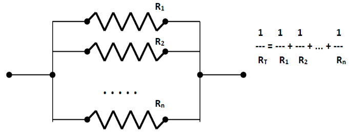

<link rel="stylesheet" type="text/css" href="../Inicio/estilo.css" media="screen" />

# Sintaxis de C. Programación Estructurada: instrucción de control de  repetición I

## Temporización

4 horas (1.5 Presenciales + 2.5 No presenciales)

## Seguimiento

[Enlace a autoevaluación](../Seguimientotrabajos.md)


## Objetivos
- Conocer la sintaxis básica del lenguaje de programación C: tipos de datos, constantes, variables, operadores, instrucciones de asignación y de control. Identificar algunas características genuinas de este lenguaje de programación.
- Conocer las principales funciones de la biblioteca estándar de C para la entrada/salida de información por el terminal así como para cálculos matemáticos básicos.
- Implementar algoritmos sencillos que hagan uso de las construcciones estructuradas de control (programación estructurada): secuencia, selección y repetición.
- Identificar y corregir errores sintácticos del lenguaje de programación C que surgen durante la codificación.
- Utilizar adecuadamente la función scanf para la entrada de datos al programa a través del teclado.
- Presentar adecuadamente en pantalla los resultados de salida de un programa mediante la función printf. 
- Probar con datos operacionales la correctitud de los programas desarrollados e identificar y corregir los errores lógicos que surjan.


## Competencias a desarrollar

- [X]	RD1: Poseer y comprender conocimientos
- [X]	RD2: Aplicación de conocimientos
- [X]	UAL1: Conocimientos básicos de la profesión
- [X]	UAL3: Capacidad para resolver problemas
- [X]	UAL6: Trabajo en equipo
- [X]	FB3: Conocimientos básicos sobre el uso y programación de los ordenadores, sistemas operativos, bases de datos y programas informáticos con aplicación en la ingeniería.


## Tareas a realizar

Desarrollar los programas correspondientes a los 6 ejercicios propuestos en esta ficha de trabajo 

## Plan de trabajo

**Lectura** individual de la ficha de trabajo por parte del alumno. 
Estudio, codificación y prueba (individual o por parejas) de los ejemplos presentados en teoría de la instrucción de control secuencial (el código fuente en C se encuentra en esta ficha de trabajo).

**Diseño e implementación en C**: Realización individual (o por parejas) de los 6 ejercicios propuestos previa distribución del trabajo entre los miembros del equipo de acuerdo con el siguiente esquema (grupos de 3 ó 4 miembros) sobre los repositorios compartidos:

- A - ejercicios 1,4                     A,B - ejercicios 1,3,5
- B - ejercicios 2,5                     C,D - ejercicios 2,4,6
- C - ejercicios 3,6

    Nota: para la implementación en lenguaje C de los programas correspondientes a los algoritmos diseñados, puede utilizar las plantillas genéricas de programas que encontrará en esta ficha de trabajo (o bien puede utilizar cualquiera de los programas de ejemplo), con el fin de optimizar la codificación en C de los archivos fuente.


**Reunión del equipo base**: cada miembro (o pareja de miembros) explica su trabajo realizado a los otros miembros del equipo y recibe la explicación del trabajo de los otros miembros. Objetivo: cada integrante del equipo debe saber resolver cualquiera de los ejercicios planteados.

**Pruebas**: los programas desarrollados serán validados de forma cruzada por los miembros del equipo utilizando como mínimo los datos de prueba suministrados, de acuerdo con el siguiente esquema:

- A - ejercicios 3,5                     A,B - ejercicios 2,4,6
- B - ejercicios 1,6                     C,D - ejercicios 1,3,5
- C - ejercicios 2,4

    Nota: en caso de detectar errores en esta fase de pruebas, estos deberán ser corregidos por los miembros del equipo que las realicen, modificando el código fuente y/o el algoritmo correspondiente. 

**Reunión del equipo base**: Configuración definitiva del repositorio. Cada miembro del equipo repoducirá en su repositorio individual el trabajo realizado por el resto de los miembros del equipo.


## Estrategias para el diseño de bucles

Escribir las primeras iteraciones e intentar descubrir el invariante:	
- ¿Qué se repite? --> cuerpo del bucle
- ¿Cuántas veces se repite? --> control del bucle


Bucles básicos

- Contador de iteraciones	

		i<--1
		Mientras (i≤N) Hacer
			{ Cuerpo del bucle }
			i<--i+1
		Fin_Mientras

- Centinela

		Leer(dato)
		Mientras(dato≠CENTINELA) Hacer
			{ Cuerpo del bucle }
			Leer(dato)
		Fin_Mientras

- Indicador de evento
	
		indicador<--falso
		Mientras(no(indicador)) Hacer
			{ Cuerpo del bucle: en alguna iteración se }
			{ modifica el indicador: indicador<--verdadero }
		Fin_Mientras

## Sintaxis de C: construcción de control de repetición

- Repetición: while, do-while.
```c
		while(expresión){   			do{  instrucción;
	 	  instrucción;				}while(expresión);
		}
```
	while comprueba la expresión, y si el resultado es verdadero ejecuta instrucción; se sale de la repetición cuando expresión sea falsa (igual a 0).

	do-while ejecuta primero instrucción y luego comprueba la expresión; se sale de la repetición cuando expresión sea falsa.

	Nota: si el cuerpo del bucle (instrucción;) es una instrucción compuesta o bloque de instrucciones, debe ir encerrada entre llaves {}. Las llaves no son necesarias si se trata de una instrucción simple.

- Repetición: for.
```c
		for(exp1;exp2;exp3){
			instrucción;
		}
```
	exp1: inicialización. Puede haber más de una asignación separadas por comas.

	exp2: condición de comprobación para volver a ejecutar otra iteración del bucle.

	exp3: actualización. Puede haber más de una asignación separadas por comas.

	Puede faltar cualquier parte del bucle, pero los separadores ";" no pueden faltar. El operador "," se usa para separar las distintas asignaciones en exp1 y exp3; es el operador de más baja prioridad y es asociativo de izquierda a derecha (no confundirlo con la coma de las funciones ó de las declaraciones).


	
- Instrucciones break, continue, goto.

	break: 		obliga a salir de un bloque controlado por for, while, do-while ó switch.

	continue: 	pasa a la siguiente iteración (a la comparación en los bucles while y do-while, y a la re-actualización en los bucles for).
	
	goto: 		transferencia incondicional del control. Sintaxis:

			goto etiqueta;
			...
			etiqueta: instrucción;


### Ejemplos de programas con construcción de control de repetición 

#### Mayor temperatura
>   Construir un programa que calcule e imprima la mayor de un conjunto de datos de temperaturas introducidas por teclado. El número de datos es conocido a priori (se lee por teclado).

Diseño &ensp;&ensp;&ensp;   [  Mayor Temperatura.psc](https://github.com/MaterialesProgramacion/ProblemasProgramacion/blob/master/Iteracion/temperatura.psc)
Codificación &ensp;&ensp;&ensp;   [ TemperaturaMaxima.c](https://github.com/MaterialesProgramacion/ProblemasProgramacion/blob/master/Iteracion/temperaturaMaxima3_1.c)


#### Mayor temperatura con centinela
>    Construir un programa que calcule e imprima la mayor de un conjunto de datos de temperaturas introducidas por teclado. El número de datos no es conocido a priori, finalizándose la introducción de datos con el valor –999.

Diseño &ensp;&ensp;&ensp;   [  Mayor Temperatura.psc](https://github.com/MaterialesProgramacion/ProblemasProgramacion/blob/master/Iteracion/temperaturaCentinela.psc)
Codificación &ensp;&ensp;&ensp;   [ TemperaturaMaxima.c](https://github.com/MaterialesProgramacion/ProblemasProgramacion/blob/master/Iteracion/temperaturaMaxima3_2.c)

#### Fuerzas concurrentes
>    Construir un programa que calcule e imprima la resultante de un conjunto de fuerzas concurrentes. Las componentes espaciales de cada fuerza son introducidas por teclado de una en una, finalizándose la entrada de datos con una fuerza nula

Diseño &ensp;&ensp;&ensp;   [  fuerzasConcurrentes.psc](https://github.com/MaterialesProgramacion/ProblemasProgramacion/blob/master/Iteracion/fuerzasConcurrentes.psc)
Codificación &ensp;&ensp;&ensp;   [ fuerzasConcurrentes.c](https://github.com/MaterialesProgramacion/ProblemasProgramacion/blob/master/Iteracion/fuerzasConcurrentes.c)


#### Sucesión de Fibonacci
>    Construir un programa que calcule e imprima en pantalla el término n-ésimo
de la serie de Fibonacci, dado por teclado el número del término a calcular

Diseño &ensp;&ensp;&ensp;   [  fibonacci.psc](https://github.com/MaterialesProgramacion/ProblemasProgramacion/blob/master/Iteracion/fibonacci.psc)
Codificación &ensp;&ensp;&ensp;   [ fibonacci.c](https://github.com/MaterialesProgramacion/ProblemasProgramacion/blob/master/Iteracion/fibonacci.c)

#### Producto de Wallis
>    Construir un programa que calcule el producto de Wallis (expresión utilizada
en matemáticas para representar el valor de PI/2), hasta un factor tal que la diferencia en
valor absoluto entre dicho término y el número 1 sea inferior a un valor dado (precisión). El
programa leerá por teclado dicho valor de precisión, calculará el producto de Wallis hasta el
término correspondiente (sin incluirlo) utilizando la siguiente fórmula y presentará el resultado
en la pantalla

Diseño &ensp;&ensp;&ensp;   [  fibonacci.psc](https://github.com/MaterialesProgramacion/ProblemasProgramacion/blob/master/Iteracion/fibonacci.psc)
Codificación &ensp;&ensp;&ensp;   [ fibonacci.c](https://github.com/MaterialesProgramacion/ProblemasProgramacion/blob/master/Iteracion/fibonacci.c)

#### Sumatoria
>    Construir un programa que calcule e imprima en pantalla la sumatoria de n terminos de (i/2^i)
donde el número de sumandos se introduce por teclado.

Diseño &ensp;&ensp;&ensp;   [calculoSumatoria.psc](https://github.com/MaterialesProgramacion/ProblemasProgramacion/blob/master/Iteracion/3maccalculoSumatoria.psc)
Codificación &ensp;&ensp;&ensp;   [ calculoSumatoria.c](https://github.com/MaterialesProgramacion/ProblemasProgramacion/blob/master/Iteracion/calculoSumatoria.c)


#### Máximo Comun Divisor
>    Construir un programa que calcule e imprima en pantalla el máximo común
divisor de dos números enteros positivos introducidos por teclado

Diseño &ensp;&ensp;&ensp;   [maximoComunDivisor.psc](https://github.com/MaterialesProgramacion/ProblemasProgramacion/blob/master/Iteracion/maximoComunDivisor.psc)
Codificación &ensp;&ensp;&ensp;   [ maximoComunDivisor.c](https://github.com/MaterialesProgramacion/ProblemasProgramacion/blob/master/Iteracion/maximoComunDivisor.c)


_____

## EJERCICIOS A RESOLVER
_____

### **Ejercicio 1.** Multiplos de tres
> Diseñar un programa que calcule e imprima en pantalla la suma de todos los números impares múltiplos de 3 comprendidos entre 0 y n, dado un número entero positivo n por teclado.

**Datos de prueba**


|Entrada|Salida|
|---|---|
| Suma impares múltiplos de 3    [0,10]	  |	      12|
| Suma impares múltiplos de 3 [0,100]	|	    867
| Suma impares múltiplos de 3 [0,1000]	| 83667


### **Ejercicio 2.** Potencia de un número
> Diseñar un programa que calcule e imprima en pantalla la potencia de un número, dados por teclado el número base (real) y el exponente (entero).

**Datos de prueba**
|Entrada|Salida|
|---|---|
| 2<sup>10</sup>	|	1024.000
| 	3<sup>4</sup>	|	    81.000
| 	2<sup>-2</sup>	|	      0.250
| 	1<sup>0</sup>	|	      1.000
| 	0<sup>1</sup>	|	      0.000
| 	0<sup>0</sup>	|	Indeterminación
| 	0<sup>-1</sup>	|	Infinito


### **Ejercicio 3.** Factorial
> Diseñar un programa que calcule e imprima en pantalla el factorial de un número entero no negativo dado por teclado.

**Datos de prueba**
|Entrada|Salida|
|---|---|
| 0!	|	      1
| 	5!	|	  120
| 	7!	|	5040

Comprobar el mayor número del que se puede calcular su factorial en función del tipo de dato:
|Entrada|Salida|
|---|---|
 short 	|	    7!	
 int	|	  12!
 long	|	  12!
 float	|	  34!
 double	|	170!


### **Ejercicio 4.** 
> Diseñar un programa que dado por teclado un valor x mayor que –1 y menor que +1, calcule y presente en pantalla la siguiente suma:

		 S(x)=x-(x2/2)+(x3/3)-(x4/4)+.... (xn/n) 
1.	Para un valor n dado introducido por teclado.
2.	Hasta un sumando n (no incluido) tal que abs(xn/n)\<E,
		 donde el valor de E también se introduce por teclado.

**Datos de prueba**

- x=0.5 

				n=1    	S(x)=0.500000000000000
				n=5    	S(x)=0.407291666666667
				n=10    S(x)=0.405434647817460
				n=50   	S(x)=0.405465108108164
				n=100   S(x)=0.405465108108164
- x=-0.5
  
  				n=1    	S(x)=-0.500000000000000
   				n=5    	S(x)=-0.688541666666667
				n=10   	S(x)=-0.693064856150793
				n=50   	S(x)=-0.693147180559945
				n=100   S(x)=-0.693147180559945

-	x=0.5, 	

				E=0.1 	S(x)=0.375000000000000    		n=2
				E=0.01 	S(x)=0.401041666666667    		n=4
				E=1e-15   	S(x)=0.405465108108164    	n=44

- x=-0.5
  
  			   	E=0.1  		S(x)=-0.625000000000000    	n=2
				E=0.01 		S(x)=-0.682291666666667    	n=4
				E=1e-15    	S(x)=-0.693147180559944    	n=44

Nota: S(x)=ln(1+x)


### **Ejercicio 5.** Resistencia equivalente
> Diseñar un programa que calcule la resistencia equivalente de un conjunto de hasta un máximo de 100 resistencias en paralelo. El programa deberá leer por teclado las resistencias individuales en ohmios, de una en una y adecuadamente validadas, finalizando la entrada de datos bien cuando se introduzca un valor 0 para la resistencia o bien cuando se  haya introducido el nº máximo de resistencias, presentando en pantalla la resistencia equivalente en ohmios.



**Datos de prueba**
Nota: para las pruebas considerar que el número máximo de resistencias es 5.
Resistencias individuales (ohmios)	RT (ohmios)
|Entrada|Salida|
|---|---|
 5   0					| 5.000
 5   5   5   5   5		| 1.000
 5   -5   5   -5   0	| 2.500
 0						| No hay ninguna resistencia


### **Ejercicio 6.**  Media temperaturas
> Diseñar un programa que lea por teclado un conjunto de datos de temperatura en el intervalo [-50,+50], y que calcule su media aritmética y su desviación estándar. El tamaño del conjunto de datos no se especifica a priori, finalizándose la entrada de datos con el valor –99.

T<sub>media</sub>=  (ΣT<sub>i</sub>) /n

σ = ((Σ(T<sub>i</sub>-T<sub>media</sub>)<sup>2</sup>)/n)<sup>1/2</sup> = ((Σ(T<sub>i</sub><sup>2</sup>)-n*T<sub>media</sub><sup>2</sup>)/n)<sup>1/2</sup>

**Datos de prueba**

Datos de E:	4, 5, 5, 6, 5, 5, 5, 5,-99
- Nº de datos válidos: 8
- T<sub>media</sub>= 5.00
- σ = 0.50

Datos de E:	-5,0,5,10,-99
- Nº de datos válidos: 4
- T<sub>media</sub>= 2.50
- σ = 5.59

Datos de E:	-60,51,-99
- Nº de datos válidos: 0

------
## EJERCICIOS ADICIONALES
------
#### **1**
> Indicar los resultados que muestran en pantalla los siguientes fragmentos de programa, corrigiéndolos en caso de que no sean los resultados esperados:
``` c
printf("Introduzca un entero: ");
scanf(" %d",&a);
if(a=0)
   printf("El valor de a es igual a 0");
else
   printf("El valor de a es distinto de 0");
______________________________________________
temp=35.5;
if(temp>=0)
   if(temp>100)
      printf("Precaución: agua hirviendo");
else  printf("Precaución: agua congelada");
______________________________________________
double x;
x=100;
x=sqrt(x);
printf("La raiz vale: %.2d",&x);
```


    RESPUESTA:


#### **2**
> Explicar qué mensaje se presenta en pantalla cuando se ejecuta el siguiente fragmento de programa, suponiendo que i y suma son dos variables enteras. Comprobarlo construyendo un programa sencillo que incluya dicho código.
```c
	i=0;
	suma=0;
	while(i<10)
		i++;
		suma+=i;
	printf("la suma de los %d primeros enteros vale: %d\n",i,suma);
```


    RESPUESTA:


#### **3**
 > Suponer que **a**, **b** y **c** son variables de tipo **int**, **float** y **char**, respectivamente, y que tienen asignados los valores **a=5**, **b=6.1** y **c='x'**. Determinar el valor de las siguientes expresiones escritas en C, justificando brevemente la respuesta:
```c
2*a/(3 % a)					(a=4)&&((a=='5')||(a<=5))
(a==4)||(!((c>'a')&&(!(a!=8))))	(a++==(int)(b))||(c>'x') 
```

    RESPUESTA:


#### **4**
>  La función **toupper()** pertenece a una biblioteca estándar denominada  **ctype.h**. Listar un par de funciones contenidas en dicha biblioteca e indicar para qué se utilizan.

	RESPUESTA:

#### **5**
> ¿Para qué se utiliza la función **getch()**? ¿A qué biblioteca pertenece? ¿Es portable dicha función? ¿Qué diferencia hay entre esa función y la función **getche()**?


	RESPUESTA:
