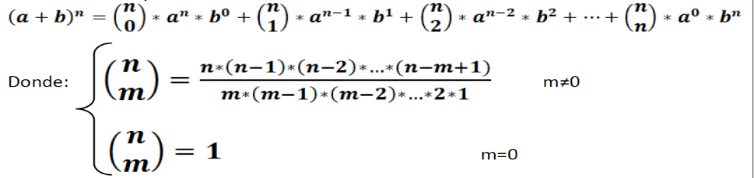
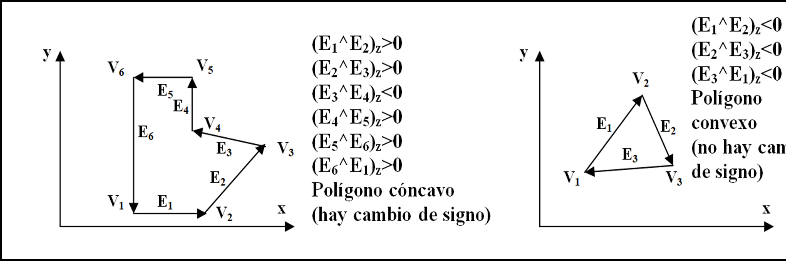
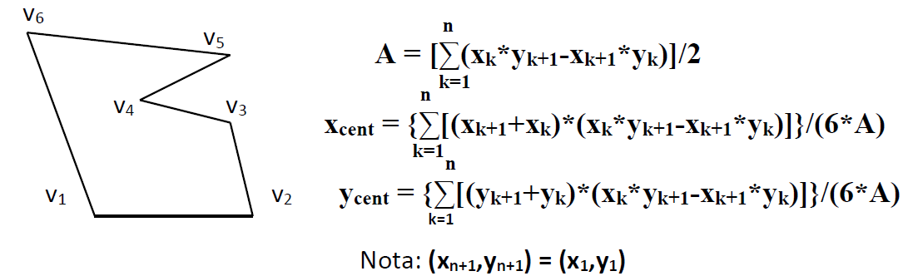
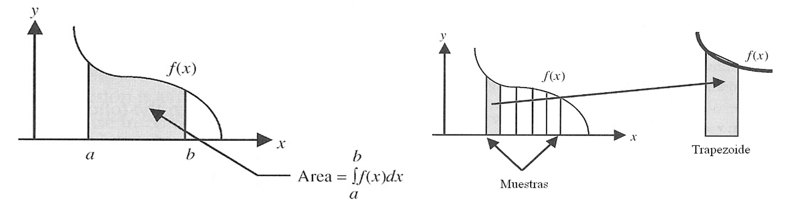

<link rel="stylesheet" type="text/css" href="../Inicio/estilo.css" media="screen" />

# Sintaxis de C. Programación Estructurada: instrucción de control de  repetición II

## Temporización

4 horas (1.5 Presenciales + 2.5 No presenciales)

## Seguimiento

[Enlace a autoevaluación](../Seguimientotrabajos.md)


## Objetivos
- Conocer la sintaxis básica del lenguaje de programación C: tipos de datos, constantes, variables, operadores, instrucciones de asignación y de control. Identificar algunas características genuinas de este lenguaje de programación.
- Conocer las principales funciones de la biblioteca estándar de C para la entrada/salida de información por el terminal así como para cálculos matemáticos básicos.
- Implementar algoritmos sencillos que hagan uso de las construcciones estructuradas de control (programación estructurada): secuencia, selección y repetición.
- Identificar y corregir errores sintácticos del lenguaje de programación C que surgen durante la codificación.
- Utilizar adecuadamente la función scanf para la entrada de datos al programa a través del teclado.
- Presentar adecuadamente en pantalla los resultados de salida de un programa mediante la función printf. 
- Probar con datos operacionales la correctitud de los programas desarrollados e identificar y corregir los errores lógicos que surjan.

## Competencias a desarrollar

- [X]	RD1: Poseer y comprender conocimientos
- [X]	RD2: Aplicación de conocimientos
- [X]	UAL1: Conocimientos básicos de la profesión
- [X]	UAL3: Capacidad para resolver problemas
- [X]	UAL6: Trabajo en equipo
- [X]	FB3: Conocimientos básicos sobre el uso y programación de los ordenadores, sistemas operativos, bases de datos y programas informáticos con aplicación en la ingeniería.


## Tareas a realizar

Desarrollar los programas correspondientes a los 6 ejercicios propuestos en esta ficha de trabajo 

## Plan de trabajo

**Lectura** individual de la ficha de trabajo por parte del alumno. 
Estudio, codificación y prueba (individual o por parejas) de los ejemplos presentados en teoría de la instrucción de control secuencial (el código fuente en C se encuentra en esta ficha de trabajo).

**Diseño e implementación en C**: Realización individual (o por parejas) de los 6 ejercicios propuestos previa distribución del trabajo entre los miembros del equipo de acuerdo con el siguiente esquema (grupos de 3 ó 4 miembros) sobre los repositorios compartidos:

- A - ejercicios 1,4                     A,B - ejercicios 1,3,5
- B - ejercicios 2,5                     C,D - ejercicios 2,4,6
- C - ejercicios 3,6

Nota: para la implementación en lenguaje C de los programas correspondientes a los algoritmos diseñados, puede utilizar las plantillas genéricas de programas que encontrará en esta ficha de trabajo (o bien puede utilizar cualquiera de los programas de ejemplo), con el fin de optimizar la codificación en C de los archivos fuente.


**Reunión del equipo base**: cada miembro (o pareja de miembros) explica su trabajo realizado a los otros miembros del equipo y recibe la explicación del trabajo de los otros miembros. Objetivo: cada integrante del equipo debe saber resolver cualquiera de los ejercicios planteados.

**Pruebas**: los programas desarrollados serán validados de forma cruzada por los miembros del equipo utilizando como mínimo los datos de prueba suministrados, de acuerdo con el siguiente esquema:

- A - ejercicios 3,5                     A,B - ejercicios 2,4,6
- B - ejercicios 1,6                     C,D - ejercicios 1,3,5
- C - ejercicios 2,4

    Nota: en caso de detectar errores en esta fase de pruebas, estos deberán ser corregidos por los miembros del equipo que las realicen, modificando el código fuente y/o el algoritmo correspondiente. 

**Reunión del equipo base**: Configuración definitiva del repositorio. Cada miembro del equipo repoducirá en su repositorio individual el trabajo realizado por el resto de los miembros del equipo.


## Estrategias para el diseño de bucles:
Escribir las primeras iteraciones e intentar descubrir el invariante:

Diseño del flujo de control
- ¿Cuál es la condición que termina el bucle?
- Inicialización y actualización de las variables que intervienen en dicha condición.
  
Diseño del proceso interior (cuerpo del bucle)
- ¿Cuál es el proceso que se repite?
- Inicialización y actualización de las variables que intervienen en dicha proceso.

Sub-tareas iterativas utilizadas frecuentemente en los cuerpos de los bucles
- Contadores: de iteración y de sucesos.
- Acumuladores (totalizadores) de sumas y de productos.
- Almacenar valores anteriores (máximo, mínimo, último, los dos últimos,…).


## Ejemplos de programas con construcción de control de repetición 

### Tabla de multiplicar
>    Construir un programa que imprima en pantalla la tabla de multiplicar de los 9 primeros números naturales.

Diseño &ensp;&ensp;&ensp; [tablaMultiplicarFinal.psc](https://github.com/MaterialesProgramacion/ProblemasProgramacion/blob/master/Iteracion/maximoComunDivisor.psc)

Codificación  &ensp;&ensp;&ensp;  [tablaMultiplicarFinal.c](https://github.com/MaterialesProgramacion/ProblemasProgramacion/blob/master/Iteracion/tablaMultiplicarFinal.c)


### Rectángulo con asteriscos
>    Construir un programa que imprima en pantalla mediante asteriscos las aristas de un rectángulo, dados por teclado las dimensiones del mismo, donde la base debe estar comprendida entre 3 y 40, y la altura entre 3 y 20. Ejemplos:

a=10
h=10
```
    * * * * * * * * * * * * * * *
    *                           *
    *                           *
    *                           *
    *                           *
    *                           *
    *                           *
    *                           *
    *                           *
    * * * * * * * * * * * * * * *
```

a=5
h=5
```
 * * * * *   
 *       *
 *       *
 *       *
 * * * * *
```
Diseño &ensp;&ensp;&ensp; [rectanguloAsteriscos.psc](https://github.com/MaterialesProgramacion/ProblemasProgramacion/blob/master/Iteracion/rectanguloAsteriscos.psc)

Codificación&ensp;&ensp;&ensp; [ rectanguloAsteriscos.c](https://github.com/MaterialesProgramacion/ProblemasProgramacion/blob/master/Iteracion/rectanguloAsteriscos.c)


### Tabla de senos
>    Construir un programa que imprima en pantalla las tablas de la función seno(n*x) para valores de n desde 1 hasta 10, y para valores de x de 0 a 90º con incrementos del ángulo de 0.1º.

Diseño &ensp;&ensp;&ensp;  [tablaSenos.psc](https://github.com/MaterialesProgramacion/ProblemasProgramacion/blob/master/Iteracion/tablaSenos.psc)

Codificación&ensp;&ensp;&ensp;  [ tablaSenos.c](https://github.com/MaterialesProgramacion/ProblemasProgramacion/blob/master/Iteracion/tablaSenos.c)


### Raiz Cuarta
>    Construir un programa que calcule e imprima en pantalla la raíz cuarta de un número real positivo introducido por teclado. El número de decimales del cálculo se introducirá también por teclado y deberá ser inferior o igual a 10.

### Triángulo de Tartaglia
>    Construir un programa que imprima en pantalla el triángulo de Tartaglia (también llamado triángulo de Pascal) dado por teclado el número de la última fila del mismo (con un máximo de 20 filas):

                  1                   Fila 0
                1   1                 Fila 1
              1   2   1               Fila 3
            1   3   3   1             Fila 4
          1   4   6   4   1           Fila 5
        1   5   10  10   5  1         Fila 6
      1   6  15  20  15   6   1       Fila 7
    1   7  21  35  35  21   7   1     Fila 8
                                      ...

Los extremos de cada fila del triángulo valen 1 y cada valor intermedio se obtiene sumando los dos números que están situados encima del mismo (en la fila anterior). Nota: los coeficientes de la fila n del triángulo se corresponden con los coeficientes del desarrollo de la potencia n-ésima del binomio de Newton:





### Convexidad de polígonos
> Construir un programa para identificar si un polígono es convexo (todos sus ángulos interiores son menores de 180º) o no (cóncavo) Se debe estudiar el cambio de signo de la componente z del producto vectorial de dos vectores de arista consecutivos. El programa solicitará por teclado el nº de vértices del polígono (mayor o igual a 3), así como las coordenadas bidimensionales (x,y) de cada uno de los vértices vi, procediendo a la identificación de la concavidad/convexidad del polígono e imprimiendo en pantalla el mensaje correspondiente. 
 
Ejemplos:




### Cuadrados perfectos
>    Construir un programa que dado un número entero positivo por teclado, imprima en pantalla todas las formas diferentes en que puede expresarse dicho número como la suma de cuatro cuadrados de enteros no negativos (teorema de los cuatro cuadrados de Lagrange). Ejemplo:

10 = 0<sup>2</sup> + 0<sup>2</sup> + 1<sup>2</sup> + 3<sup>2</sup> = 0 + 0 + 1 + 9
10 = 1<sup>2</sup> + 1<sup>2</sup> + 2<sup>2</sup> + 2<sup>2</sup> = 1 + 1 + 4 + 4

______
## EJERCIOS A RESOLVER
______

### **Ejercicio 1. Centroide**
> Diseñar un programa que calcule e imprima en pantalla el centroide de un objeto con forma poligonal (centroide: posición del centro de masas para un objeto con densidad uniforme). El número de lados del polígono (n) será leído previamente por teclado, comprobándose que es mayor o igual a 3, introduciéndose a continuación en orden la abscisa (x) y la ordenada (y) de cada uno de los n vértices del polígono.



**Datos de prueba**
|Nº de lados |Vértices|Centroide|
|---|---|---|
|3| (0,0), (10,0), (10,10)|(6.667,3.333)|
|4| (0,0), (10,0), (10,10), (0,10)| (5.000,5.000)|
|8| (0,0), (3,0), (3,1), (1,1), (1,2), (3,2), (3,4), (0,4)|(1.400,2.100)|


### **Ejercicio 2. Área bajo la curva**
> Diseñar un programa que integre la función **f(x)=x<sup>3</sup>-3x<sup>2</sup>+5** en un intervalo, esto es que calcule el área bajo la curva, mediante un proceso de muestreo en pasos discretos.



Área trapezoide=base*(h<sub>izq</sub>+h<sub>der</sub>)/2

El programa permitirá seleccionar el intervalo de integración y el valor del incremento (base).

**Datos de prueba**

|a	|b	|base|	Area|
|---|--|---|---|
|0|	2|	0.4|	6.000000|
|  |		|0.3|	5.995500|
| |	|	0.2|	6.000000|
|	|	|0.1|	6.000000|
|	|	|1e-2|	6.000000|
|	|	|1e-5|	6.000000|
|1.5|	4|	0.4|	|14.937250|
| |	|0.3|	14.794450|
| |	|0.2|	14.692450|
| |	|0.1|	14.631250|
| |	|1e-2|	14.609594|
| |	|1e-5|	14.609375|


### **Ejercicio 3. Raiz cero**

> Construir un programa que calcule una raíz (cero) de la función **f(x)=x<sup>5</sup>-x<sup>4</sup>+x<sup>3</sup>-3**, mediante el método de bisección. Dicho método se basa en el teorema de Bolzano que dice que si una función f(x) es continua y toma en los extremos de un intervalo [a,b] valores de signo opuesto, entonces la función admite al menos una raíz en dicho intervalo. Para el cálculo de la raíz, se parte del intervalo inicial [x<sub>izq</sub>x<sub>der</sub>], se calcula el punto medio x<sub>m</sub> y se evalúa el signo del producto f(<sub>izq</sub>)*f(x<sub>m</sub>):

- Si f(<sub>izq</sub>)*f(x<sub>m</sub>)<0 -- redefinir límite izquierdo del intervalo: x<sub>der</sub> -- x<sub>m</sub>
- Si f(<sub>izq</sub>)*f(x<sub>m</sub>)>0 -- redefinir límite derecho del intervalo: x<sub>izq</sub>x<sub>m</sub>
- Si f(<sub>izq</sub>)*f(x<sub>m</sub>)=0 -- hay una raíz en x<sub>m</sub>
  
El proceso anterior de reducción del intervalo a la mitad se repite hasta encontrar una raíz o bien hasta que el tamaño del intervalo sea menor que un valor de precisión E dado. En este último caso la raíz se aproxima por el valor central de dicho intervalo.

El programa deberá leer por teclado dos valores a y b que cumplan la condición del teorema de Bolzano, así como un valor positivo para la precisión (exactitud o error) E deseada, escribiendo en pantalla la raíz (x) y el valor correspondiente de la función (f(x)). Si los valores dados de a y b no cumplen la condición de Bolzano se volverán a leer por teclado solo en el caso de que sean distintos y ninguno de ellos sea una raíz. El programa se ejecutará de forma reiterada para un nuevo conjunto de datos de entrada, finalizando su ejecución cuando coincidan los límites izquierdo y derecho del intervalo.


**Datos de prueba**
|a|	b|	E|	raíz (x)|	f(x)|	Nº de iteraciones|
|---|----|----|----|----|---|
|-1	|1	|No cumple la condición del teorema de Bolzano|
|0|	1|	No cumple la condición del teorema de Bolzano|
|0|	2|	1e-15|	1.294864555957280|	0.000000000000001|	52|
|-10|	10|	1e-15|	1.294864555957280|	-0.000000000000002 | 	56|
|1	|1|	Fin de ejecución|


### **Ejercicio 4. Distancias**
> Diseñar un programa que lea por teclado las distancias recorridas por un coche y los tiempos empleados en los diferentes tramos de su trayectoria, y que calcule e imprima la velocidad media empleada en toda la trayectoria, así como el primer tramo donde se alcanzó la máxima velocidad media por tramo, presentando la misma en la pantalla.

**Datos de prueba**

Nº de tramos: 5

|Tramo|	Distancia recorrida (m)|	Tiempo empleado (sg)|
|---|----|---|
|1|	100|	  5|
|2	|200|	20|
|3	|300|	10|
|4	|250|	10|
|5	|150|	  5|

Velocidad media trayectoria: 20 m/sg

Tramo 3 (ó tramo 5) -- velocidad máxima por tramo: 30 m/sg

### **Ejercicio 5. Dibujar asteriscos**
> Diseñar un programa que lea por teclado un número natural menor de 20, y que imprima en pantalla bien un rombo de asteriscos si el número es impar, o bien un triángulo rectángulo si el número es par. Ejemplos:


n=5 
```
     *
   * * * 
 * * * * *
   * * *
     *
```

n=4 
  ```
  *
  * *
  * * *
  * * * *
  ```

**Datos de prueba**
````
n=1                       n=2
  *                       *
                          * *
  
````

````
n=3                       n=4
     *                    * 
   * * *                  * *
     *                    * * *
                          * * * *
````

 
```
n=5                       n=6
     *                    *
   * * *                  * *
 * * * * *                * * *
   * * *                  * * * *
     *                    * * * * *
                          * * * * * *
```

### **Ejercicio 6. **
> Dado un número natural menor de 20 presentar en pantalla un triángulo rectángulo con base y altura igual al número introducido y formado por los primeros números naturales escritos en orden inverso. Ejemplos:


```
n=5                       n=7
   15                     28
   14 13                  27 26
   12 11 10               25 24 23
   9  8  7  6             22 21 20 19
   5  4  3  2  1          18 17 16 15 14
                          13 12 11 10  9  8
                          7   6  5  4  3  2 1 
```


**Datos de prueba**

```
n=1                     n=3
   1                       6
                           5  4
                           3  2  1

n=5                       n=7
   15                     28
   14 13                  27 26
   12 11 10               25 24 23
   9  8  7  6             22 21 20 19
   5  4  3  2  1          18 17 16 15 14
                          13 12 11 10  9  8
                          7   6  5  4  3  2 1 
```


------
## EJERCICIOS ADICIONALES
------

### **1**
> ¿Está permitida en programación estructurada la utilización de la instrucción de control goto (transferencia incondicional del control)?


    RESPUESTA:

### **2**
> Traducir a lenguaje C los siguientes fragmentos de algoritmos:
```
n: entero
x: real
Repetir  Escribir("Introduzca x: ")
         Leer(x)
         Escribir("Introduzca n: ")
         Leer(n)
Hasta que ((x≥0)ó(n≥0))y(x≤10+n)
________________________________
i,j,cont: enteros
cont<-0
Desde i=1 hasta 100 Hacer
   cont<-cont+i
   Desde j=100 hasta i paso=-1 Hacer
      cont<-cont+1
   Fin_desde
Fin_desde
Escribir("Contador: ",cont);
```

    RESPUESTA:


### **3**
>  Implementar en C de tres formas diferentes el siguiente fragmento de algoritmo, utilizando las instrucciones de repetición do-while, while y for, respectivamente:
 ```
Var	x,z: real
	. . . . 
	Repetir	Escribir("Introduzca x: ")
			Leer(x)
			Escribir("Introduzca z: ")
			Leer(z)
			Hasta Que (x>0) y (z>0) y (x≠z)

```

    RESPUESTA:

### **4**
>  En el ejercicio 2, si se desea calcular el área encerrada por una función diferente (por ejemplo: f(x)=seno(x)*exp(-x)) con el eje de las abscisas en un intervalo determinado, ¿qué cambios debería realizar en el programa?


    RESPUESTA:

### **5**
 >  Considerar los seis siguientes fragmentos de instrucciones de repetición anidadas. Indicar en cada caso el nº de veces que se ejecuta la instrucción A:

```
Desde i=1 hasta n Hacer
   Instrucción_A
Fin_desde
Desde j=1 hasta n Hacer
   Instrucción_A
Fin_desde	Desde i=1 hasta n Hacer
   Desde j=1 hasta n Hacer
        Instrucción_A
   Fin_desde
Fin_desde	Desde i=1 hasta n Hacer
   Desde j=1 hasta n Hacer
       Desde k=1 hasta n Hacer
          Instrucción_A
       Fin_desde
   Fin_desde
Fin_desde
Desde i=1 hasta n Hacer
    Desde j=i hasta n Hacer
        Instrucción_A
    Fin_desde
Fin_desde	Desde i=1 hasta n Hacer
    Desde j=1 hasta n Hacer
        Instrucción_A
   Fin_desde
    Desde j=1 hasta n Hacer
        Instrucción_A
   Fin_desde
Fin_desde	Desde i=1 hasta n Hacer
  Desde j=1 hasta n Hacer
     Desde k=1 hasta n Hacer
        Desde l=1 hasta n Hacer
           Instrucción_A
         Fin_desde
     Fin_desde
  Fin_desde
Fin_desde
  ```


 ¿Existe alguna relación entre el nº de veces que se ejecuta la instrucción y el nº de instrucciones de repetición anidadas? 


    RESPUESTA:

