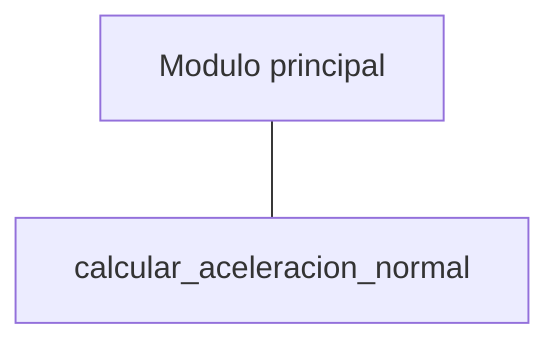
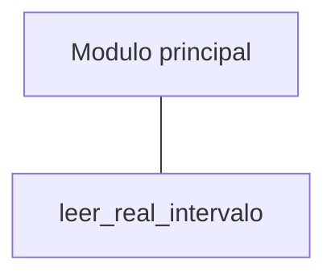
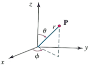
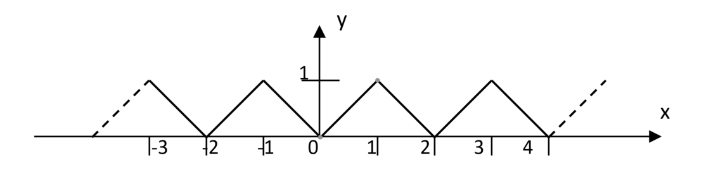
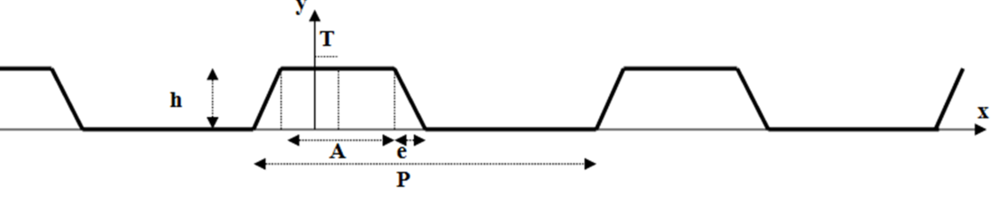
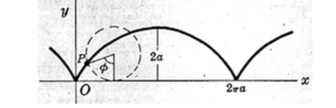

<link rel="stylesheet" type="text/css" href="../Inicio/estilo.css" media="screen" />


# Sintaxis de C. Diseño Modular: construcción de módulos y pruebas unitarias

## Temporización

4 horas (1.5 Presenciales + 2.5 No presenciales)

## Seguimiento

[Enlace a autoevaluación](../Seguimientotrabajos.md)


## Objetivos
- Conocer la estructura sintáctica de un programa modular en C:  definiciones de funciones, prototipos de funciones, bibliotecas de funciones, paso de parámetros, tipo de dato puntero, funciones como parámetros, tipos de almacenamiento automático, externo, estático y registro. 
- Implementar programas modulares en lenguaje de programación C. Identificar y corregir errores sintácticos que surgen durante la codificación.
- Construir módulos individuales (subprogramas), identificando su actividad funcional (entrada, salida, cálculo,...) y su interfaz para la comunicación de información con otros módulos (lista de parámetros formales + valor especial asociado al identificador del módulo). Distinguir entre parámetros de entrada y de salida. Documentar adecuadamente estos módulos mediante la notación sub-algorítmica.
- Descomponer un problema en sub-problemas, identificando a partir del enunciado del mismo la información a procesar y la lista de tareas de manipulación de información; organizar esta lista de tareas de forma jerárquica, descomponiendo tareas complejas en tareas más simples. Representar mediante un diagrama en forma de árbol la estructura del programa. 
- Resolver problemas sencillos mediante recursividad como alternativa a la construcción de repetición: expresar el problema de forma recursiva distinguiendo entre el caso general y el caso base.
- Utilizar módulos como parámetros con el objetivo de separar algunos algoritmos de cálculo de las funciones sobre las que actúan.
- Probar con datos operacionales la correctitud de los módulos individuales (pruebas unitarias) y de los programas desarrollados e identificar y corregir los errores lógicos que surjan.


## Competencias a desarrollar

- [X]	RD1: Poseer y comprender conocimientos
- [X]	RD2: Aplicación de conocimientos
- [X]	UAL1: Conocimientos básicos de la profesión
- [X]	UAL3: Capacidad para resolver problemas
- [X]	UAL6: Trabajo en equipo
- [X]	FB3: Conocimientos básicos sobre el uso y programación de los ordenadores, sistemas operativos, bases de datos y programas informáticos con aplicación en la ingeniería.


## Tareas a realizar

Desarrollar los programas correspondientes a los 6 ejercicios propuestos en esta ficha de trabajo 

## Plan de trabajo

- Explicación de la práctica por parte del profesor, lectura individual de la misma por parte del alumno y codificación y prueba (individual o por parejas) de los ejemplos que aparecen en esta ficha de trabajo.	30 mn
- Diseño preliminar: cada equipo deberá analizar cada uno de los ejercicios propuestos, y deberá identificar para cada subprograma propuesto su actividad funcional y su interfaz (lista de parámetros formales), indicando el tipo de subprograma que va a implementar (función o procedimiento).	30 mn
- Diseño e implementación en C: Realización individual (o por parejas) de los ejercicios propuestos (subprograma + módulo principal para las pruebas) previa distribución del trabajo entre los miembros del equipo de acuerdo con el siguiente esquema (grupos de 3 ó 4 miembros):  60 mn

  - A - ejercicios 1,4                     A,B - ejercicios 1,3,5
  - B - ejercicios 2,5                     C,D - ejercicios 2,4,6
  - C - ejercicios 3,6


- Reunión del equipo base: cada miembro (o pareja de miembros) explica su trabajo realizado a los otros miembros del equipo y recibe la explicación del trabajo de los otros miembros. Objetivo: cada integrante del equipo debe saber resolver cualquiera de los ejercicios planteados.	60 mn
- Pruebas: los programas desarrollados serán probados de forma cruzada por los miembros del equipo utilizando como mínimo los datos de prueba suministrados, de acuerdo con el siguiente esquema:

  - A - ejercicios 3,5                     A,B - ejercicios 2,4,6
  - B - ejercicios 1,6                     C,D - ejercicios 1,3,5
  - C - ejercicios 2,4

Nota: en caso de detectar errores en esta fase de pruebas, estos deberán ser corregidos por los miembros del equipo que las realicen.	30 mn

- Reunión del equipo base: elaboración conjunta de la documentación a presentar según modelo adjunto así como de la respuesta a las cuestiones planteadas en el mismo.	30 mn


## Ejemplos de construcción de módulos 

### Estrategia de construcción de un módulo
#### Diseño de un módulo	
- Leer detenidamente el enunciado del sub-problema.
- Asignar un nombre de identificador al módulo.
- Identificar la actividad funcional del módulo. Ésta se clasifica en entrada, salida, cálculo/transformación, control ó combinación de las anteriores.
- Identificar su interfaz (lista de parámetros formales): a través de la interfaz se establecen las transferencias o intercambios de información con otros módulos. En esta interfaz habrá que separar la información que recibe el módulo para poder hacer su trabajo (parámetros de entrada), de la información/resultados que salen del módulo (parámetros de salida).
- Establecer el tipo de módulo (función/procedimiento) en base a su interfaz. Si el módulo devuelve al menos un resultado, tendremos que decidir si un dato de salida se devuelve de forma especial a través del identificador del módulo (función) ó si todos se devuelven a través de la lista de argumentos (procedimiento).
- Diseñar el sub-algoritmo que resuelve el sub-problema.
#### Prueba del módulo
- Los subprogramas no se pueden ejecutar directamente. Para poder realizar pruebas unitarias de un módulo es necesario construir un programa completo que incluya dicho módulo.

 
### Ejemplos de diseño modular

#### Aceleración Normal

> Construir un subprograma que calcule la aceleración normal (o centrípeta) de una partícula con movimiento circular uniforme, dados por teclado la velocidad angular ω de la misma (rad/sg) y el radio R de la trayectoria (m), y que presente el resultado en pantalla (ejercicio 1 del Trabajo en cooperativo 2). Nota:  	a<sub>N</sub>=ω<sup>2</sub>R

- Nombre del módulo: 	calcular_aceleracion_normal

- Actividad funcional
  - El módulo a construir realiza varias actividades funcionales (entrada de ω y R por teclado, cálculo de a<sub>N</sub> y presentación de resultados en pantalla).

- Interfaz (lista de parámetros formales)	
  - El subprograma no comunica información con ningún otro subprograma. Todo su trabajo funcional lo realiza sin información de entrada por parte de otros módulos y no devuelve ningún resultado a otros módulos.
  El sub-programa a construir es de tipo procedimiento dado que no devuelve ningún valor especial asociado a su identificador de subprograma.

  Nota: este ejemplo lo único que pretende ilustrar es como se puede convertir un programa completo en un sub-programa sin argumentos.


- Diseño del módulo &ensp;&ensp;&ensp; [aceleracionNormalModular.psc](https://github.com/MaterialesProgramacion/ProblemasProgramacion/blob/master/DisModular/aceleracionNormalModular.psc)


- Prueba del módulo
    - Los subprogramas no se pueden ejecutar directamente. Para poder realizar pruebas unitarias de un módulo es necesario construir un programa completo que incluya dicho módulo. En nuestro caso vamos a construir un programa simple que consta de dos módulos, el módulo a probar y un módulo principal que activa dicho subprograma:


```
Algoritmo modulo_principal()
Var	c: carácter
Inicio	Repetir	calcular_aceleracion_normal()
		Escribir("Ejecutar de nuevo (s/n)? ")
		Leer(c)
	Hasta_que (c='N')ó(c='n')
Fin_algoritmo_principal
```


- Codificación  &ensp;&ensp;&ensp;  [aceleracionNormalModular.c](https://github.com/MaterialesProgramacion/ProblemasProgramacion/blob/master/DisModular/aceleracionNormalModular.c)


#### Leer real en intervalo
> Construir un subprograma que devuelva un número real introducido por teclado, cuyo valor esté comprendido en un intervalo, dados los extremos de dicho intervalo en cualquier orden; si ambos extremos del intervalo coinciden, devolver directamente dicho valor sin ningún procesamiento adicional.

- Nombre del módulo:	leer_real_intervalo
- Actividad funcional	
  - La tarea funcional del módulo consiste en leer por teclado un nº real con la restricción de que dicho número esté comprendido dentro de un intervalo de dos valores reales. Nótese que este módulo tiene una funcionalidad limitada y específica (módulo de entrada de datos).

- Interfaz (lista de parámetros formales):
  -	Para poder realizar su trabajo funcional, este módulo requiere que se le indique a priori los extremos del intervalo, y el resultado que devuelve al módulo llamador es el dato (adecuadamente validado) introducido por teclado:

    E: a,b (real)  { extremos del intervalo }

    S: x (real)      { número leído por teclado }

  - El sub-programa se va a construir como un procedimiento (no devuelve ningún valor especial asociado a su identificador de subprograma). El único resultado se devuelve a través de la lista de parámetros formales.

- Diseño 
   - En el diseño del módulo se debería tener en cuenta la posibilidad de que los extremos del intervalo se den en cualquier orden (habría que ordenarlos dentro del módulo a construir), así como de que estos coincidan (en cuyo caso no se lee nada por teclado y se devuelve directamente uno de estos extremos):
  - &ensp;&ensp;&ensp; [LeerRealIntervalo.psc](https://github.com/MaterialesProgramacion/ProblemasProgramacion/blob/master/DisModular/leerRealIntervalo.psc)

- Prueba del módulo	
  - Los subprogramas no se pueden ejecutar directamente. Para poder realizar pruebas unitarias de un módulo es necesario construir un programa completo que incluya dicho módulo. En nuestro caso vamos a construir un programa simple que consta de dos módulos, el módulo a probar y un módulo principal que activa dicho subprograma:




```
Algoritmo modulo_principal()
Var	c: carácter
	a,b,x: real
Inicio	Repetir Escribir("LECTURA NUMERO INTERVALO ")
		Escribir("Introduzca limites del intervalo: ")
		Escribir("Izquierdo: ")
		Leer(a)
		Escribir("Derecho: ")
		Leer(b)
		leer_real_intervalo(a,b,x)
		Escribir("Numero leido: ",x)
		Escribir("Ejecutar de nuevo (s/n)? ")
		Leer(c)
	Hasta_que (c='N')ó(c='n')
Fin_algoritmo_principal
```

- Codificación  &ensp;&ensp;&ensp;  [LeerRealIntervalo.c](https://github.com/MaterialesProgramacion/ProblemasProgramacion/blob/master/DisModular/leerRealIntervalo.c)


## Tipos de almacenamiento

Las variables en C representan posiciones de la memoria central de la computadora que son referenciadas mediante un nombre de identificador de la variable (en lugar de por su dirección física de memoria) y que vienen caracterizadas por su tipo de datos y por su tipo de almacenamiento. Ambas características se establecen en la declaración de la variable:

	tipo_almacenamiento  tipo_datos  nombre_variable;

El tipo de almacenamiento se refiere la permanencia de la variable y a su ámbito dentro del programa (parte del programa en la que se reconoce la variable). Existen 4 tipos de especificaciones de almacenamiento: automática, externa, estática y registro, identificadas respectivamente por las palabras reservadas: auto, extern, static y register.

*Variables automáticas*: se declaran siempre dentro de la función y son locales a la función donde han sido declaradas: su ámbito está confinado a esa función, por lo que variables automáticas definidas en diferentes funciones serán independientes unas de otras aunque tengan el mismo nombre. 

Cualquier variable declarada dentro de una función se interpreta como una variable automática a menos que se incluya dentro de la declaración un tipo distinto de almacenamiento. Esto incluye también la declaración de los parámetros formales. No es necesaria la palabra reservada auto al principio de cada declaración de variable y normalmente no se incluye.

	Se pueden asignar valores iniciales a las variables automáticas directamente en su declaración o en cualquier instrucción de la función. Tales valores se reasignarán cada vez que se ejecute la función. Si una variable automática no es inicializada de alguna manera, su valor inicial será impredecible y probablemente incomprensible.

	Una variable automática no mantiene su valor cuando se transfiere el control fuera de la función en que está definida. Por tanto, cualquier valor asignado a una variable automática dentro de una función se perderá una vez que se sale de la función.

*Variables externas*: están definidas fuera de cualquier función y su ámbito se extiende desde el punto de definición o declaración hasta el resto del archivo fuente.  A veces de les denomina variables globales dado que pueden ser reconocidas por cualquier función que caiga dentro de su ámbito. Estas variables mantienen sus valores asignados dentro de su ámbito: se les puede asignar un valor dentro de una función y usar dicho valor en otra función (mecanismo de transferencia de información entre funciones sin usar argumentos).

Hay que distinguir entre definición y declaración de una variable externa: 

	    Definición:		tipo var;

Se realiza solo una vez en alguno de los archivos fuente y fuera de las funciones, asignándose memoria y pudiéndose inicializar.

	Declaración:		extern tipo var;
	
Hace referencia a la variable en una función de otro archivo ó antes de su definición. No se asigna memoria, no siendo por tanto necesario especificar el tamaño de los arrays.

*Variables estáticas*: son variables que mantienen su valor. Se declaran con el prefijo static. Pueden ser de dos tipos:

- Internas: están declaradas dentro de una función y su ámbito es local como las variables automáticas, pero tienen una existencia permanente (retienen su valor en las sucesivas activaciones de la función) y constituyen un medio permanente y privado de almacenamiento en una función. 

	Declaración: ```static tipo variable;```

- Externas: son conocidas sólo en el resto del archivo en el que están definidas; se definen fuera de las funciones y constituyen un almacenamiento oculto al resto del programa.

Las funciones también pueden ser estáticas (por defecto son externas, esto es, son visibles a lo largo de todo el programa), siendo por tanto inaccesibles desde fuera del archivo en que se definen.

*Variables registro*: Son variables muy usadas que conviene tenerlas en registros máquina:

	register tipo var;

Solo aplicables a variables automáticas y a parámetros formales de una función. Solo para variables enteras.

	Reglas para la inicialización de las variables:

- Inicializaciones implícitas:

| | |  
|----|------|
|externas y estáticas	|		0|
|automáticas y registro	|		valor indefinido|

-	Inicializaciones explícitas:

| | | |
|---|---|--|
|variables simples		|	al declararlas|
| |externas y estáticas	|	una vez al compilar|
|| automáticas y registro	|	cualquier expresión válida, cada vez que se entra en su función ó bloque
|arrays automáticos		||	no se pueden inicializar|
|arrays externos y estáticos: 	||	Ejemplo:|
|||							int cifras[10]={0,1,2,3,4,5,6,7,8,9};|
|cadenas de caracteres:|| 			Ejemplo:
|||     char saludo[10]="hola";  ó
|||     char saludo[10]={'h','o','l','a'};


## El preprocesador de C

Somete el código fuente a una serie de procesos especiales (directivas) antes de enviarlo al compilador. Las líneas destinadas al preprocesador van marcadas con el signo # delante, no finalizan en ; y pueden continuar en la línea siguiente usando el caracter \. Algunas de las opciones disponibles son:

-	Constantes simbólicas:	```#define NOMBRE cadena_recambio```
	Las constantes simbólicas, también llamadas macros, se sustituyen literalmente por su cadena de recambio (valor, constante, expresión con otras macros,...) en los lugares del programa fuente donde aparezca antes de la compilación. La sustitución es literal (salvo cuando la macro está entre comillas) y hay que tener cuidado cuando hay operaciones: incluir paréntesis en la definición de la macro.
-	Macro con argumentos:		```#define NOMBRE(argumentos) cadena_recambio```
	Una macro con argumentos se parece a una función, con la salvedad de que la sustitución de los argumentos es literal (¡cuidado con las operaciones!), mientras que en las funciones los argumentos son valores que se pasan ya calculados.
	Ejemplo:	```#define CUBO(x)  ((x)*(x)*(x))```
-	Incluir un grupo de definiciones de macros, trozos de programas, funciones, cabeceras (".h"),...:
	```#include "nombre_archivo"```

	ó	```#include <nombre_archivo>```
-	Rango de validez de las macros:
	``` #define ```...	si se redefine una macro, se toma la última definición
	```#undef ```...	volvemos a la definición anterior de la macro (controlamos la asignación a realizar)
-	Instrucciones de selección para ajustar la compilación a distintos sistemas (si está definida ó no una macro, si su valor es igual a un valor dado,...):

```
#ifdef MACRO		#ifndef MACRO		#if MACRO==cadena
....			....				....
....			....				....
#else			#else				#else
....			....				....
....			....				....
#endif			#endif				#endif
```
________
## EJERCIOS A RESOLVER
_____________

Construcción de módulos: para cada uno de los siguientes ejercicios, construir un módulo que se ajuste a la especificación dada, identificando sus parámetros de entrada y  de salida e indicando el tipo de módulo a construir (función o procedimiento). Escribir a continuación un programa sencillo para probar el módulo.


### **Ejercicio 1**
> Construir un subprograma para pasar de coordenadas cartesianas a esféricas.



r=√(x^2+y^2+z^2 )

x=r*sen(θ)*cos⁡(ϕ)

y=r*sen(θ)*sen⁡(ϕ)

z=r*cos(θ) 

θ: ángulo polar o colatitud: [0,π]

φ: ángulo azimutal: [0,2*π]

**Datos de prueba**
|  | | |  |  |  |
|---|---|---|----|----|---|
|(x,y,z):	| (0,0,0)|     (-1,-1,0)   | (1,1,1) |  (1,1-1) |    (0,0,-1)|
|(r,θ,Φ): |(0,0,0) | (1.41,90,225) | (1.73,54.74,45) | (1.73,125.26,45) | (1,180,0)| 


### **Ejercicio 2**

> Construir un subprograma que devuelva las soluciones del siguiente sistema de ecuaciones:
 
 a<sub>1</sub>*x+b<sub>1</sub>*y+c<sub>1</sub>=0
 
 a<sub>2</sub>*x+b<sub>2</sub>*y+c<sub>2</sub>=0

**Datos de prueba**


a<sub>1</sub>| b<sub>1</sub> | b<sub>1</sub> |a<sub>2</sub> |b<sub>2</sub> |c<sub>2</sub>| x | y| Código resultante
|---|---|---|----|----|---|---|---|---|
1	|1	|0	|1|	-1|	1	|-0.5|	0.5	|'C' (sist. compatible determinado)|
1	|1	|1	|2	|2	|2	|		'M' (sist. compat. indeterminado)|
1	|1|	1|2	|2	|3|			'I' (sistema incompatible)|
0|	0|	0|	1|	1|	1|			'M' (sist. compat. indeterminado)|
0	|0|	0|	0|	0|	1|			'I' (sistema incompatible)|
|0|	0|	0|	0|	0|	0|1			'0' (igualdades 0=0)


### **Ejercicio 3**
> Construir un subprograma que calcule y devuelva el momento de inercia de un cilindro hueco de masa **m**, de radio exterior **a**, radio interior **b** y altura **h**, alrededor de un eje de rotación (especificado este mediante un carácter). Suponer el cilindro como un cuerpo rígido que tiene densidad uniforme.
| | | |
|--|--|--|
|eje de rotacion| Momento de inercia|
'c'	|Eje del cilindro.	|m*(a2+b2)/2|
'p'|	Eje perpendicular al eje del cilindro y que pasa por el centro de masa.|	m*(3*a2+3*b2+h2)/12
'd'	|Eje que coincide con el diámetro en uno de los extremos.|	m*(3*a2+3*b2+4*h2)/12

**Datos de prueba**
m (kg)|	a (cm)	|b (cm)|	h (cm)|	Eje|	Momento de Inercia (kg*m<sup>2</sup>)
|--|--|--|--|--|--|
1.00|	20|	19|	100|	'c'|	0.038
1.00|	20|	19|	100|	'p'|	0.102
1.00|	20|	19|	100|	'd'|	0.352


### **Ejercicio 4**
> Construir un subprograma que dado un número real, devuelva el valor correspondiente de la siguiente función:



Ayuda: utilice las propiedades de simetría y de periodicidad para reducir el sub-algoritmo al intervalo [0,2] 

**Datos de prueba**
x|	y
|--|--|
0.5|	0.5
1.0	|1.0
1.3	|0.7
4.2	|0.2
-1.3|	0.7
-4.2|	0.2


### **Ejercicio 5**
> Construir una función que devuelva el valor de la función periódica pulso rectangular, dados como argumentos un número real x y los parámetros de la función **P** (periodo), **h** (altura), **A** (ancho), **e** (escalón) y **T** (desfase).
 




Ayuda: desplazar el valor de x a la izquierda una cantidad T, y aplicar simetría y periodicidad.
**Datos de prueba**
P	|h|	A|	e|	T|	x|	y
|--|--|--|--|--|--|--|
10|	1|	4|	1	|1|	2|	1
||||||					3.5|	0.5
||||||						-6.5	|0.5
||||||						55|	0
4	|1|	0|	1|	0|	-5.5|	0
||||||						3.5|	0.5
||||||						20.25|	0.75
||||||						-0.75|	0.25
4	|1|	4|	0|	0|	123.7|	1
||||||						-66.6|	1


### **Ejercicio 6**
> Diseñar una función que devuelva de forma aproximada el valor de la cicloide en un punto x, dados como argumentos un número real x en el intervalo (-∞,+∞) y el valor de a (>0):

 


Cicloide: curva descrita por un punto de una circunferencia de radio a cuando rueda sin resbalar sobre el eje X. 
Ecuaciones paramétricas:

	x = a * (Φ - sen(Φ))
	y = a * (1- cos(Φ))

Ayuda: a partir del valor de x calcular previamente el parámetro Φ mediante prueba y error con una precisión de 10-3

**Datos de prueba**

a|	x|	Cicloide
|--|--|--|
2|	1	|1.855
1|	3|	1.998
1|	3.1416|	2.000
1|	6.2832|	0.001


------
## EJERCICIOS ADICIONALES
------
Responder brevemente las siguientes cuestiones relativas al lenguaje de programación C:

### **1**
> 	¿Qué es un prototipo de función? ¿Con qué elemento de la documentación del diseño se corresponde? ¿Es obligatoria su inclusión en el código fuente?. ¿Para qué se utilizan?

    RESPUESTA:

### **2**
> ¿Qué es una definición de función?. ¿Con qué elemento de la documentación del diseño se corresponde?. ¿Cómo se pueden implementar (si ello es posible) los procedimientos en C si en este lenguaje de programación la pieza modular es la función?.
> 
    RESPUESTA:

### **3**
>  ¿Cuál es la finalidad de la palabra reservada void? ¿Dónde se utiliza? ¿Cuál es la finalidad de la instrucción return? ¿Se pueden incluir varias instrucciones return en una función?

    RESPUESTA:

### **4**
> Suponer que una función F1 llama a otra función F2 dentro de un programa en C. ¿Tiene importancia el orden en el que aparecen en el código fuente las definiciones de las dos funciones? Justificar la respuesta.

    RESPUESTA:

### **5**
> ¿Se puede llamar (activar) una función entera que tiene como argumentos dos parámetros reales de entrada y otros dos reales de salida desde más de un lugar en un mismo programa?. ¿Es posible llamarla pasándole como parámetros actuales cuatro expresiones de tipo real?. Justificar la respuesta.

    RESPUESTA:

### **6**
> 	Cuando se activa una función, ¿deben de coincidir los nombres de los parámetros reales de salida con los de los parámetros formales correspondientes? ¿Pueden coincidir los nombres de los parámetros formales de una función con los de otras variables definidas en la misma?

    RESPUESTA:

### **7**
> 	¿Qué es una variable puntero?. Describir su dominio (valores permitidos), la forma de asignarle valores a las mismas y un operador que actúe sobre dicha tipología.

    RESPUESTA:
