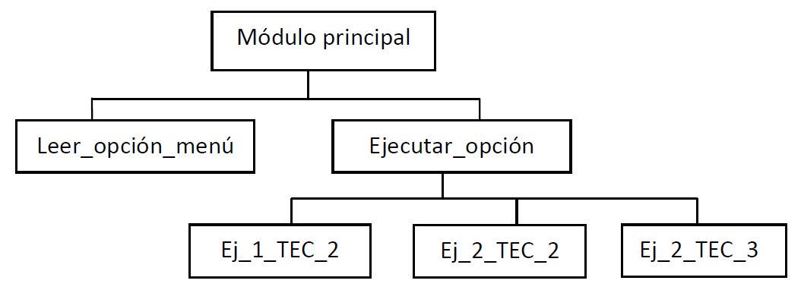
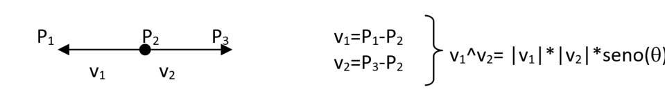
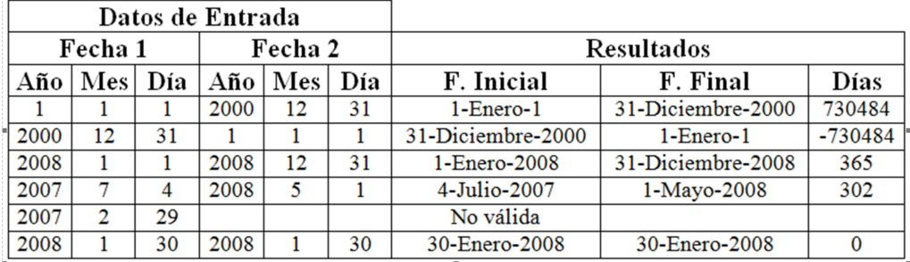
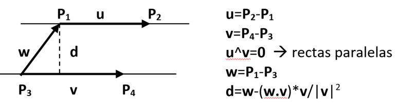
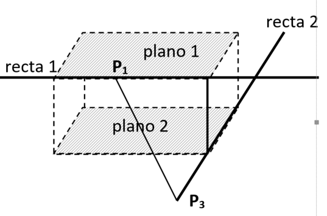
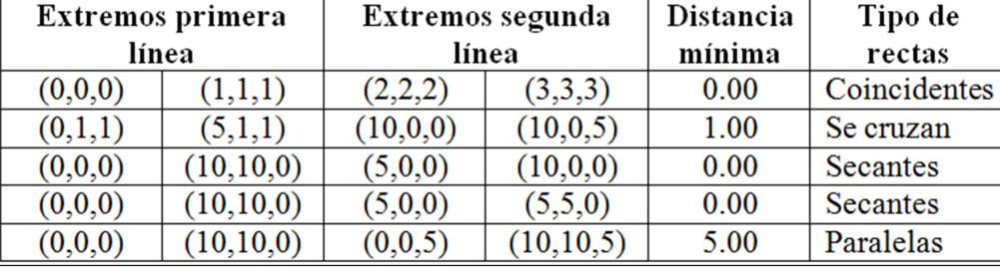

<link rel="stylesheet" type="text/css" href="../Inicio/estilo.css" media="screen" />

# Sintaxis de C. Diseño Modular: Descomposición Modular 

## Temporización

4 horas (1.5 Presenciales + 2.5 No presenciales)

## Seguimiento

[Enlace a autoevaluación](../Seguimientotrabajos.md)


## Objetivos

- Conocer la estructura sintáctica de un programa modular en C:  
definiciones de funciones, prototipos de funciones, bibliotecas de  funciones,  paso  de  parámetros,  tipo  de  dato  puntero,  funciones  como parámetros,  tipos  de  almacenamiento  automático,  externo,  estático  y registro.  

- Implementar programas modulares en lenguaje de programación C.  Identificar y corregir errores sintácticos que surgen durante la  codificación. 

- Construir módulos individuales (subprogramas), identificando su  actividad funcional (entrada, salida, cálculo,...) y su interfaz para la  comunicación  de  información  con  otros  módulos  (lista  de  parámetros formales + valor especial asociado al identificador del módulo). Distinguir  entre  parámetros  de  entrada  y  de  salida.  Documentar  adecuadamente estos módulos mediante la notación sub-algorítmica. 

- Descomponer  un  problema  en  sub-problemas,  identificando  a  partir  del  enunciado  del  mismo  la  información  a  procesar  y  la  lista  de  tareas  de  manipulación  de  información;  organizar  esta  lista  de  tareas  de  forma  jerárquica,  descomponiendo  tareas  complejas  en  tareas  más  simples.  Representar  mediante  un  diagrama  en  forma  de  árbol  la  estructura  del programa.

- Resolver  problemas  sencillos  mediante  recursividad  como  alternativa  a  la  construcción  de  repetición:  expresar  el  problema  de  forma  recursiva  distinguiendo entre el caso general y el caso base. 
  
- Utilizar  módulos  como  parámetros  con  el  objetivo  de  separar  algunos  algoritmos de cálculo de las funciones sobre las que actúan. 
  
- Probar con datos operacionales la correctitud de los módulos  individuales (pruebas unitarias) y de los programas desarrollados e  identificar y corregir los errores lógicos que surjan


## Competencias a desarrollar

- [X]	RD1: Poseer y comprender conocimientos
- [X]	RD2: Aplicación de conocimientos
- [X]	UAL1: Conocimientos básicos de la profesión
- [X]	UAL3: Capacidad para resolver problemas
- [X]	UAL6: Trabajo en equipo
- [X]	FB3: Conocimientos básicos sobre el uso y programación de los ordenadores, sistemas operativos, bases de datos y programas informáticos con aplicación en la ingeniería.

## Tareas a realizar

Desarrollar los programas correspondientes a los ejercicios propuestos en esta ficha de trabajo 

## Plan de trabajo

- Explicación de la práctica por parte del profesor y   desarrollo de dos ejemplos. Lectura individual de la misma  por parte  del alumno y codificación y prueba  (individual  o  por parejas) de los ejemplos que aparecen en esta ficha de  trabajo.  -30 mn 
- Análisis  +  Diseño  preliminar:  cada  miembro  del  equipo  realizará individualmente el análisis (pre-diseño) y el  diseño preliminar de uno de los tres ejercicios planteados: 
                 A -> ejercicio 1 
                 B -> ejercicio 2 
                 C, D -> ejercicio 3 
20 mn 

- Reunión  de  expertos:  cada  miembro  de  cada  equipo  se  reúne  con  los  miembros  homólogos  de  los  otros  equipos  para  discutir  entre  todos  la  solución  planteada  (diseño  preliminar) al ejercicio del que son responsables  -20 mn 

- Reunión del equipo base:  
   1. Cada miembro explica su solución a los otros dos  miembros  y  recibe  la  explicación  de  las  soluciones  de  los otros miembros. Objetivo: cada miembro del  equipo debe conocer la estrategia global de resolución  de cualquiera de los tres ejercicios.  
   2. Distribución del trabajo: los diferentes módulos  individuales a desarrollar serán asignados a los diferentes  miembros  del  equipo  procurando  que  cada  miembro participe en módulos de al menos dos de los  ejercicios propuestos.  - 20 mn 

- Diseño  detallado  +  Implementación:  cada  miembro  del equipo  diseñará  y  codificará  en  C  los  módulos  de  los  que es responsable.  - 90 mn 

- Combinación  (integración)  de  los  módulos  +  pruebas:  el  responsable de cada ejercicio construirá el correspondiente programa a partir de los diferentes módulos desarrollados y realizará las pruebas de correctitud con los datos suministrados, realizando las modificaciones pertinentes. - 30 mn 

- Reunión del equipo base: elaboración conjunta de la 
documentación a presentar según modelo adjunto así 
como  de  la  respuesta  a  las  cuestiones  planteadas  en  el 
mismo.  - 30 mn 
 
 
## Estrategia de resolución de los problemas 
- Análisis  
(Pre-diseño) 
    Leer enunciado detenidamente e identificar (mediante análisis 
gramatical de la narrativa del enunciado): 
    - Información  a procesar (sustantivos)  -> separar los elementos  de E y  de  S,  asignarles  un  identificador,  un  tipo  de  datos  y  posibles restricciones en sus valores. 
    - Tareas de manipulación de información (verbos, frases verbales) -> Lista de tareas -> descomponer las tareas complejas en tareas más simples ampliando sus descripciones incorporando detalles. 

- Diseño - 2 pasos 
  - 1) Diseño preliminar o arquitectónico 
    -   Diseño de datos: nuevas tipologías 
       Estructura del programa  diagrama de módulos  1 módulo por cada tarea diferente 

           Establece relaciones de dependencia (no de control) 
    -    Interfaces entre módulos: para cada módulo del diagrama: 
        Nombre o identificador 

            Breve descripción de su actividad funcional 

            Lista de parámetros formales 
  - 2) Diseño detallado o procedimental:   
            módulo -> sub-algoritmo

## Ejemplos resueltos

### 
>Construir un programa que presente al usuario un menú con las siguientes opciones disponibles:

>1.	Calcular la aceleración normal (o centrípeta) de una partícula con movimiento circular uniforme.
> 2.	Convertir grados centígrados a Fahrenheit.
> 3.	Calcular temperatura a partir de voltaje del sensor.
> 4.	Finalizar ejecución.

> El programa leerá por teclado la opción disponible y ejecutará las acciones pertinentes, tras las cuales se volverá a presentar el menú, finalizándose la ejecución del mismo al introducir la opción 4. 

Nota: las tres opciones del menú se corresponden con los ejercicios 1 y 2 del Trabajo en Equipo Cooperativo 2, y 2 del Trabajo en Equipo Cooperativo 3. Implementar directamente los programas de dichos ejercicios como módulos sin ninguna descomposición funcional adicional.

#### Análisis  (Pre-diseño)

##### Información Entrada: 

    opción del menú (carácter) (-> w,R/ºC/v , según opción)

#####  Información Salida: 

    (resultados de cada opción del menú) (-> an/ºF/T, según opción)

#####  Tareas: 
- Presentar en pantalla menú de opciones y leer opción del menú.
- Ejecutar opción seleccionada:
- Calcular aceleración normal (Ejercicio 1-TEC_2).
- Convertir grados centígrados en Fahrenheit (Ejercicio 2-TEC_2).
- Calcular temperatura a partir de voltaje del sensor (Ejercicio 2-TEC_3).

Nota: las tres últimas tareas no se descomponen en tareas más simples siguiendo las indicaciones del ejercicio.

#### Diseño

- Estructura de programa



- Interfaces entre módulos


|Nombre módulo	|Tipo parám.|	Nombre parám.|	Tipo de datos|
|--|--|--|--|
|Módulo principal|--|--|--|			
|Leer_opción_menú	|S|	Opción|	Carácter|
|Ejecutar_opción	|E|	Opción|	Carácter|
Ej_1_TEC_2			
Ej_2_TEC_2			
Ej_2_TEC_3			


- Diseño detallado

```
Algoritmo Módulo_principal
Var      c: carácter
Inicio   Repetir   Llamar a Leer_opcion_menu(c)
                             Llamar a Ejecutar_opcion(c)
             Hasta_que (c='4')
Fin_algoritmo_principal

Procedimiento Leer_opcion_menu(opción: carácter (S))
Inicio   Escribir("Menú de opciones: ")
             Escribir("1.- Calcular aceleración normal ")
             Escribir("2.- Convertir grados centígrados en Farenheit ")
             Escribir("3.- Calcular temperatura a partir de voltaje ")
             Escribir("4.- Finalizar ejecución")
             Escribir("      Introduzca opción:   ")
             Leer(opción)
Fin_procedimiento

Procedimiento Ejecutar_opcion(opción: carácter (E))
Inicio                    Según_sea (opción) Hacer
                             '1': Llamar a Ej_1_TEC_2()
                             '2': Llamar a Ej_2_TEC_2()
                             '3': Llamar a Ej_2_TEC_3()
                             Fin_según_sea
Fin_procedimiento

Procedimiento Ej_1_TEC_2()
Var	an,va,r: real
Inicio	Escribir("ACELERACION NORMAL (O CENTRIPETA)")
	Escribir("Introduzca velocidad angular (rad/sg): ")
	Leer(va)
	Escribir("Introduzca radio de la trayectoria (m): ")
	Leer(r)
	anva*va*r
	Escribir("La aceleracion normal vale: ",an, "m/sg2")
Fin_procedimiento

Procedimiento Ej_2_TEC_2()
.... { convertir programa 2 de TEC_2 en sub-programa }
Fin_procedimiento

Procedimiento Ej_2_TEC_3()
.... { convertir programa 2 de TEC_3 en sub-programa }
Fin_procedimiento

```


#### Codificación 
 &ensp;&ensp;&ensp;  [LeerRealIntervalo.c](https://github.com/MaterialesProgramacion/ProblemasProgramacion/blob/master/DisModular/menu.c)


#### Combinatorio

> Construir un programa que calcule e imprima el número de combinaciones c de n objetos tomados de m en m, donde los valores de n y m serán introducidos por teclado y adecuadamente validados.

Nota:
             
c = n!/  m! (n-m)! = c<sub>n,m</sub> = 
	           

Diseño  &ensp;&ensp;&ensp;  [combinatorio.psc](https://github.com/MaterialesProgramacion/ProblemasProgramacion/blob/master/DisModular/combinatorio.psc)


Codificación  &ensp;&ensp;&ensp;  [combinatorio.c](https://github.com/MaterialesProgramacion/ProblemasProgramacion/blob/master/DisModular/combinatorio.c)


#### Sumatorio

> Construir un programa que calcule e imprima en pantalla la siguiente suma para un número real dado, donde el número de sumandos se introduce por teclado:

````
     	               n
	  S(x) = ex =  1 + ∑  (xi/i!) 
		              i=1
````


Codificación  &ensp;&ensp;&ensp;  [combinatorio.c](https://github.com/MaterialesProgramacion/ProblemasProgramacion/blob/master/DisModular/sumaSerie.c)

______
## EJERCIOS A RESOLVER
_____
### **Ejercicio 1**
> Construir un programa que lea por teclado las coordenadas bidimensionales de 3 puntos diferentes no colineales (que no estén en la misma línea recta), y que calcule e imprima en pantalla el centro y el radio de la circunferencia que definen.

Nota: centro **(xc,yc)** y radio **r** de la circunferencia que pasa por 3 puntos no colineales **(x1,y1)**, **(x2,y2)** y **(x3,y3)**:

y<sub>c</sub>=[(x<sub>1</sub>-x<sub>3</sub>)*(x<sub>1</sub>-x<sub>2</sub>)*(x<sub>2</sub>-x<sub>3</sub>)+(x<sub>1</sub>-x<sub>3</sub>)*(y<sub>1</sub><sup>2</sup>-y<sub>2</sub><sup>2</sup>)-(x1-x2)*(y<sub>1</sub><sup>2</sup>-y<sub>3</sub><sup>2</sup>)]/[2*(x<sub>1</sub>-x<sub>3</sub>)*(y<sub>1</sub>-y<sub>2</sub>)-2*(x<sub>1</sub>-x<sub>2</sub>)*(y<sub>1</sub>-y<sub>3</sub>)]

x<sub>c</sub>=[(y<sub>1</sub>-y<sub>3</sub>)*(y<sub>1</sub>-y<sub>2</sub>)*(y<sub>2</sub>-y<sub>3</sub>)+(y<sub>1</sub>-y<sub>3</sub>)*(x<sub>1</sub><sup>2</sup>-x<sub>2</sub><sup>2</sup>)-(y<sub>1</sub>-y<sub>2</sub>)*(x<sub>1</sub><sup>2</sup>-x<sub>3</sub><sup>2</sup>)]/[2*(y<sub>1</sub>-y<sub>3</sub>)*(x<sub>1</sub>-x<sub>2</sub>)-2*(y<sub>1</sub>-y<sub>2</sub>)*(x<sub>1</sub>-x<sub>3</sub>)]

r<sup>2</sup>=(x<sub>1</sub>-x<sub>c</sub>)<sup>2</sup>+(y<sub>1</sub>-y<sub>c</sub>)<sup>2</sup>

Nota: para comprobar que 3 puntos en el plano están o no en la misma línea, formar dos vectores con los mismos, calcular el producto vectorial y si este es el vector nulo entonces los 3 puntos están alineados en línea recta:



**Datos de prueba**
|(x<sub>1</sub>,y<sub>1</sub>)	|(x<sub>2</sub>,y<sub>2</sub>)|	(x<sub>3</sub>,y<sub>3</sub>)	|(x<sub>c</sub>,y<sub>c</sub>)|	r|
|---|---|---|---|---|
(0,5)|	(5,0)|	(0,-5)|	(0.00,0.00)	|  5.00
(0,0)|	(5,5)|	(10,10)		
(0,0)|	(2,2)|	(10,8)	|(33.00,-31.00)|	45.28


### **Ejercicio 2**
> Construir un programa Construir un programa que calcule el número de días transcurridos entre dos fechas dadas. El programa leerá por teclado dos fechas adecuadamente validadas, solicitando de cada una de ellas el año (1-2015), el mes (1-12) y el día (1-28/29/30/31),  calculará el nº de días transcurridos entre las mismas e imprimirá en pantalla el resultado con su signo (negativo indica que la segunda fecha es anterior a la primera) según el formato indicado en los siguientes ejemplos:

Datos|de entrada	|Resultados
|--|----|----|
Fecha 1|	Fecha 2|	
Año:        1|Año:  2000| Fecha inicial:      1-Enero-1
Mes:        1|Mes:      12|Fecha final:       31-Diciembre-2000
Día:         1|Día:       31	|Días Transcurridos: 730484
Año:  2008 | Año:  2008| Fecha inicial:      1-Enero-2008
Mes:        1 |Mes:      12| Fecha final:       31-Diciembre-2008
Día:         1	|Día:       31	| Días Transcurridos: 365

Nota: los años bisiestos son todos los múltiplos de 4, excepto los múltiplos de 100 menos los múltiplos de 400. Ejemplos: 4, 8, 12, 400, 2000,... son años bisiestos; 100, 200, 300, 1000, 1900,... no lo son.

Sugerencia: calcular el nº de días transcurridos entre una fecha y el 1-Enero-1 (fecha de referencia).

**Datos de prueba**



### **Ejercicio 3**
> Construir un programa que calcule la distancia mínima entre dos líneas rectas en el espacio. El programa leerá por teclado las coordenadas tridimensionales de 2 parejas de puntos diferentes (cada pareja define una recta), calculará la distancia mínima e imprimirá en pantalla el resultado, indicando además si las rectas son paralelas, coincidentes, secantes o si se cruzan sin intersectar entre si.

Nota 1: cálculo de la distancia mínima si las dos rectas son paralelas:



Nota 2: cálculo de la distancia mínima si las dos rectas no son paralelas



n=u^v es vector perpendicular a las dos rectas (establece la dirección de la distancia mínima)
Ecuaciones de los planos 1 y 2 (perpendiculares a n y que contienen respectivamente a las rectas 1 y 2):
nx*x+ny*y+nz*z+d1=0      d1=-n.P1

nx*x+ny*y+nz*z+d2=0      d2=-n.P3

Distancia entre dos planos paralelos:

w=P1-P3

d=abs(w.n/|n|)=abs((d2-d1)/|n|)


**Datos de prueba**



-----
## EJERCICIOS ADICIONALES
-----
### **1**
>	Ejecute el segundo ejemplo presentado en esta ficha de trabajo (cálculo de combinaciones) con los siguientes datos de prueba suministrados y realice las modificaciones indicadas.

|n	|m|	c|
|--|--|--|
|10	|1|	10
|10	|3|	120
|10	|5|	252
|10	|7|	120
|10	|10|	1
|100	|50|	100891344545564149000000000000
|200|	100|	9.0548514656103381e+58     (*)|

(*) En lugar de usar la función factorial, usar un acumulador de productos: 

 C<sub>n,k</sub> = [n*(n-1)*...*(m+1)]/[(n-m)*(n-m-1)*...*1] = [(n-k+1)/k] * C<sub>n,k-1</sub>


    RESPUESTA:


### **2**
>	Modificar el ejemplo presentado en la sesión de Grupo Docente cuyo código fuente está en esta ficha, de manera que la función **calcular_suma** sea más eficiente (O(n<sup>2</sup>) -> O(n)), calculando para ello cada término de la suma a partir del anterior sin usar las funciones **potencia** y **factorial**.


    RESPUESTA:
