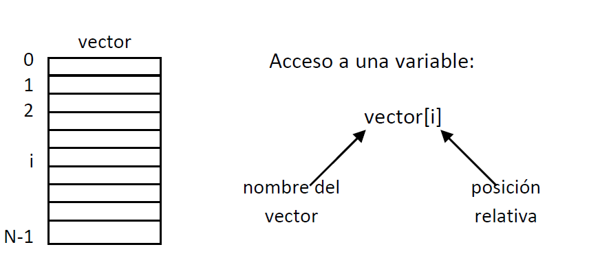
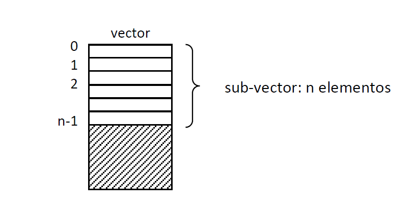
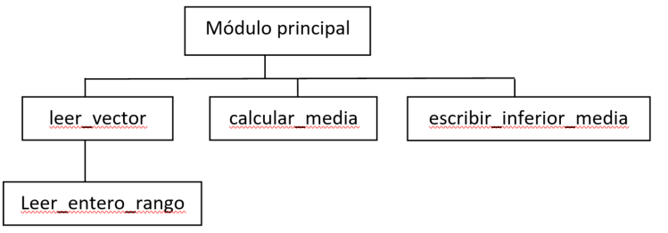

<link rel="stylesheet" type="text/css" href="../Inicio/estilo.css" media="screen" />

# Estructuras de Datos: arrays


## Temporización

4 horas (1.5 Presenciales + 2.5 No presenciales)

## Seguimiento

[Enlace a autoevaluación](../Seguimientotrabajos.md)


## Objetivos
-	Conocer la sintaxis de C para la definición de nuevas tipologías de datos y para la implementación de estructuras de datos estáticas de tipo arrays, tanto  unidimensionales (vectores) como multidimensionales. 
-	Diferenciar entre los conceptos de tipo de dato y de variable.
-	Representar conjuntos de datos estáticos y homogéneos mediante arrays. Construir los tipos de datos correspondientes, identificando los correspondientes elementos de la estructura de datos (tamaño, organización y tipo base).
-	Declarar variables de tipos de datos definidos por el programador. Acceder directamente a cada uno de los elementos individuales de una variable de tipo array mediante indexación.
-	Procesar todos los elementos de un array, de 1 en 1, empezando por el primero y siguiendo el orden físico de almacenamiento, mediante una instrucción de repetición controlada por un contador de iteraciones (recorrido secuencial).
-	Modificar el algoritmo básico del recorrido secuencial para adaptarlo a un problema particular: recorrido secuencial parcial, empezando por un elemento diferente del primero, retrocediendo el índice en lugar de avanzarlo, con varias condiciones de salida,…
-	Trasvasar elementos de información estructurados entre partes del programa a través de las interfaces de las funciones (lista de parámetros formales), tanto de arrays completos como de elementos individuales de un array.
-	Implementar programas modulares en lenguaje de programación C. Identificar y corregir errores sintácticos que surgen durante la codificación.
-	Resolver problemas sencillos con arrays, aplicando las operaciones básicas sobre los mismos (acceso directo a elementos individuales y acceso secuencial).
-	Probar con datos operacionales la correctitud de los módulos y programas desarrollados e identificar y corregir los errores lógicos que surjan.

## Competencias a desarrollar

- [X]	RD1: Poseer y comprender conocimientos
- [X]	RD2: Aplicación de conocimientos
- [X]	UAL1: Conocimientos básicos de la profesión
- [X]	UAL3: Capacidad para resolver problemas
- [X]	UAL6: Trabajo en equipo
- [X]	FB3: Conocimientos básicos sobre el uso y programación de los ordenadores, sistemas operativos, bases de datos y programas informáticos con aplicación en la ingeniería.
## Tareas a realizar

Desarrollar los programas correspondientes a los 3 ejercicios propuestos en esta ficha de trabajo 

## Plan de trabajo

**Explicación** de la práctica por parte del profesor, lectura individual de la misma por parte del alumno y codificación y prueba (individual o por parejas) de los ejemplos que aparecen en esta ficha de trabajo.	30 mn

**Análisis + Diseño preliminar:** cada miembro del equipo realizará individualmente el análisis (pre-diseño) y el diseño preliminar de uno de los tres ejercicios planteados:

- A - ejercicio 1
- B - ejercicio 2
- C, D - ejercicio 3	

**Reunión de expertos**: cada miembro de cada equipo se reúne con los miembros homólogos de los otros equipos para discutir entre todos la solución planteada (diseño preliminar) al ejercicio del que son responsables	

**Reunión del equipo base**: 

1.	Cada miembro explica su solución a los otros dos miembros y recibe la explicación de las soluciones de los otros miembros. Objetivo: cada miembro del equipo debe conocer la estrategia global de resolución de cualquiera de los tres ejercicios. 
2.	Distribución del trabajo: los diferentes módulos individuales a desarrollar serán asignados a los diferentes miembros del equipo procurando que cada miembro participe en módulos de al menos dos de los ejercicios propuestos.	

**Diseño detallado + Implementación**: cada miembro del equipo diseñará y codificará en C los módulos de los que es responsable.

**Combinación (integración) de los módulos + pruebas**: el responsable de cada ejercicio construirá el correspondiente programa a partir de los diferentes módulos desarrollados y realizará las pruebas de correctitud con los datos suministrados, realizando las modificaciones pertinentes.

**Reunión del equipo base**: elaboración conjunta de la documentación a presentar según modelo adjunto así como de la respuesta a las cuestiones planteadas en el mismo.	

## Sintaxis de C: “arrays” unidimensionales

### 1.- Clasificación de los tipos de datos en C


Una estructura de datos (o tipo de dato estructurado) es una colección de datos que pueden ser caracterizados en términos de una organización y de un conjunto de operaciones definidas en la misma. En lenguaje C encontramos los siguientes tipos de datos:


- Simples  (primitivos)	
    - Estándar (predefinidos)	
        - Enteros	
            - int
            - short int
            - long int
            - unsigned int
        - Reales
          	- float
                -long float
            - double
		- Caracteres
            - char
		- Punteros	
	- Definidos por el programador
        - Enumerados	
            - enum
- Compuestos (estructurados)	
    - Estáticos
    	- “Arrays”	
		- Registros (sin variante)	
          - struct
		- Registros con variante 
          - union
		- Archivos
          - FILE *

Nótese que en C no existe el tipo lógico (ó booleano), ni tampoco el tipo sub-rango, presentes en otros lenguajes de programación. Las cadenas de caracteres existen en C como “arrays” unidimensionales (vectores) de caracteres, pero no como tipos especiales. Los tipos estructurados son en realidad constructores genéricos de nuevas tipologías, que habrá que definir “ad-hoc” para cada problema.


### 2.- "Arrays"

Un “array” (también denominado vector, matriz, tabla o formación) es un tipo de dato estructurado (o estructura de datos) con las dos características siguientes:

-	Homogéneo: los datos elementales que la constituyen son del mismo tipo de datos.
-	Estático: consta de un nº fijo de datos.

Un “array” representa un conjunto de variables que ocupan posiciones consecutivas de memoria, y que se referencian individualmente mediante un nombre común y uno (o varios índices) que indican la posición relativa de la variable dentro del “array”.

En la declaración de los “arrays” siempre aparecen dos clases de tipos de datos:

-	Tipo índice: en C siempre es un valor entero para todas las dimensiones, siendo 0 el valor inicial para cada dimensión.
-	Tipo base: tipo de dato de cada elemento del “array” (todos deben de ser del mismo tipo de datos).


#### “Arrays” unidimensionales (vectores).

En C se puede bien declarar primero un tipo vector (“array” unidimensional) y luego declarar una variable de dicha tipología, o bien declarar directamente una variable de tipo vector (sin construir el tipo estructurado), indicando en ambos casos el rango del vector (nº de elementos). El índice de todos los vectores en C va desde 0 hasta el valor máximo del rango menos 1:





-	Declaración de una variable tipo vector:	
``` c
tipo_base nombre_variable[N];
```
donde N es el rango del vector. En C todos los vectores vienen ordenados a partir del valor de índice 0, por lo que en su declaración solo hay que indicar el límite superior del índice (que coincide con el rango o nº de elementos del vector). Los corchetes cuadrados sirven para indicar al compilador que se trata de un vector.

Ejemplos:
``` c
	float  temp[100]; 	/* vector de 100 reales    */
	int contadores[5];	/* vector de 5 enteros     */
	char frase[50];		/* vector de 50 caracteres */
```
 -	Declaración de un tipo vector:	typedef  tipo_base  tipo_vector[N];
Declaración de variables:	tipo_vector  nombre_variable;

Ejemplos:	
``` c
/* tipos definidos por el usuario */
typedef float tipo_temp[100];
		typedef int tipo_contadores[5];
		typedef char tipo_frase[50];	
		/* declaración de variables */
		tipo_temperaturas temperaturas;
		tipo_contadores contadores;
		tipo_frase frase;	
```

En C, a diferencia de otros lenguajes de programación, es menos usual el declarar los tipos previamente y definir las variables según los tipos; lo más usual en C es declarar directamente las variables con el tipo asociado. Metodológicamente, tal y como se presenta en pseudo-código, es interesante discriminar la organización (tipos de datos) de la aplicación (variables).

Nótese que el tamaño del vector se declara al escribir el programa y éste no puede cambiar durante la ejecución del programa. Si se desea procesar una lista variable de elementos del mismo tipo de datos, se debe declarar un vector lo suficientemente grande y registrar el tamaño del sub-vector con datos en una variable entera (éste normalmente ocupa las primeras posiciones del vector):





Operaciones con vectores:

- Acceso a elementos individuales del vector: a través de su índice (respetando siempre los límites):

  - Asignación:
	```c
    temp[5] = 17.4;
    temp[i+1] = temp[i];
    temp[2*i-j] = 3.4;
	```

  - Entrada/salida:	
	```c	
	scanf(" %f" , &temp[8]);
	printf(" %.1f", temp[10]);
	```
  - Expresiones:
	```c
		temp[3]=temp[3]+1.0;
		temp[11]=temp[10]+2.0;
		(temp[5] > temp[3])
	```
- Acceso secuencial (recorrido del vector): acceso a todos los elementos de 1 en 1 empezando por el primero y siguiendo el orden físico de almacenamiento:
	```c
	#define max 100
	typedef  tipo_base tipo_vector[max];
		int i;
		tipo_vector v;
		. . . .
		i=0;
		while (i<max){
			/* procesar elemento v[i] */
			i=i+1;
		}
	```
  - Entrada/salida: (tipo_base=float)	
	- Entrada:
		```c
		for(i=0; i<max; ++i){
			printf("v[%d]? ",i+1));
			scanf(" %f", &v[i]);
		}
		```
	- Salida:
		```c
		for(i=0; i<max; ++i){
			printf("v[%d]= %.1f\n",i+1,v[i]);
		}
		´´´
	- Copia o duplicado:
		```c
		tipo_vector v2;
		for(i=0; i<max; ++i){
			v2[i]=v[i];
		}
		```
	- Búsqueda secuencial (elemento: x):
  	```c
	i=0; 
	enc=0;
    while((i<max)&&(!enc)){
    if(v[i]==x)	enc=1;
     else 	i=i+1;
		}
 	if (enc)
		printf("Encontrado");
		else	printf("No encontrado"); 
	```
  - Paso de vectores como parámetros:
	- De componentes individuales (como parámetros reales)
    	- Valor (E) ->	v[i]
		- Variable (S ó E/S) ->	 &v[i]
    - Del vector completo: en C los vectores (y los “arrays” en general) se pasan por dirección (no existe el paso de “arrays” por valor).
		- Parámetro real -> 	v
			El nombre del vector representa la dirección del primer elemento (no es necesario poner “&” delante del nombre de una variable “array”).
		- Parámetro formal: varias posibilidades de declaración (nótese que las dos últimas son compatibles con “arrays” de cualquier tamaño):
    	```c
		tipo_vector v	/* usando el tipo vector definido	      */
		tipo_base v[]	/* declarando directamente el parámetro   formal como un vector. No es necesario declarar el tamaño del vector 	   */
		tipo_base *v	/* declarando el parámetro formal como un puntero al tipo base 		      */		
		```
		En los dos primeros casos, el acceso dentro de la función llamada a un elemento del vector se realiza de la forma convencional
			```
			  v[i] 
 			```
		Nótese que dentro de la función llamada, el parámetro formal que representa al vector (que siempre se pasa por dirección) se manipula como si fuera un parámetro de entrada.

		Usando la notación de punteros, el elemento i-ésimo es 
			```
			 *(v+i) 
 			```
	- De un sub-vector: indicar el rango de valores (inferior y superior) como parámetros:
		- Parámetros reales 
			```c
			v, i, j
			```
		- Parámetros formales ->	
			```c
			tipo_vector v, int i, int j
			```


### Estrategia de resolución de los problemas
#### Análisis 
(Pre-diseño)	Leer enunciado detenidamente e identificar (mediante análisis gramatical de la narrativa del enunciado):
-	Información a procesar (sustantivos)
-	Tareas de manipulación de información (verbos, frases verbales)

Lista de tareas -> descomponer las tareas complejas en tareas más simples

#### Diseño -> 2 pasos	

1) Diseño preliminar o arquitectónico
-	Diseño de datos: nuevas tipologías
-	Estructura del programa -> diagrama de módulos
1 módulo por cada tarea diferente

Establece relaciones de dependencia (no de control)
-	Interfaces entre módulos: para cada módulo del diagrama:
	Nombre o identificador

	Breve descripción de su actividad funcional

	Lista de parámetros formales
2) Diseño detallado o procedimental:  
            módulo -> sub-algoritmo


#### Lista temperaturas *Ejemplo resuelto*
> Construir un programa que lea por teclado una serie de temperaturas (25 como máximo) y que calcule e imprima en pantalla la cantidad de datos que sea inferior a la media.

##### Análisis 
(Pre-diseño)	

Información entrada:

	nº de datos a leer -> n (entero: 1-25)
	temperaturas        -> reales (máximo 25)

Información de salida:

	 temperaturas inferiores a la media  reales

Tareas:

-	Leer por teclado datos de temperaturas.
-	Leer nº de datos a leer
-	Calcular temperatura media.
-	Escribir en pantalla temperaturas inferiores a la media.

##### Diseño

###### Diseño de datos
		CONST   MAX=25
		TIPOS     tipo_vector: vector[1..MAX] de reales

Nota: la serie de temperaturas se representará mediante un sub-vector

###### Estructura del programa



| Nombre módulo           | Tipo parámetro | Nombre parámetro | Tipo de datos |
|-------------------------|----------------|------------------|---------------|
| Módulo principal        |                |                  |               |
| Leer_vector             | S              | v                | tipo_vector   |
|                         |                | n                | entero        |
| leer_vector_rango       | E              | a                | entero        |
|                         |                | b                | entero        |
|                         | S              | m                | entero        |
| calcular_media          | E              | v                | tipo_vector   |
|                         |                | n                | entero        |
|                         | S              |                  | real          |
| escribir_inferior_rango | E              | media            | real          |
|                         |                | v                | tipo_vector   |
|                         |                | n                | entero        |


  &ensp;&ensp;&ensp;  [listaTemperaturas.psc](https://github.com/MaterialesProgramacion/ProblemasProgramacion/blob/master/Vectores/listatemperaturas.psc)


##### Codificación 
 &ensp;&ensp;&ensp;  [listaTemperaturas.c](https://github.com/MaterialesProgramacion/ProblemasProgramacion/blob/master/Vectores/listatemperaturas.c)


#### *Codificación de otros ejemplos*

##### Lista temperaturas
> Construir un programa que lea por teclado 24 datos de temperatura de un sistema, medidos cada uno a intervalos de una hora en un día determinado, y que calcule e imprima en pantalla las diferencias de cada temperatura con respecto a la temperatura media de ese día.


Codificación  &ensp;&ensp;&ensp;  [listaTemperaturas.c](https://github.com/MaterialesProgramacion/ProblemasProgramacion/blob/master/Vectores/listatemperaturas2.c)


##### Sistema de partículas

> Construir un programa interactivo para gestionar un sistema de partículas, que permita las siguientes opciones que se puedan seleccionar a través de un menú:
> 1.	Insertar una nueva partícula, leyendo por teclado su masa mi y su posición espacial (xi,yi,zi). Dos partículas no pueden ocupar la misma posición espacial.
> 2.	Eliminar una partícula, dando su número de orden en el sistema de partículas clasificadas por valores decrecientes de masa.
> 3.	Escribir en pantalla un listado de todas las partículas del sistema, clasificadas por valores decrecientes de masa.
> 4.	Escribir en pantalla la masa total del sistema y la posición del centro de masas.
> 5.	Finalizar la ejecución del programa.

Codificación  &ensp;&ensp;&ensp;  [sistemaparticulas.c](https://github.com/MaterialesProgramacion/ProblemasProgramacion/blob/master/Vectores/sistemaparticulas.c)


__________
## EJERCIOS A RESOLVER
____________
### **Ejercicio 1**

Considere la siguiente representación de un polinomio mediante un vector de coeficientes:
```
Const	Max=100	{ Grado máximo del polinomio }
Tipos	tipo_polinomio: vector[0..Max] de real
```

Ej:   P=x<sup>4</sup>-8x<sup>2</sup>+6x-10

|    <sup>  0    </sup> |<sup>     1    </sup>|<sup>     2  </sup>   |<sup>     3   </sup> |<sup>     4   </sup> |     <sup>5   </sup> |  <sup>   6   </sup> |    ...   |          |    <sup>100  </sup> |
|:----------:|:--------:|:---------:|:--------:|:--------:|:--------:|:--------:|:--------:|:--------:|:--------:|
|     -10    |     6    |     -8    |     0    |     1    |     0    |     0    |     0    |     0    |     0    |


Construir un programa para derivar polinomios, que lea por teclado el grado y los coeficientes del polinomio a derivar, y que imprima en pantalla el polinomio resultante. Ejemplo:

 dP/dx=4x<sup>3</sup>-16x+6

|    <sup>  0    </sup> |<sup>     1    </sup>|<sup>     2  </sup>   |<sup>     3   </sup> |<sup>     4   </sup> |     <sup>5   </sup> |  <sup>   6   </sup> |    ...   |          |    <sup>100  </sup> |
|:----------:|:--------:|:---------:|:--------:|:--------:|:--------:|:--------:|:--------:|:--------:|:--------:|
|    6   |     16    |     0    |     0    |     1    |     0    |     0    |     0    |     0    |     0    |


**Datos de prueba**

- P=x<sup>4</sup>-8x<sup>2</sup>+6x-10		dP/dx=4x<sup>3</sup>-16x+6
- P=10x<sup>5</sup>+8x<sup>4</sup>+x		dP/dx=50x<sup>4</sup>+32x<sup>3</sup>+1
- P=0			dP/dx=0


### **Ejercicio 2**
> Construir un programa que localice e imprima en pantalla todos los números primos (números solamente divisibles entre 1 y entre sí mismos) comprendidos entre 1 y 1000, utilizando el procedimiento de la criba de Erastótenes, consistente en lo siguiente:
>- 	Considerar un vector de 1000 enteros, inicializados con los valores 1 a 1000.
>- 	A partir del segundo elemento, asignar el valor 0 a todos los elementos del vector que distan dos posiciones, a partir de este elemento (sin incluirlo).
>- 	Continuar con el siguiente elemento diferente de 0, y asignar el valor 0 a todos los elementos que distan el número almacenado en ese elemento del vector
>-	Repetir el proceso sucesivamente, hasta el elemento que se encuentra en la posición parte_entera(raiz_cuadrada 1000))+1.
>Concluido este proceso, todos los elementos diferentes de 0 serán números primos.


**Datos de prueba**
Números primos entre 1 y 1000:
| 1   | 2   | 3   | 5   | 7   | 11  | 13  |
|-----|-----|-----|-----|-----|-----|-----|
| 17  | 19  | 23  | 29  | 31  | 37  | 41  |
| 43  | 47  | 53  | 59  | 61  | 67  | 71  |
| 73  | 79  | 83  | 89  | 97  | 101 | 103 |
| 107 | 109 | 113 | 127 | 131 | 137 | 139 |
| 149 | 151 | 157 | 163 | 167 | 173 | 179 |
| 181 | 191 | 193 | 197 | 199 | 211 | 223 |
| 227 | 229 | 233 | 239 | 241 | 251 | 257 |
| 263 | 269 | 271 | 277 | 281 | 283 | 293 |
| 307 | 311 | 313 | 317 | 331 | 337 | 347 |
| 349 | 353 | 359 | 367 | 373 | 379 | 383 |
| 389 | 397 | 401 | 409 | 419 | 421 | 431 |
| 433 | 439 | 443 | 449 | 457 | 461 | 463 |
| 467 | 479 | 487 | 491 | 499 | 503 | 509 |
| 521 | 523 | 541 | 547 | 557 | 563 | 569 |
| 571 | 577 | 587 | 593 | 599 | 601 | 607 |
| 613 | 617 | 619 | 631 | 641 | 643 | 647 |
| 653 | 659 | 661 | 673 | 677 | 683 | 691 |
| 701 | 709 | 719 | 727 | 733 | 739 | 743 |
| 751 | 757 | 761 | 769 | 773 | 787 | 797 |
| 809 | 811 | 821 | 823 | 827 | 829 | 839 |
| 853 | 857 | 859 | 863 | 877 | 881 | 883 |
| 887 | 907 | 911 | 919 | 929 | 937 | 941 |
| 947 | 953 | 967 | 971 | 977 | 983 | 991 |
| 997 |     |     |     |     |     |     |

### **Ejercicio 3**

> Construir un programa que calcule e imprima en pantalla la distribución de frecuencias relativas acumulativas de los índices de calidad del aire medidos por diferentes estaciones de monitorización. Dicho índice se calcula para cinco de los principales contaminantes (dióxido de azufre, monóxido de carbono, dióxido de nitrógeno, ozono y partículas suspendidas) y se representa con una escala que va de 0 a 500. El programa solicitará por teclado el nº de estaciones de medida (máximo 100), así como los índices de calidad del aire registrado por cada una de ellas, e imprimirá a continuación el histograma de frecuencias acumulativas considerando 10 intervalos de clase de igual longitud. 

**Datos de prueba**

```
Número de estaciones de medida: 10
Índices de calidad del aire: 41, 467, 334, 0, 169, 224, 478, 358, 462, 464 


HISTOGRAMA DE FRECUENCIAS RELATIVAS ACUMULATIVAS
================================================

Intervalo  FA     FR    FRA
[  0- 50)   2  0.200  0.200 ********
[ 50-100)   0  0.000  0.200 ********
[100-150)   0  0.000  0.200 ********
[150-200)   1  0.100  0.300 ************
[200-250)   1  0.100  0.400 ****************
[250-300)   0  0.000  0.400 ****************
[300-350)   1  0.100  0.500 ********************
[350-400)   1  0.100  0.600 ************************
[400-450)   0  0.000  0.600 ************************
[450-500)   4  0.400  1.000 ****************************************

```

```
Número de estaciones de medida: 15
Índices de calidad del aire: 205, 145, 281, 327, 461, 491, 495, 442, 327, 436, 391, 104, 402, 153, 292


HISTOGRAMA DE FRECUENCIAS RELATIVAS ACUMULATIVAS
================================================

Intervalo  FA     FR    FRA
[  0- 50)   0  0.000  0.000 
[ 50-100)   0  0.000  0.000 
[100-150)   2  0.133  0.133 *****
[150-200)   1  0.067  0.200 ********
[200-250)   1  0.067  0.267 ***********
[250-300)   2  0.133  0.400 ****************
[300-350)   2  0.133  0.533 *********************
[350-400)   1  0.067  0.600 ************************
[400-450)   3  0.200  0.800 ********************************
[450-500)   3  0.200  1.000 ****************************************

```

```
Número de estaciones de medida: 20
Índices de calidad del aire: 382, 421, 216, 218, 395, 447, 226, 271, 38, 369, 412, 167, 299, 35, 394, 203, 311, 322, 333, 173 


HISTOGRAMA DE FRECUENCIAS RELATIVAS ACUMULATIVAS
================================================

Intervalo  FA     FR    FRA
[  0- 50)   2  0.100  0.100 ****
[ 50-100)   0  0.000  0.100 ****
[100-150)   0  0.000  0.100 ****
[150-200)   2  0.100  0.200 ********
[200-250)   4  0.200  0.400 ****************
[250-300)   2  0.100  0.500 ********************
[300-350)   3  0.150  0.650 **************************
[350-400)   4  0.200  0.850 **********************************
[400-450)   3  0.150  1.000 ****************************************
[450-500)   0  0.000  1.000 ****************************************
```


```
Número de estaciones de medida: 30
Índices de calidad del aire: 164, 141, 211, 253, 368, 47, 144, 162, 257, 37, 359, 223, 241, 29, 278, 316, 35, 190, 342, 288, 106, 40, 442, 264, 148, 446, 305, 390, 229, 370

HISTOGRAMA DE FRECUENCIAS RELATIVAS ACUMULATIVAS
================================================

Intervalo  FA     FR    FRA
[  0- 50)   5  0.167  0.167 *******
[ 50-100)   0  0.000  0.167 *******
[100-150)   4  0.133  0.300 ************
[150-200)   3  0.100  0.400 ****************
[200-250)   4  0.133  0.533 *********************
[250-300)   5  0.167  0.700 ****************************
[300-350)   3  0.100  0.800 ********************************
[350-400)   4  0.133  0.933 *************************************
[400-450)   2  0.067  1.000 ****************************************
[450-500)   0  0.000  1.000 ****************************************
```


__________
## EJERCICIOS ADICIONALES
_______

1. ¿En qué se diferencia un variable de tipo array de una variable simple? 
 
 
		RESPUESTA:

  
2. ¿Qué condiciones deben cumplir todos los elementos de cualquier array? 


 	   RESPUESTA:


3. ¿Cómo se identifican los elementos individuales de un array? 

    	RESPUESTA:


4. ¿Para qué se utilizan los índices? ¿Cómo se escriben en C? ¿Qué restricciones se aplican en  C a los valores de los índices? 


    	RESPUESTA:

5. ¿Es posible declarar en C directamente una variable de tipo array sin construir  previamente la nueva tipología de datos asociada (typedef)? 


    RESPUESTA:


6. ¿Qué ventajas tiene el definir el tamaño de un array en términos de constantes simbólicas  en lugar de usar constantes literales? 


    RESPUESTA:

   
7. De  las  siguientes  declaraciones  de  nuevos  tipos  de  datos  array,  indicar  cuales  no  son 
válidas sintácticamente y corregir los correspondientes errores: 

```
#define MAX 100 
#define n     1 
#define m   500 
typedef  tipo1 char[1..MAX]; 
typedef  double tipo2[n..m]; 
typedef  tipo3: array[1..MAX] of int; 
typedef  float[M] tipo4; 
typedef  float tipo5[m,m];  /* array de dos dimensiones */ 
```


   	 RESPUESTA:


8. ¿Cómo  se  representa  en  memoria  central  una  variable  de  tipo  array  unidimensional? 
¿Cómo se puede acceder a un elemento individual del  array? ¿Qué representa el nombre  de la variable? 


 	   RESPUESTA:


9. Para  cada  uno  de  los  siguientes  bloques  de  información,  diseñar  e implementar  en  C  una  estructura  de  datos  adecuada  para  representar  la  información  indicada  y  declarar  una  variable de la tipología construida. Indicar también como se accede a cada dato individual  de la variable estructurada. 
    
- 25  datos  de  velocidades  de  un  vehículo  de  pruebas,  medidas  en  instantes  de  tiempo 
diferentes. 
- La  presión  atmosférica  en  un  punto  situado  a  1500  m  de  altitud,  expresada  en 
milímetros de mercurio. 
- La temperatura (en grados centígrados y con dos decimales de precisión) del 
combustible que va por una tubería de  1 km de longitud, medida en ambos extremos 
de la misma y en puntos equidistantes 50 m. 
- El  número  total  de  vueltas  que  da  una  rueda  en  un  intervalo  de  tiempo  de  100 
segundos. La rueda está inicialmente en reposo y se somete a una aceleración angular 
constante α durante 10 segundos. 
- Posición espacial de un avión en 100 instantes de tiempo diferentes. 
- Una  imagen  digitalizada  de  1024*1024  cuadrículas,  que  contiene  el  color  de  cada 
cuadrícula  en  formato  RGB  (rojo,  verde  y  azul)  mediante  3  números  reales  en  el 
intervalo [0,1]. 
- Los valores de la temperatura atmosférica terrestre, medidos en múltiples puntos con 
las siguientes características: 
- Equidistantes  100  km  en  dirección  radial,  para  valores  desde  7000  km 
hasta 8000 km (ambos incluidos) medidos desde el centro de la tierra. 
- Separados cenitalmente por 10º de latitud, desde –90º hasta 90º. 
- Separados acimutalmente por 10º de longitud, desde 0º hasta 350º. 
- La  cantidad  de  masa  vegetal  en  kg  que  hay  en  cada  metro  cúbico  de  un  invernadero 
con  forma  rectangular  y  cubierta  plana  horizontal,  cuyas  dimensiones  son  100  m  de 
largo, 50 m de ancho y 3 m de alto. 


    RESPUESTA:


10.  ¿Qué se entiende por arrays paralelos? ¿Qué relación existe entre los elementos de ambos 
arrays? 


    RESPUESTA:


11.  Teniendo  en  cuenta  que  un  array  es  una  estructura  de  datos  estática,  cómo  podría  representar  en  C  una  lista  variable  de  hasta  100  datos  reales  como  máximo,  mediante arrays.  Tenga  en  cuenta  que el  nº  de  elementos  no  es  conocido  a  priori  y  puede  cambiar  durante la ejecución del programa. 

	RESPUESTA:


12.  ¿Es posible pasar en C todo un array como parámetro de Entrada a una función? 


    RESPUESTA:


13.  ¿Qué diferencias sintácticas encuentra en C cuando pasa como parámetro real un  elemento  individual  de  un  array  como  parámetro  de  E  y  como  parámetro  de  S  a  una  función? 


    RESPUESTA:


14.  Considerar los siguientes prototipos de dos funciones en C: 
```
#define MAX 100 
typedef   float  tipo_vector[100]; 
void leer_subvector(tipo_vector v, int *n); 
void escribir_subvector(tipo_vector v, int n); 
```

¿Qué parámetros son de E y cuales son de S en las interfaces de ambas funciones?


    RESPUESTA:


## Respuestas a los Ejercicios adicionales

1.	Una variable simple representa un único elemento de información de un tipo de datos 
	básico.
	Un array representa un conjunto de elementos de información del mismo tipo de 
	datos.
2.	Todos deben de ser del mismo tipo de datos.
3.	Mediante indexación: uno (o varios índices) que indican la posición de cada elemento 
	dentro de la estructura de datos.
4.	Para el acceso individual a cada elemento del array.
	En C se escriben entre parejas de corchetes cada índice. Ej: v[4]
	En C el valor del índice está comprendido entre 0 y N-1 (N: nº de elementos del array)
5.	Si es posible. Ejemplo:
```
	float v[10];   /* Declara una variable array de 10 datos reales en simple precisión */
```
6.	Si modifica el tamaño del array, tan solo hay que modificar el valor de la constante.

7.


| Declaración original|	Declaración corregida|
|---|---|
|typedef  tipo1 char[1..MAX];|	typedef  char tipo1[MAX];|
|typedef  double tipo2[n..m];|	typedef  double tipo2[m-n+1];|
|typedef  tipo3: array[1..MAX] of int;|	typedef  int tipo3[MAX];|
|typedef  float[M] tipo4;|	typedef  float tipo4[M];|
|typedef  float tipo5[m,m];|  	typedef  float tipo5[m][m];  |

8.	Un bloque de posiciones consecutivas de memoria suficiente para almacenar todos los 
	elementos del array.

	Nombre de la variable array[valor del índice]
	
	El nombre de la variable de array representa la dirección de memoria del primer 
	elemento del mismo.
9. 

- 25 datos de velocidades de un vehículo de pruebas, medidas en instantes de tiempo diferentes.

	Diseño del tipo de dato	
	```
	#define MAX 25
	typedef float tipo_velocidades[MAX];
	```

	Declaración de variable	
	```
	tipo_velocidades v;
	```

	Acceso a elemento individual	
	```
	v[i]          i: 0..24
	```

- La presión atmosférica en un punto situado a 1500 m de altitud, expresada en milímetros de mercurio.

	Diseño del tipo de dato	

	Declaración de variable	
	```
	float presion;
	```
	Acceso a elemento individual
	```
	presion
	```

- La temperatura (en grados centígrados y con dos decimales de precisión) del combustible que va por una tubería de 1 km de longitud, medida en ambos extremos de la misma y en puntos equidistantes 50 m.

	Diseño del tipo de dato	#define LONGITUD 1000
	```
	#define TRAMO         50
	typedef float tipo_temperaturas[LONGITUD/TRAMO+1];
	```
	Declaración de variable	
	```
	tipo_temperaturas t;
	```
	Acceso a elemento individual
	```
	t[i]          i: 0..20
	```

- El número total de vueltas que da una rueda en un intervalo de tiempo de 100 segundos. La rueda está inicialmente en reposo y se somete a una aceleración angular constante α durante 10 segundos.

	Diseño del tipo de dato	

	Declaración de variable	
	```
	int n;
	```
	
	ó 

	```
	float n; //si consideramos fracciones de vuelta)
	```

	Acceso a elemento individual
	```
	n
	```

- Posición espacial de un avión en 100 instantes de tiempo diferentes.

	Diseño del tipo de dato	
	```
	#define MAX 100
	typedef float tipo_posiciones[MAX];
	```
	Declaración de variable
	```
	tipo_posiciones pos;
	```
	Acceso a elemento individual
	```
	pos[i]          i: 0..99
	```

- Una imagen digitalizada de 1024*1024 cuadrículas, que contiene el color de cada cuadrícula en formato RGB (rojo, verde y azul) mediante 3 números reales en el intervalo [0,1
	Diseño del tipo de dato	
	```
	#define FILAS 1024
	#define COLS 1024
	typedef float tipo_imagenBN[MAX];
	```

	Declaración de variable	tipo_imagenBN rojo,verde,azul;  // Arrays 2D paralelos
	Acceso a elemento individual	
	```
	rojo[i][j]
	verde[i][j]
	azul[i][j]          i,j: 0..1023
	```
- Los valores de la temperatura atmosférica terrestre, medidos en múltiples puntos con las siguientes características:

	•	Equidistantes 100 km en dirección radial, para valores desde 7000 km hasta 8000 km (ambos incluidos) medidos desde el centro de la tierra.
	•	Separados cenitalmente por 10º de latitud, desde –90º hasta 90º.
	•	Separados acimutalmente por 10º de longitud, desde 0º hasta 350º.

	Diseño del tipo de dato	#define RMAX 8000
	```
	#define RMIN 7000
	#define RSEP    100
	#define CMAX 90
	#define CMIN -90
	#define CSEP    10
	#define AMAX 350
	#define AMIN     0
	#define ASEP     10
	typedef float tipo_TAT[(RMAX-RMIN)/RSEP+1] 
                                         [(CMAX-CMIN)/CSEP+1]
                                          [(AMAX-AMIN)/ASEP+1];

	```
	Declaración de variable	tipo_TAT tat;  // Arrays 3D
	Acceso a elemento individual	
	```
	tat[i][j][k]
	          i: 0..10
              j: 0..18
              k: 0..35
	```

- La cantidad de masa vegetal en kg que hay en cada metro cúbico de un invernadero con forma rectangular y cubierta plana horizontal, cuyas dimensiones son 100 m de largo, 50 m de ancho y 3 m de alto.
	Diseño del tipo de dato	
	```
	#define LARGO 100
	#define ANCHO 50
	#define ALTO   3
	typedef float tipo_MV[LARGO][ANCHO][ALTO];
	```
	Declaración de variable	
	```
	tipo_MV mv;  // Arrays 3D
	```
	Acceso a elemento individual
	```
		mv[i][j][k]        i: 0..99
                           j: 0..40
                           k: 0..2
	```

10.	Variables de array de la misma tipología que almacenan en la misma posición (valor del  	índice) diferentes elementos de información de un mismo objeto.

11.	La lista se representaría mediante un sub-array formado por un array de 100 reales más una variable entera que indicaría el nº de elementos almacenados en las primeras  	posiciones del array. El valor de esta variable entera (y por tanto del sub-array) iría  	cambiando durante la ejecución del programa entre 0 y 100.

12.	No es posible: en C los arrays siempre se pasan por dirección (S ó E/S).

13.	E: 
 	```
	v[i]
	```
	S: 
	```
	&v[i]
	```

14.

|Prototipo de función	|Entrada	|Salida|
|---|---|---|
|void leer_subvector(tipo_vector v, int *n);	|	v |n|
|void escribir_subvector(tipo_vector v, int n);	|n	|v|


