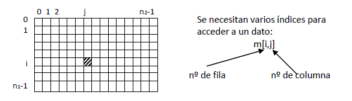
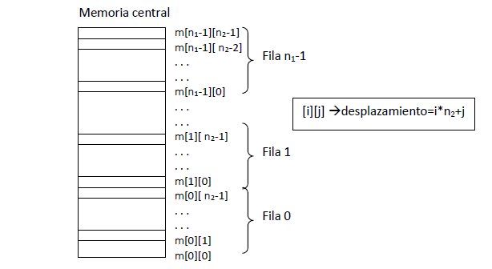

<link rel="stylesheet" type="text/css" href="../Inicio/estilo.css" media="screen" />

# Estructuras de Datos: arrays multidimensionales


## Temporización

4 horas (1.5 Presenciales + 2.5 No presenciales)

## Seguimiento

[Enlace a autoevaluación](../Seguimientotrabajos.md)

## Objetivos

- Conocer la sintaxis de C para la definición de nuevas tipologías de datos e implementación de estructuras de datos estáticas: “arrays” unidimensionales y multidimensionales, cadenas de caracteres y registros (con y sin parte variante). 
-	Implementar programas modulares en lenguaje de programación C. Identificar y corregir errores sintácticos que surgen durante la codificación.
-	Resolver problemas sencillos con “arrays” unidimensionales y multidimensionales, aplicando las operaciones básicas sobre los mismos (acceso directo a elementos individuales y acceso secuencial).
-	Resolver ejercicios sencillos de cadenas de caracteres con representación semi-estática. Conocer las operaciones básicas que se realizan sobre las cadenas de caracteres.
-	Resolver (diseñar e implementar) ejercicios sencillos de registros con y sin parte variante: construir operaciones abstractas sobre tipos abstractos de datos.
-	Resolver (diseñar e implementar) problemas con modelos complejos de información: representar el modelo de información mediante tipologías básicas y constructores de tipos estructurados. Acceder a elementos individuales de información.
-	Conocer los algoritmos básicos de clasificación y búsqueda internas. Aplicarlos a la resolución (diseño e implementación) de sub-problemas de clasificación por diferentes criterios, con datos representados mediante vectores de registros. 
-	Utilizar números pseudo-aleatorios para problemas de simulación y juegos de azar.
-	Diseñar  e implementar programas que resuelven problemas de ingeniería usando operaciones abstractas sobre tipos abstractos de datos: representar el modelo de información mediante una combinación de estructuras de datos y construir operaciones complejas mediante técnicas de diseño modular y programación estructurada.
-	Probar con datos operacionales la correctitud de los módulos y programas desarrollados e identificar y corregir los errores lógicos que surjan.


## Competencias a desarrollar

- [X]	RD1: Poseer y comprender conocimientos
- [X]	RD2: Aplicación de conocimientos
- [X]	UAL1: Conocimientos básicos de la profesión
- [X]	UAL3: Capacidad para resolver problemas
- [X]	UAL6: Trabajo en equipo
- [X]	FB3: Conocimientos básicos sobre el uso y programación de los ordenadores, sistemas operativos, bases de datos y programas informáticos con aplicación en la ingeniería.
- 
## Tareas a realizar

Desarrollar los programas correspondientes a los 3 ejercicios propuestos en esta ficha de trabajo 

## Plan de trabajo

**Explicación** de la práctica por parte del profesor, lectura individual de la misma por parte del alumno y codificación y prueba (individual o por parejas) de los ejemplos que aparecen en esta ficha de trabajo.	30 mn

**Análisis + Diseño preliminar:** cada miembro del equipo realizará individualmente el análisis (pre-diseño) y el diseño preliminar de uno de los tres ejercicios planteados:

- A - ejercicio 1
- B - ejercicio 2
- C, D - ejercicio 3	

**Reunión de expertos**: cada miembro de cada equipo se reúne con los miembros homólogos de los otros equipos para discutir entre todos la solución planteada (diseño preliminar) al ejercicio del que son responsables	

**Reunión del equipo base**: 

1.	Cada miembro explica su solución a los otros dos miembros y recibe la explicación de las soluciones de los otros miembros. Objetivo: cada miembro del equipo debe conocer la estrategia global de resolución de cualquiera de los tres ejercicios. 
2.	Distribución del trabajo: los diferentes módulos individuales a desarrollar serán asignados a los diferentes miembros del equipo procurando que cada miembro participe en módulos de al menos dos de los ejercicios propuestos.	

**Diseño detallado + Implementación**: cada miembro del equipo diseñará y codificará en C los módulos de los que es responsable.

**Combinación (integración) de los módulos + pruebas**: el responsable de cada ejercicio construirá el correspondiente programa a partir de los diferentes módulos desarrollados y realizará las pruebas de correctitud con los datos suministrados, realizando las modificaciones pertinentes.

**Reunión del equipo base**: elaboración conjunta de la documentación a presentar según modelo adjunto así como de la respuesta a las cuestiones planteadas en el mismo.	

## Sintaxis de C: “arrays” multidimensionales (tablas y matrices)


Los “arrays” multidimensionales representan grupos de datos del mismo tipo que se encuentran ordenados según un conjunto de índices. Ejemplo: matriz de n<sub>1</sub> filas y n<sub>2</sub> columnas:





###	 Declaración de una variable tipo “array” multidimensional:	


```c
tipo_base nombre_variable[N1][N2]..[Ni];
```


donde N1, N2,..., Ni son los límites superiores de las respectivas dimensiones del “array”. En C todas las dimensiones vienen ordenados a partir del valor de índice 0, por lo que en su declaración solo hay que indicar el límite superior del índice.

Ejemplos:

```c
	float  m[10][20];		/* matriz de 10*20 datos reales */
	int cubo[5][10][8];	/* “array” de 5*10*8 enteros    */
	char pagina[25][80];	/* tabla de 25*80 caracteres     */
```


- Declaración de un tipo “array”:

```c
    typedef tipo_base tipo_array[N1]...[Ni];
```


- Declaración de variables:		tipo_array  nombre_variable;

Ejemplos:

```c
/* tipos definidos por el usuario */
typedef float  tipo_matriz[10][20];
typedef int tipo_cubo[5][10][8];
typedef char tipo_pagina[25][80];

/* declaración de variables */
tipo_matriz m;
tipo_cubo cubo;
tipo_pagina pagina;	
```


Nota: también es posible construir un tipo matriz como un vector de vectores:
	Ejemplo:
	```c
		typedef float tipo_fila[20];
		typedef tipo_fila tipo_matriz[10];
	```

Una variable de matriz es representada en memoria central por el compilador de C como un conjunto de posiciones de memoria consecutivas, almacenándose los elementos de la matriz por filas (el primer índice avanza más lentamente y el último más rápidamente):





### Operaciones con “arrays” multidimensionales:

- 	Acceso a elementos individuales del “array”: a través de sus índices (respetando siempre los respectivos límites):
  
- 	Asignación:
```c
m[1][1] = 1.5;
```
- 	Entrada/salida:
```c  
scanf(" %f", &m[2][2]);
printf("%.0f",m[1][5]);
```

-	Expresiones:
```c
m[1][1]=m[1][1]+1.0;
(m[1][5] > m[1][4])
```

- Acceso secuencial (recorrido del “array”): acceso a todos los elementos de 1 en 1 empezando por el primero y siguiendo el orden físico de almacenamiento  1 repetición para cada dimensión (estructuras repetitivas anidadas). Ejemplo:

    ```c
    #define	nf 10
    #define	nc 15
    typedef	float tipo_matriz[nf][nc];
    . . .
		int i,j;
		tipo_matriz m;
    ```


- Recorrido secuencial por filas: (C almacena la matriz en memoria por filas)

    ```c
	    i=0;
		while (i<nf){
			j=0;
			while (j<nc){
				/* procesar elemento m[i][j] */
				j=j+1;
			}
			i=i+1;
		}
    ```

- Recorrido secuencial por columnas:

    ```c
		j=0;
		while (j<nc){
			i=0;
			while (i<nf){
				/* procesar elemento m[i][j] */
				i=i+1;
			}
			j=j+1;
		}
    ```

- Entrada/salida:	

	E:

        ```c
    	for (i=0; i<nf; ++i){
				for (j=0; j<nc; ++j){ 
                        printf("m[%d,%d]? ", i+1, j+1);
                        scanf(" %f", &m[i][j]);
				}
			}
        ```

	S:

        ``` c
        for (i=0; i<nf; ++i){
				for (j=0; j<nc; ++j){
                    printf("m[%d,%d]= %.1f",i+1,j+1,m[i][j]);
				}
			}
        ``` 

- Copia o duplicado:
    ``` c
		tipo_matriz m2;
		. . .
		for (i=0; i<nf; ++i){
			for (j=0; j<nc; ++j){
                m2[i][j]=m[i][j];
			}
		}
    ``` 

- Búsqueda secuencial:	(elemento: x)		
   ``` c  
        i=0;
        enc=0;
        while ((i<nf)&&(! enc)){
	        j=0;
	        while ((j<nc)&&(! enc)){
        if (m[i][j]==x)	
        enc=1;
	        else	j=j+1;
        			}
		if (! enc) 
            i=i+1;
		    }
		if (enc) 
		    printf("Encontrado");
		else
        	printf("No encontr.");
   ``` 

-	Paso de “arrays” como parámetros:
	- De componentes individuales (como parámetros actuales)
		- Valor (E)  ---		m[i][j]
		- Variable (S ó E/S) ---  &m[i][j]
-	Del “array” completo: en C los “arrays” se pasan por dirección (no existe el paso de “arrays” por valor).
	- Parámetro actual --- 	m
		El nombre del “array” representa la dirección del primer elemento (no es necesario poner “&” delante del nombre de una variable “array”).
	- Parámetro formal: varias posibilidades de declaración:
  ```c
tipo_matriz m		/* usando el tipo matriz definido	        */
tipo_base m[][nc]	/* declarando directamente el parámetro   */
					/* formal como una matriz. No es 	        */
					/* necesario declarar el tamaño del 
					/* primer índice 			        */
tipo_base(*m)[nc]	/* declarando el parámetro formal como   */
					/* un puntero a un vector de datos del       */
					/* tipo base (puntero a filas) 		        */
```

En los dos primeros casos, el acceso dentro de la función llamada a un elemento de la matriz se realiza de la forma convencional 

	m[i][j]

Nótese que dentro de la función llamada, el parámetro formal que representa la matriz (que siempre se pasa por dirección) se manipula como si fuera un parámetro de entrada.

Usando la notación de punteros, el elemento m[i][j] es:

	 *(*(m+i)+j)

- De una fila:
	- Parámetro actual 
  	```c
  	fila[i]
 	```

	- Parámetro formal --	varias posibilidades:
	 ```c
	tipo_fila v
	tipo_base v[nc]
	tipo_base *v
  	```

### Ejemplo Sistema lineal de 3 ecuaciones

>	Construir un programa que resuelva un sistema lineal de 3 ecuaciones con 3 incógnitas y presente en pantalla los resultados, dados por teclado los coeficientes de las incógnitas y los términos independientes de las ecuaciones respectivas

a<sub>11</sub>*x<sub>1</sub>+a<sub>12</sub>*x<sub>2</sub>+a<sub>13</sub>*x<sub>3</sub>=c<sub>1</sub>
a<sub>21</sub>*x<sub>1</sub>+a<sub>22</sub>*x<sub>2</sub>+a<sub>23</sub>*x<sub>3</sub>=c<sub>2</sub>
a<sub>31</sub>*x<sub>1</sub>+a<sub>32</sub>*x<sub>2</sub>+a<sub>33</sub>*x<sub>3</sub>=c<sub>3</sub>

Expresado como determinantes

	|a11 a12 a13|       |x1|        |c1|
	|a21 a22 a23|   *   |x2|  =     |c2|
	|a31 a32 a33|       |x3|        |c3|


Codificación  &ensp;&ensp;&ensp;  [sistema3ecuaciones.c](https://github.com/MaterialesProgramacion/ProblemasProgramacion/blob/master/Vectores/sistema3ecuaciones3incog.c)


______
## EJERCIOS A RESOLVER
_____

### **Ejercicio 1**
>	Construir un programa que lea por teclado dos matrices rectangulares de hasta 5 filas por 5 columnas, y que calcule (si ello es posible) la suma y el producto de las mismas y lo imprima en pantalla. Las dimensiones de cada matriz (nº de filas y nº de columnas) también se introducirán por teclado, pudiendo ser diferentes.


**Datos de prueba**

|Matriz primera (3x3)

     1    2    3         	
     4    5    6         	
     7    8    9         	

Matriz segunda (3x3)

   	1    1    1
   	2    2    2
   	3    3    3


Suma de matrices:

	 1    2    3         1    1    1         2    3    4
	 4    5    6    +    2    2    2   =     6    7    8
	 7    8    9         3    3    3        10   11   12

Producto de matrices:

	 1    2    3         1    1    1        14   14   14
   	 4    5    6    *    2    2    2   =    32   32   32
     7    8    9         3    3    3        50   50   50


Matriz primera (3x5):

    1    1    1    1    1    
    1    1    1    1    1   
    1    1    1    1    1     
                              
                              
Matriz segunda (5x2):

    2    2 
    2    2 
    2    2 
    2    2 
    2    2 

Suma de matrices: no se pueden sumar.

Producto de matrices:

    1    1    1    1    1         2    2        10   10
    1    1    1    1    1    *    2    2   =    10   10
    1    1    1    1    1         2    2        10   10
                                  2    2     
                                  2    2

### **Ejercicio 2**
> Construir un módulo que pre-multiplique por la izquierda una matriz A por otra matriz B (ambas de dimensiones 3x3), almacenando el resultado del producto en la matriz A, esto es: AB.A. Considerar la siguiente declaración de tipos:

Tipos		tipoMatriz3x3: vector[1..3,1..3] de reales
Construir un programa que lea por teclado dos matrices 3x3, que llame a continuación al módulo de pre-multiplicación y que presente finalmente el resultado en la pantalla.

**Datos de prueba**

|A|	B|	A<-B.A|
|---|---|---|
1   1   1 | 	2   2   2 |6   6   6
1   1   1| 	2   2   2 | 6   6   6
1   1   1 |	2   2   2 |6   6   6

|A|	B|	A<-B.A|
|---|---|---|
1     0   -1 |1   2   3 |	 3   1     -4
1   -1     0 |4   5   6 |   9   1   -10
0     1   -1| 7   8   9	| 15   1   -16


### **Ejercicio 3**

> Considerar las siguientes estructuras de datos para representar una imagen digital obtenida mediante un satélite correspondiente a una zona rectangular de una ciudad determinada:


La imagen está dividida en pequeños cuadrados (píxeles) donde se almacena un valor real comprendido entre 0 y 1, el cual es proporcional a la polución por CO2 en dicha zona. Construir un programa que lea por teclado una imagen y que imprima en pantalla las coordenadas de los píxeles con valores de contaminación superiores en un 25% al valor de la polución media.

**Datos de prueba**
	Pruebas con NF=NC=3
	
	Datos de Entrada:
    	    1     2     3
  	1 0.130 0.368 0.926
  	2 0.666 0.949 0.119
  	3 0.383 0.568 0.062

	Polucion media: 0.464
	Pixeles con polucion superior al 25% de la media (0.579):
 		(1,3) (2,1) (2,2)        

	Datos de Entrada:
    	    1     2     3
  	1 0.308 0.977 0.589
  	2 0.832 0.450 0.149
  	3 0.209 0.411 0.586

	Polucion media: 0.501
	Pixeles con polucion superior al 25% de la media (0.627):
 		(1,2) (2,1)


