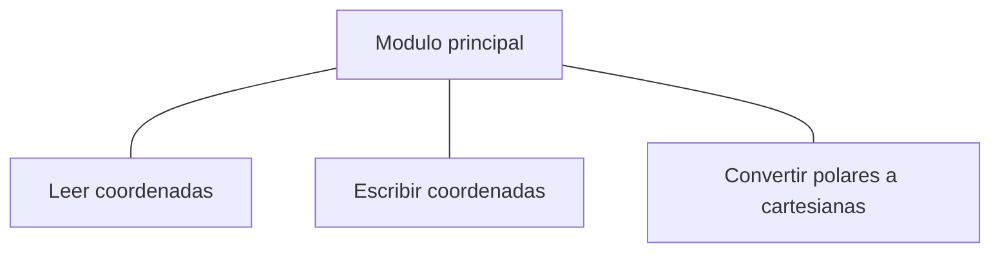
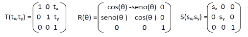

<link rel="stylesheet" type="text/css" href="../Inicio/estilo.css" media="screen" />

# Estructuras de Datos: Registros con y sin parte variante

### Temporización

4 horas (1.5 Presenciales + 2.5 No presenciales)

## Seguimiento

[Enlace a autoevaluación](../Seguimientotrabajos.md)

## Objetivos

-	Conocer la sintaxis de C para la definición de nuevas tipologías de datos e implementación de estructuras de datos estáticas: “arrays” unidimensionales y multidimensionales, cadenas de caracteres y registros (con y sin parte variante). 
-	Implementar programas modulares en lenguaje de programación C. Identificar y corregir errores sintácticos que surgen durante la codificación.
-	Resolver problemas sencillos con “arrays” unidimensionales y multidimensionales, aplicando las operaciones básicas sobre los mismos (acceso directo a elementos individuales y acceso secuencial).
-	Resolver ejercicios sencillos de cadenas de caracteres con representación semi-estática. Conocer las operaciones básicas que se realizan sobre las cadenas de caracteres.
-	Resolver (diseñar e implementar) ejercicios sencillos de registros con y sin parte variante: construir operaciones abstractas sobre tipos abstractos de datos.
-	Resolver (diseñar e implementar) problemas con modelos complejos de información: representar el modelo de información mediante tipologías básicas y constructores de tipos estructurados. Acceder a elementos individuales de información.
-	Conocer los algoritmos básicos de clasificación y búsqueda internas. Aplicarlos a la resolución (diseño e implementación) de sub-problemas de clasificación por diferentes criterios, con datos representados mediante vectores de registros. 
-	Utilizar números pseudo-aleatorios para problemas de simulación y juegos de azar.
-	Diseñar  e implementar programas que resuelven problemas de ingeniería usando operaciones abstractas sobre tipos abstractos de datos: representar el modelo de información mediante una combinación de estructuras de datos y construir operaciones complejas mediante técnicas de diseño modular y programación estructurada.
-	Probar con datos operacionales la correctitud de los módulos y programas desarrollados e identificar y corregir los errores lógicos que surjan.


### Competencias a desarrollar

- [X]	RD1: Poseer y comprender conocimientos
- [X]	RD2: Aplicación de conocimientos
- [X]	UAL1: Conocimientos básicos de la profesión
- [X]	UAL3: Capacidad para resolver problemas
- [X]	UAL6: Trabajo en equipo
- [X]	FB3: Conocimientos básicos sobre el uso y programación de los ordenadores, sistemas operativos, bases de datos y programas informáticos con aplicación en la ingeniería.
  
### Tareas a realizar

Desarrollar los programas correspondientes a los 3 ejercicios propuestos en esta ficha de trabajo 


### Plan de trabajo

**Explicación** de la práctica por parte del profesor, lectura individual de la misma por parte del alumno y codificación y prueba (individual o por parejas) de los ejemplos que aparecen en esta ficha de trabajo.	30 mn

**Análisis + Diseño preliminar:** cada miembro del equipo realizará individualmente el análisis (pre-diseño) y el diseño preliminar de uno de los tres ejercicios planteados:

- A - ejercicio 1
- B - ejercicio 2
- C, D - ejercicio 3	

**Reunión de expertos**: cada miembro de cada equipo se reúne con los miembros homólogos de los otros equipos para discutir entre todos la solución planteada (diseño preliminar) al ejercicio del que son responsables	

**Reunión del equipo base**: 

1.	Cada miembro explica su solución a los otros dos miembros y recibe la explicación de las soluciones de los otros miembros. Objetivo: cada miembro del equipo debe conocer la estrategia global de resolución de cualquiera de los tres ejercicios. 
2.	Distribución del trabajo: los diferentes módulos individuales a desarrollar serán asignados a los diferentes miembros del equipo procurando que cada miembro participe en módulos de al menos dos de los ejercicios propuestos.	

**Diseño detallado + Implementación**: cada miembro del equipo diseñará y codificará en C los módulos de los que es responsable.

**Combinación (integración) de los módulos + pruebas**: el responsable de cada ejercicio construirá el correspondiente programa a partir de los diferentes módulos desarrollados y realizará las pruebas de correctitud con los datos suministrados, realizando las modificaciones pertinentes.

**Reunión del equipo base**: elaboración conjunta de la documentación a presentar según modelo adjunto así como de la respuesta a las cuestiones planteadas en el mismo.	


## Registros (“struct”)

Una estructura registro es un tipo de dato estructurado formado por yuxtaposición de datos de cualquier tipo llamados campos (ó miembros). Se trata pues de una estructura de datos estática (consta de un número fijo de datos) y heterogénea (los datos pueden ser cada uno de cualquier tipología, no necesariamente la misma).

En C se puede bien declarar un tipo registro (struct) y a continuación declarar una variable de esa tipología, o bien declarar directamente una variable de tipo registro (sin construir el tipo estructurado), indicando en ambos casos los nombres de los campos constituyentes.

- Declaración de una variable tipo registro:	
```c
struct etiqueta_registro{
tipo1 nombre_campo1;
tipo2 nombre_campo2;
. . .
tipoN nombre_campoN;
		}nombre_variable;
```

La etiqueta del registro es opcional, y en caso de utilizarse permite la declaración futura de nuevas variables registro con dicha estructura (funciona de forma parecida a los tipos de datos definidos mediante ```typedef```).

Ejemplos:	

```c
struct etiq_fecha{	/* etiqueta del registro */
			int dia;
			int mes;
			int anio;
		} fecha_ultimo_pago;	
		struct etiq_fecha fecha_examen;
		struct{			/* sin etiqueta registro */
			char nombre[30];
			char apellidos[40];
			long int dni;
			char direccion[50];
			int edad;
			float nota_teoria;
			int practicas_aprobadas;
		}ficha1, ficha2;
```

- Declaración de un tipo registro:		typedef  struct etiqueta_registro{
```c
tipo1 nombre_campo1;
tipo2 nombre_campo2;
. . .
tipoN nombre_campoN;
	}tipo_registro;
```
- Declaración de variables:

```c
tipo_registro nombre_variable;
```

Ejemplos:	
```c
/* tipos definidos por el usuario */
typedef struct{	
			int dia;
			int mes;
			int anio;
		}tipo_fecha;	
		typedef struct{
			char nombre[30];
			char apellidos[40];
			long int dni;
			char direccion[50];
			int edad;
			float nota_teoria;
			int practicas_aprobadas;
		}tipo_ficha_alumno;
		/* declaración de variables */
		tipo_fecha fecha_ultimo_pago, fecha_examen;
		tipo_ficha_alumno ficha1,ficha2;
```
**Operaciones con registro:**

-	Acceso a componentes individuales: 	variable.campo
Operador selector de campo: 
	- Asignación:		
		```c
		strcpy(ficha1.nombre, "José R. ");
		ficha2.edad = ficha1.edad;
		ficha2.practicas_aprobadas = 1;
		```

	-  Entrada/salida:	scanf(" %f" , &(ficha1.nota_teoría));
       ```c
		printf(" %s %s\n" ,ficha1.nombre,ficha1.apellidos);
		```

	- Expresiones:
		```c
		(ficha1.nota_teoría>=5.0)&&(ficha1.practicas_aprobadas)
		```

- Copia de un registro completo a una variable de tipo registro definido con los campos en el mismo orden:
  	```ficha2=ficha1;```

- Paso de parámetros: 
	- De componentes individuales (campos):
		- Valor (E):			```var_reg.campo```
		- Variable (S ó E/S):		```&var_reg.campo```
	- Del registro completo:
		- Valor (E):		
			- Parámetro actual:		```var_reg```
			- Parámetro formal:		```tipo_reg var_reg```
		- Variable (S ó E/S):
			- Parámetro actual:		```&var_reg```
			- Parámetro formal:	 	```tipo_reg *reg```
		Para el acceso a un campo del parámetro formal, se pueden usar las dos siguientes notaciones:
				```
				(*reg).campo
				reg->campo
				```
Nótese que una función también puede devolver a través de su identificador de función un registro completo.

## Uniones

Una unión es una estructura de datos que define variables que comparten el almacenamiento de memoria. Puede contener, en distintos momentos, datos de tipos y tamaños diferentes. El compilador reserva suficiente espacio de memoria para acomodar el elemento mayor de la unión. 

Al igual que las estructuras, se accede a un campo de una unión mediante el selector de campo (.), pero, a diferencia de las estructuras, los campos de la unión ocupan la misma posición de memoria (no pueden almacenar información de forma simultánea).

- Declaración de una variable tipo unión:	
```c
union etiqueta_union{
tipo1 nombre_campo1;
tipo2 nombre_campo2;
. . .
tipoN nombre_campoN;
		}nombre_variable;
```

La etiqueta de la unión es opcional, y en caso de utilizarse permite la declaración futura de nuevas variables de unión con dicha estructura (funciona de forma parecida a los tipos de datos definidos mediante typedef).

Ejemplos:
```c
union etiq_identif{	/* etiqueta de la union */
			long int dni;
			char pasaporte[20];
		} identificacion;	
union etiq_identif id2;
union{			/* sin etiqueta de union */
	float exp_real;
	int exp_entero;
	}exponente1, exponente2;
```

- Declaración de un tipo unión:
```c
typedef  union{
tipo1 nombre_campo1;
tipo2 nombre_campo2;
. . .
tipoN nombre_campoN;
	}tipo_union;
```

- Declaración de variables:		```c tipo_union nombre_variable;```
  
Ejemplos:
```c
/* tipos definidos por el usuario */
typedef union{	
			long int dni;
			char pasaporte[20];
		} tipo_identificacion;	
		typedef union{
			float exp_real;
			int exp_entero;
		}tipo_exponente;
		/* declaración de variables */
		tipo_identificacion identificacion, id2;
		tipo_exponente exponente1, exponente2;
```


### Ejemplo Sistema lineal de 3 ecuaciones

>	Construir un programa para realizar aritmética de números complejos. El programa deberá leer por teclado dos números complejos y presentará a continuación un menú en pantalla con las siguientes opciones:
        - Sumar números complejos.
        - Restar números complejos.
        - Multiplicar números complejos.
        - Dividir números complejos.
        - Terminar programa.
Tras seleccionar por teclado una opción, se ejecutará la operación correspondiente presentándose en pantalla los resultados de la misma


Codificación  &ensp;&ensp;&ensp;  [complejos.c](https://github.com/MaterialesProgramacion/ProblemasProgramacion/blob/master/Registros/operacionesComplejos.c)


### Ejemplo	punto en dos dimensiones
> Construir un programa que lea por teclado las coordenadas de un punto bidimensional, bien en coordenadas cartesianas o bien en coordenadas polares, las almacene en una variable estructurada e imprima a continuación en pantalla las coordenadas del punto en su representación actual. Seguidamente el programa transformará la representación de las coordenadas del punto a coordenadas cartesianas y finalmente volverá a imprimir las coordenadas del punto en su representación actual.

#### Análisis
- Información de E:
    Coordenadas de un punto 2D: 
            x, y: real      (representación cartesiana)
    ó      módulo, ángulo: real      (representación polar)
- Información de S:
    Coordenadas de un punto 2D: 

    ```x, y: real      (representación cartesiana)```
    ó      
	```módulo, ángulo: real      (representación polar)```

- Lista de tareas a realizar -> descomposición modular
  - Leer por teclado coordenadas del punto (cartesianas o polares)
  - Escribir en pantalla coordenadas del punto (cartesianas o polares)
  - Convertir coordenadas del punto a representación cartesiana
  - Escribir en pantalla coordenadas del punto (cartesianas o polares)

#### Diseño

##### Diseño preliminar

Diseño de datos
```
Tipos  tipo_coordenadas: registro de
                    Según_sea(cartesianas: lógico) Hacer
                             verdadero:    x: real
                                                     y: real
                             falso:             módulo: real
                                                     ángulo: real
                    Fin_según_sea
                Fin_registro
```

Estructura de programa


Interfaces entre módulos

|Nombre módulo|	Tipo parám.|	Nombre parám.| Tipo de datos|
|---|---|---|----|
|Módulo principal |||
|Leer coordenadas	|S	|punto|	tipo_coordenadas|
|Escribir coordenadas	|E|	punto	|tipo_coordenadas|
|Convertir polares a cartesianas|	E/S	|punto|	tipo_coordenadas|


Diseño detallado
```
Const   PI=3.1415

Tipos    tipo_coordenadas: registro de
                     Según_sea(cartesianas: lógico) Hacer
                              verdadero:    x: real
                                                      y: real
                              falso:             módulo: real
                                                      ángulo: real
                     Fin_según_sea
              Fin_registro


Algoritmo ConversionCoordenadasPolaresCartesianas
Var        c: carácter
              punto: tipo_coordenadas
Inicio	Repetir	Escribir("EJEMPLO DE REGISTRO VARIANTE")
		Escribir("Introduzca coordenadas 2D de un punto: ")
		Leer_coordenadas(punto)
		Escribir("Punto introducido por teclado: ")
		Escribir_coordenadas(punto)
		Convertir_polares_cartesianas(punto)
		Escribir("Punto en coordenadas cartesianas: ")
		Escribir_coordenadas(punto)
		Escribir("Desea efectuar una nueva operacion (s/n)? ")
		Leer(c)
	Hasta que (c='N')ó(c='n')
Fin_algoritmo_principal

Procedimiento leer_coordenadas(punto: tipo_coordenadas (S))
Var       i: entero
Inicio    Repetir  Escribir("Tipo de coordenadas (1: cartesianas, 0: polares): ")
                             Leer(i)
              Hasta que (i=0) ó(i=1)
              Según_sea(i) Hacer
                  1: punto.cartesianas  verdadero
                  0: punto.cartesianas  falso
              Fin_según_sea
              Si (punto.cartesianas)
              Entonces   Escribir("x: ")
                                  Leer(punto.x)
                                  Escribir("y: ")
                                  Leer(punto.y)
              Sino            Repetir  Escribir("r: ")
                                                 Leer(punto.modulo)
                                  Hasta que (punto.modulo≥0)
                                  Escribir("Angulo (grados): ")
                                  Leer(punto.angulo)
              Fin_si
Fin_procedimiento

Procedimiento ConvertirPolaresCartesianas(punto: tipo_coordenadas (E/S))
Var       x,y: real
Inicio	Si (no punto.cartesianas)
              Entonces   x  punto.modulo*cos(punto.angulo*PI/180.0)
                                  y punto.modulo*seno(punto.angulo*PI/180.0)
                                  punto.cartesianas  verdadero
                                  punto.x  x
                                  punto.y  y
              Fin_si
Fin_procedimiento

Procedimiento Escribir_coordenadas(punto: tipo_coordenadas (E))
Inicio	Si (punto.cartesianas)
              Entonces   Escribir("x: ", punto.x)
                                  Escribir("y: ", punto.y)
              Sino            Escribir("r: ", punto.modulo)
                                  Escribir("Angulo (grados): ", punto.angulo)
              Fin_si
Fin_procedimiento
```


Codificación  &ensp;&ensp;&ensp;  [puntobidimensional.c](https://github.com/MaterialesProgramacion/ProblemasProgramacion/blob/master/Registros/puntobidimensional.c)


----
## EJERCICIOS  RESOLVER
_______


### **Ejercicio 1**
> Construir un programa lo mas modular posible que lea por teclado dos registros de tiempo y calcule e imprima en pantalla el tiempo transcurrido desde el primer registro hasta el segundo. Cada registro de tiempo vendrá dado en hora, minutos, segundos y centésimas de segundo, los cuales serán leídos separadamente por teclado y adecuadamente validados (0≤hora<24, 0≤minutos<60, 0≤segundos<60, 0≤centésimas de segundo<100). El resultado se presentará en pantalla con el mismo formato. Nota: si el segundo registro de tiempo es anterior al primero, considerar que se trata del día siguiente. 


**Datos de prueba**

|Registro inicial	|Registro final	|Tiempo transcurrido|
|--|--|--|
00:00:00.00|	18:15:34.23|	18:15:34.23
20:05:34.26|	22:10:40.12|	02:05:05.86
23:50:00.00|	02:01:28.99|	02:11:28.99

### **Ejercicio 2**
>Construir un programa que utilice un registro para almacenar información sobre las 3 transformaciones geométricas bidimensionales básicas (traslación, rotación y escalado). Para la traslación, el registro debe almacenar las distancias de traslación horizontal y vertical (tx, ty); para la rotación (alrededor del origen de coordenadas), debe almacenar el ángulo de rotación (θ); y para el escalado (con respecto al origen), debe almacenar los factores de escalado en las direcciones X e Y (sx, sy). El programa debe leer por teclado el tipo de transformación (mediante un carácter: ‘T’, ‘R’, ‘E’) y sus correspondientes valores numéricos, calcular a continuación la matriz de la correspondiente transformación en coordenadas homogéneas y finalmente imprimir en pantalla dicha matriz:



**Datos de prueba**

|Transformación	|Parámetros	|Matriz|
|--|--|--|
Traslación	|tx=100,  ty=200|	1.00   0.00  100.00
|||								0.00  1.00   200.00
|||								0.00  0.00       1.00
Rotación|	θ=90º	|			0.00   -1.00  0.00
||	|1.00    0.00  0.00
||| 0.00    0.00  1.00
Escalado|	sx=2,    sy=0.5	|2.00   0.00  0.00
|||							0.00   0.50  0.00
|||							0.00   0.00  1.00

### **Ejercicio 3**
> Construir un programa que utilice un registro para almacenar información sobre 3 figuras geométricas (círculo, rectángulo y triángulo). Para el círculo, el registro debe almacenar el radio; para un rectángulo, debe almacenar las longitudes de dos lados adyacentes; y para el triángulo, debe almacenar las longitudes de sus tres lados (donde cada lado debe tener menor longitud que la suma de las otras dos longitudes). El programa debe leer por teclado el tipo de figura (mediante un carácter: ‘C’, ‘R’, ‘T’) y sus correspondientes valores numéricos, y a continuación, calcular e imprimir en pantalla el área de la figura.

Nota:	               
		área rectángulo  -> 	base * altura
		área círculo	 -> 	PI * radio<sup>2</sup>
		área triángulo	 ->	(s * (s-a) * (s-b) * (s-c))<sup>1/2</sup> 
							  s=(a+b+c)/2


**Datos de prueba**

|Figura|	Parámetros (cm)|	Área (cm<sup>2</sup>)|
|--|--|--|
Círculo	| Radio:            3	|28.27
|Círculo|	Radio:           -1|	Círculo no válido
|Rectángulo|	Base: 20, Altura:   30|	600.00
Rectángulo	|Base:   20, Altura:       0|	Rectángulo no válido
Triángulo|	Lado 1:   4, Lado 2:          5, Lado 3:          3	|6.00
Triángulo|	Lado 1:          4. Lado 2:          8, Lado 3:          3|	Triángulo no válido


_______

## EJERCICIOS ADICIONALES
_______

### **1**
Para cada uno de los siguientes ejercicios, diseñar una estructura de datos adecuada para representar la información indicada y declarar una variable de la tipología construida. Indicar también como se accede a cada dato individual de la variable estructurada.

	Una ficha de un libro de una biblioteca:
		ISBN
		Autor
		Título
		Editorial
		Año de publicación
-	Una circunferencia en el plano: dos alternativas posibles:
	-	Coordenadas del centro y radio.
	-	Coordenadas de 3 puntos diferentes no colineales, que se encuentran en su trayectoria.
-	La hora actual, en cualquiera de los dos formatos siguientes:

		Formato convencional:	hora (1-12)
		(Ej: 3:45 P.M.)	Minutos (0-59)
						Antes/después del mediodía		
		Formato militar:		entero
		(Ej: 1545)-- 	hora(1-24)
						minutos (0-59)
-	50 datos de hora, en cualquier formato.
-	Las dimensiones (ancho y alto) y el material con que están fabricadas 35 planchas rectangulares.
-	50 números racionales de la forma a/b, donde a y b son enteros tales que b≠0.
-	Una imagen digitalizada de 1024*1024 cuadrículas, que contiene el color de cada cuadrícula en formato RGB (rojo, verde y azul) mediante 3 números reales en el intervalo [0,1].
-	Las dimensiones (longitud y grosor en mm), el nº de unidades y el nombre del fabricante, de cada tipo diferente de tornillo que se utiliza para ensamblar una determinada pieza industrial.
-	Los datos de los 100 empleados de una empresa. De cada empleado se almacena la siguiente información:

		Nombre
		Apellidos
		Fecha de Nacimiento:	día, nombre del mes, año
		Edad
		Sueldo a la hora
-	Los nombres y apellidos de todos los alumnos que se presentan a un examen, siendo el número de alumnos matriculados igual a 50.


### **2**

Implementar en C las siguientes estructuras de datos, y a continuación, declarar una variable de cada tipología construida, indicando como se accede a cada dato individual de la variable estructurada declarada.

```CONST	N=100		M=50		Max_notas=5```

```
tipo_tabla: vector[1..M,1..N] de reales

tipo_ficha: registro de
	nombre: cadena20
	apellidos: cadena20
	notas: tipo_notas
	matricula: tipo_matricula
Fin_registro
tipo_notas: vector[1..Max_notas] de reales
tipo_matricula: registro de
	estudios: cadena20
	curso: entero
	créditos: entero
	importe: real
Fin_registro
cadena20: cadena[21]
```

```
tipo_puntos: vector[1..N] de tipo_punto
tipo_punto: registro de
x: real
y: real
Fin_registro

tipo_pieza: registro de
codigo: entero
densidad: real
material: cadena20
Según_sea (tipo:caracter) Hacer
'l': longitud: real
'r': ancho: real
     alto: real
'c': radio: real
'p': lado1: real
      lado2: real
      lado3: real
Fin_según_sea
Fin_registro
```


### **3**
Implementar en C una función que lea por teclado y devuelva como parámetro de salida una variable de tipo tipo_punto (dicha tipología está definida en el ejercicio anterior).


### **4**
Implementar en C una función acepte como parámetro una variable de tipo tipo_ficha (ver ejercicio nº 2 anterior) y que devuelva a través del identificador de la función la media aritmética de todas las notas.


### **5**
Implementar en C las siguientes estructuras de datos, y a continuación, declarar una variable de cada tipología construida, indicando como se accede a cada dato individual de la variable estructurada declarada.

```CONST	N=1000	M=1000	```

TIPOS	
```		
tipo_cubo: vector[1..N] de tipo_cuadrado

tipo_cuadrado: vector[1..N] de tipo_linea
tipo_linea: vector[1..N] de real

tipo_lista_coches: registro de
            n: entero
            v: tipo_vector
Fin_registro
tipo_vector:  vector[1..N] de tipo_coche
tipo_coche: registro de
fabricante: cadena20
modelo: cadena20
Fin_registro
cadena20: cadena[21]
```

```
tipo_imagen: vector[1..M,1..N] de tipo_color

tipo_color: registro de
        rojo: real 
        verde: real
        azul: real
Fin_registro
tipo_motor: registro de
fabricante: cadena20
modelo: cadena20
	Según_sea(tipo: carácter) Hacer
	'D': cilindrada: real
            emisión: real
      'V': fluido: cadena20
            potencia: real
      Fin_según_sea
Fin_registro
cadena20: cadena[21]
```

### **6**
Implementar en C una función que lea por teclado y devuelva como parámetro de salida una variable de tipo tipo_imagen (dicha tipología está definida en el ejercicio anterior).


### **7**
Implementar en C una función con dos argumentos, una lista de coches (variable de tipo tipo_lista_coches -> ver ejercicio nº 5 anterior) y el nombre de un fabricante, y que devuelva a través del identificador de la función el número total de vehículos registrados de dicho fabricante en la lista de coches.


### **8**
Implementar en C una función que lea por teclado los datos de un coche (fabricante y modelo) y lo inserte (si ello es posible) en una lista de coches (variable de tipo tipo_lista_coches  ver ejercicio nº 5) que se le pasa como argumento.


