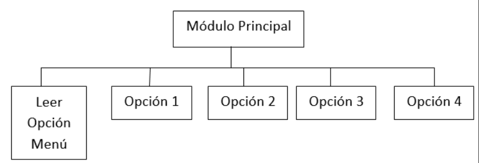

<link rel="stylesheet" type="text/css" href="../Inicio/estilo.css" media="screen" />

# Sintaxis de C. Estructuras de Datos: Combinación de Estructuras de Datos + Algoritmos de clasificación interna

## Temporización

4 horas (1.5 Presenciales + 2.5 No presenciales)

## Seguimiento

[Enlace a autoevaluación](../Seguimientotrabajos.md)

## Objetivos

-	Conocer la sintaxis de C para la definición de nuevas tipologías de datos e implementación de estructuras de datos estáticas: “arrays” unidimensionales y multidimensionales, cadenas de caracteres y registros (con y sin parte variante). 
-	Implementar programas modulares en lenguaje de programación C. Identificar y corregir errores sintácticos que surgen durante la codificación.
-	Resolver problemas sencillos con “arrays” unidimensionales y multidimensionales, aplicando las operaciones básicas sobre los mismos (acceso directo a elementos individuales y acceso secuencial).
-	Resolver ejercicios sencillos de cadenas de caracteres con representación semi-estática. Conocer las operaciones básicas que se realizan sobre las cadenas de caracteres.
-	Resolver (diseñar e implementar) ejercicios sencillos de registros con y sin parte variante: construir operaciones abstractas sobre tipos abstractos de datos.
-	Resolver (diseñar e implementar) problemas con modelos complejos de información: representar el modelo de información mediante tipologías básicas y constructores de tipos estructurados. Acceder a elementos individuales de información.
-	Conocer los algoritmos básicos de clasificación y búsqueda internas. Aplicarlos a la resolución (diseño e implementación) de sub-problemas de clasificación por diferentes criterios, con datos representados mediante vectores de registros. 
-	Utilizar números pseudo-aleatorios para problemas de simulación y juegos de azar.
-	Diseñar  e implementar programas que resuelven problemas de ingeniería usando operaciones abstractas sobre tipos abstractos de datos: representar el modelo de información mediante una combinación de estructuras de datos y construir operaciones complejas mediante técnicas de diseño modular y programación estructurada.
-	Probar con datos operacionales la correctitud de los módulos y programas desarrollados e identificar y corregir los errores lógicos que surjan.


## Competencias a desarrollar

- [X]	RD1: Poseer y comprender conocimientos
- [X]	RD2: Aplicación de conocimientos
- [X]	UAL1: Conocimientos básicos de la profesión
- [X]	UAL3: Capacidad para resolver problemas
- [X]	UAL6: Trabajo en equipo
- [X]	FB3: Conocimientos básicos sobre el uso y programación de los ordenadores, sistemas operativos, bases de datos y programas informáticos con aplicación en la ingeniería.


## Tareas a realizar

Desarrollar los tres programas propuestos en esta ficha de trabajo y presentar un informe según modelo que se adjunta.

## Plan de trabajo

**Explicación** de la práctica por parte del profesor, lectura individual de la misma por parte del alumno y codificación y prueba (individual o por parejas) de los ejemplos que aparecen en esta ficha de trabajo.	30 mn

**Análisis + Diseño preliminar:** cada miembro del equipo realizará individualmente el análisis (pre-diseño) y el diseño preliminar de uno de los tres ejercicios planteados:

- A - ejercicio 1
- B - ejercicio 2
- C, D - ejercicio 3	

**Reunión de expertos**: cada miembro de cada equipo se reúne con los miembros homólogos de los otros equipos para discutir entre todos la solución planteada (diseño preliminar) al ejercicio del que son responsables	

**Reunión del equipo base**: 

1.	Cada miembro explica su solución a los otros dos miembros y recibe la explicación de las soluciones de los otros miembros. Objetivo: cada miembro del equipo debe conocer la estrategia global de resolución de cualquiera de los tres ejercicios. 
2.	Distribución del trabajo: los diferentes módulos individuales a desarrollar serán asignados a los diferentes miembros del equipo procurando que cada miembro participe en módulos de al menos dos de los ejercicios propuestos.	

**Diseño detallado + Implementación**: cada miembro del equipo diseñará y codificará en C los módulos de los que es responsable.

**Combinación (integración) de los módulos + pruebas**: el responsable de cada ejercicio construirá el correspondiente programa a partir de los diferentes módulos desarrollados y realizará las pruebas de correctitud con los datos suministrados, realizando las modificaciones pertinentes.

**Reunión del equipo base**: elaboración conjunta de la documentación a presentar según modelo adjunto así como de la respuesta a las cuestiones planteadas en el mismo.	

## Sintaxis de C: ejemplo de implementación  de una combinación de estructuras de datos

### Diseño de datos
```
Const	Max_alumnos = 50
	Max_notas = 6
Tipos	tipo_tabla: vector[1..Max_alumnos] de tipo_ficha
	tipo_ficha: registro de
		nombre: cadena20
		apellidos: cadena20
		dni: entero
		fecha_nacimiento: tipo_fecha
		numero_convocatorias: entero
		notas: tipo_notas
		dirección: tipo_dirección
	Fin_registro
	tipo_fecha: registro de
		día: entero
		mes: entero
		año: entero
	Fin_registro
	tipo_notas: vector[1..Max_notas] de real
	tipo_dirección: registro de
		calle: cadena20
		ciudad: cadena15
		cp: entero
		tfno: entero
		e_mail: cadena40
	Fin_registro
	cadena15: cadena[16]
	cadena20: cadena[21]
	cadena40: cadena[41]
Var	tabla: tipo_tabla
```


### Correspondencia en C
```c
#define  Max_alumnos  50
#define  Max_notas 6

/* Nuevos tipos de datos */
typedef char cadena15[16];
typedef char cadena20[21];
typedef char cadena40[41];
typedef struct{
	int dia;
	int mes;
	int anno;
}tipo_fecha;
typedef float tipo_notas[Max_notas];
typedef struct{
	cadena20 calle;
	cadena15 ciudad;
	int cp;
	int tfno;
	cadena40 e_mail;
}tipo_direccion;
typedef struct{
	cadena20 nombre;
	cadena20 apellidos;
	int dni;
	tipo_fecha fecha_nacimiento;
	int numero_convocatorias;
	tipo_notas notas;
	tipo_direccion direccion;
}tipo_ficha;
typedef tipo_ficha tipo_tabla[Max_alumnos];
tipo_tabla tabla;
```


### Programa ejemplo de manipulación de una combinación de estructuras de datos

Codificación  &ensp;&ensp;&ensp;  [combinacion.c](https://github.com/MaterialesProgramacion/ProblemasProgramacion/blob/master/Registros/combinacionestruc.c)


______
## EJERCIOS A RESOLVER
_____

### **Ejercicio 1**

> Considerar la siguiente estructura de datos diseñada para registrar en orden cronológico datos de experimentos de laboratorio de nuevos materiales:
```
Const	Max = 200
Tipos	tipo_vector: vector[1..MAX] de tipo_experimento
               tipo_ experimento: registro de
	     material: cadena30     { Nombre del nuevo material 	}
	     fabricante: cadena30  { Nombre del fabricante 	}
	     propiedades: tipo_pro     { Propiedades mecánicas	}
	Fin_registro
	tipo_pro: registro de
	    densidad: real	{ Kg/m3			}
	    dureza: entero	{ Escala 1..10			}
	    rt: real		{ resistencia a la tracción (Mpa)	}
	    me: real		{ módulo de elasticidad (Mpa)	}
	Fin_registro
             cadena30: cadena[31]
Var	a: tipo_vector
```

Construir un programa que presente en pantalla un menú con las siguientes opciones:

-	Añadir un nuevo experimento, dados por teclado los datos del mismo.
-	Listar en pantalla todos los experimentos registrados, de uno en uno, permitiendo al usuario la posibilidad de continuar o finalizar el listado.
-	Modificar el nombre de un material en todos los experimentos donde aparece. Se solicitará por teclado tanto el nombre actual como el nuevo nombre, procediéndose a la sustitución del mismo y presentando al final en pantalla un mensaje con el nº de re-emplazamientos realizados.
-	Eliminar un experimento, dado por teclado el nombre del material, presentando en pantalla los datos de cada experimento con dicho material y solicitando al usuario confirmación del borrado, efectuando la operación correspondiente, tras la cual se preguntará al usuario si desea seguir borrando otros experimentos con dicho material.
-	Imprimir en pantalla un listado con el nombre de cada fabricante diferente junto con el nº total de experimentos realizados sobre materiales desarrollados por el mismo con una dureza superior a un valor introducido por teclado. Al final del listado, imprimir el nº total de experimentos con dichas características.
-	Clasificación:
  - 	Listar los experimentos registrados por valores decrecientes de densidad del nuevo material.
  -	Listar los experimentos registrados por orden alfabético de nombre de material (clave primaria) y de fabricante (clave secundaria).
-	Terminar la ejecución del programa.

**Datos de prueba**

|Opción menú |Datos de entrada|	Resultados|
|---|---|---|
Añadir experimento|	
|| Mat:  a
|| Fab:  f1
|| Dur:    1
|| Den:   1
|| RT:     1
|| ME:    1	|
|Añadir experimento
|| 	Mat:  b
|| Fab:  f1
|| Dur:    2
|| Den:   2
|| RT:     2
|| ME:    2	|
|Añadir experimento	Mat:  c|
|| Fab:  f2
|| Dur:    3
|| Den:   3
|| RT:     3
|| ME:    3	
| Añadir experimento	Mat:  d
|| Fab:  f1
|| Dur:    4
|| Den:   4
|| RT:     4
|| ME:    4	
|Listar experimentos||
|| |		Mat  Fab   Dur   Den    RT    ME
|| |===  ===   ===   ===   ===   ===
|| |a    f1      1  1.00  1.00  1.00 
|| |b    f1      2  2.00  2.00  2.00
|| |c    f2      3  3.00  3.00  3.00
|| |d    f1      4  4.00  4.00  4.00  
||Clasificación: listado por densidad
|| |		Mat  Fab   Dur   Den    RT    ME
|| |===  ===   ===   ===   ===   ===
|| |d    f1      4  4.00  4.00  4.00
|| |c    f2      3  3.00  3.00  3.00 
|| |b    f1      2  2.00  2.00  2.00 
|| |a    f1      1  1.00  1.00  1.00 
|Clasificación: listado por nombre material	
|| |	Mat  Fab   Dur   Den    RT    ME
|| |===  ===   ===   ===   ===   ===
|| |a    f1      1  1.00  1.00  1.00 
|| |b    f1      2  2.00  2.00  2.00
|| |c    f2      3  3.00  3.00  3.00
|| |d    f1      4  4.00  4.00  4.00  
|Imprimir listado...|	Dur:   1	
|| |Fabricante   Nº de pruebas
|| |==========   =============
|| |f1                        3
|| |f2                        1
|| | ----
||| Total                     4
|Modificar Nombre	|Actual:  c
|| Nuevo:  e	|1 reemplazamiento realizado   
|Eliminar experimento	|Mat:  a	
|Listar experimentos
||| 	Mat  Fab   Dur   Den    RT    ME
||| ===  ===   ===   ===   ===   ===
||| b    f1      2  2.00  2.00  2.00
||| e    f2      3  3.00  3.00  3.00
||| d    f1      4  4.00  4.00  4.00  
|Finalizar programa		

### Ejercicio 2	

> Construir un programa para gestionar las calificaciones de los alumnos matriculados en la asignatura “Fundamentos de Programación”.

|Identificación Alumno|	Calificaciones en los exámenes parciales|
|--|--|


|Nombre| 	Apellido 1|	Apellido 2|	1|	2|	3|	4|	5|
|--|--|--|--|--|--|--|--|
							
							
							
Considerar la siguiente estructura de datos diseñada para registrar los datos de los diferentes alumnos:
```
Const	N = 60		{ Máximo de alumnos	}
NOTAS=5	{ Máximo de parciales	}
Tipos	tipo_vector: vector[1..MAX] de tipo_alumno
               tipo_ alumno: registro de
	     id: tipo_identificacion     { Identificación del alumno	}
	     notas: tipo_notas             { Notas del alumno 	              }
	Fin_registro
	tipo_identificacion: registro de
	    nom: cadena20 	{ Nombre		}
	    ape1: cadena20	{ Primer apellido	}
	    ape2: cadena20	{ Segundo apellido	}
	Fin_registro
tipo_notas: vector[1..NOTAS] de reales
             cadena20: cadena[21]
Var	v: tipo_vector
```

El programa presentará en pantalla un menú con las siguientes opciones:
-	Inserción de un nuevo alumno: se leerán por teclado los datos del alumno (nombre y apellidos), comprobándose que no está ya registrado.
-	Calificación exámenes parciales: se introducirá por teclado las calificaciones de todos los alumnos en los diferentes exámenes parciales, de una en una, presentando previamente en pantalla el nombre y apellidos del alumno correspondiente. Si un alumno no se ha presentado a un examen se introducirá como nota el valor –1.
-	Consulta individual de calificaciones: se presentarán en pantalla todas las calificaciones de un alumno, dado por teclado su nombre y apellidos.
-	Listado secuencial de calificaciones: se presentarán en pantalla las calificaciones de todos los alumnos.
-	Calificación final: se presentará en pantalla la calificación final de todos los alumnos en la asignatura, como la media aritmética de las calificaciones parciales. En el caso de que el alumno no se haya presentado a un examen parcial, no aparecerá en el listado. 
-	Clasificación:
    -	Listar las calificaciones parciales de los alumnos en orden alfabético (primer apellido + segundo apellido + nombre).
    -	Listar las calificaciones parciales de los alumnos por valores decrecientes de la calificación media de los exámenes parciales evaluados. Los alumnos a los que les falte algún examen parcial de los ya evaluados aparecerán al final del listado.
- 	Terminar programa.

**Datos de Prueba**

Máximo alumnos: 4
Nº exámenes parciales: 2

|Opción menú	|Datos de entrada|	Resultados|
|---|---|---|
|Inserción alumno	|aa  aaa  aaa| |	
| |	bb  bbb  bbb	|
|| 	dd  ddd  ddd	|
||	bb bbb  bbb	|Ya está registrado ese alumno.
||	cc  ccc  ccc	
|Listado calificaciones|||
|||	Apellidos y nombre
|||	aaa  aaa, aa
|||bbb  bbb, bb
|||ddd  ddd, dd
|||ccc  ccc, cc
|Inserción alumno		|No se pueden registrar mas alumnos|
|Insertar calificación parcial|	Examen parcial nº 1|
||	aaa  aaa, aa: 1
||	bbb  bbb, bb: 2
||	ddd  ddd, dd: 4
||	ccc  ccc, cc: -1	
|Listado calificaciones		||Apellidos y nombre  Nota 1
|||	aaa  aaa, aa aa               1.00
|||	bbb  bbb, bb                   2.00
|||	ddd  ddd, dd                   4.00
|||	ccc  ccc, cc
|Listado calificaciones		|Apellidos y nombre  Nota 1
|||	aaa  aaa, aa aa               1.00
|||	bbb  bbb, bb                   2.00
|||	ddd  ddd, dd                   4.00
|||	ccc  ccc, cc
|Insertar calificación parcial|	Examen parcial nº 2
|| aaa  aaa, aa: 5
|| bbb  bbb, bb: 6
|| ddd  ddd, dd: 8
|| ccc  ccc, cc: 7	
Listado calificaciones		||Apellidos y nombre  Nota1 Nota2
|||	aaa  aaa, aa aa              1.00    5.00
|||	bbb  bbb, bb                  2.00    6.00
|||	ddd  ddd, dd                   4.00   8.00
|||	ccc  ccc, cc                                 7.00
|Clasificación: listado por nombre	||	Apellidos y nombre  Nota1 Nota2
|||	aaa  aaa, aa aa              1.00    5.00
|||	bbb  bbb, bb                  2.00    6.00
|||	ccc  ccc, cc                                 7.00
|||	ddd  ddd, dd                   4.00   8.00
|Clasificación: listado por nota media|| 		Apellidos y no. Nota1 Nota2  Media
||| ddd  ddd, dd         4.00   8.00     6.00
|||bbb  bbb, bb         2.00    6.00    4.00
|||aaa  aaa, aa aa     1.00    5.00    3.00
|||ccc  ccc, cc                        7.00
|Consulta|		|Apellidos y nombre  Nota1 Nota2
||Alumno: cc ccc ccc|ccc  ccc, cc                                 7.00 |	
||Alumno: ee	|No se encuentra registrado
|Calificación final||		Apellidos y nombre  Nota Final|
||| aaa  aaa, aa aa                     3.00
||| bbb  bbb, bb                         4.00
||| ddd  ddd, dd                         6.00
|Finalizar programa		|


### Ejercicio 3	

Considerar un conjunto de piezas planas rectangulares representadas en una estructura de datos con la siguiente tipología:
```
Const	Max = 25
Tipos	tipo_conjunto_piezas: registro de
		n: entero	{ Nº de piezas del conjunto (≤Max) }
		v: tipo_vector
	Fin_registro
tipo_vector: vector[1..Max] de tipo_pieza
		tipo_pieza: registro de 
			largo: real   	{ cm }
			ancho: real  	{ cm }
                           color: cadena10
		Fin_registro
             cadena10: cadena[11]
Var	a: tipo_conjunto_piezas
```

Construir un programa que presente en pantalla un menú con las siguientes opciones:
-	Insertar una nueva pieza plana, dados por teclado su largo, su ancho (cm) y su color. 
-	Listar en pantalla las piezas registradas, indicando su color, sus medidas y su área. Al final del listado se presentará a modo de resumen el nº total de piezas y el área total de las mismas.
-	Eliminar aquellas piezas no cuadradas (largo≠ancho) con una superficie menor de un valor dado por teclado.
-	Listar en pantalla el nº total de piezas de cada color.
-	Comprobar si hay piezas mayores o iguales de unas medidas dadas por teclado (largo y ancho) y presentar en pantalla la de superficie menor, o un mensaje de texto indicando que no hay ninguna pieza de las medidas indicadas.
-	Clasificación:
    -	Listar las piezas registradas por valores decrecientes de área.
    -	Listar las piezas registradas por longitud del lado mayor en orden descendente.
-	Terminar la ejecución del programa.

**Datos de prueba**

Pruebas con Max=5

|Opción menú	|Datos de entrada|	Resultados|
|---|---|---|
|Insertar pieza|	Largo:   10
||	Ancho:  10
||	Color: negro	|
|Insertar pieza|	Largo:   10
||Ancho:  20
||Color: blanco	
|Insertar pieza|	|	Largo:   10
||Ancho:  30
||Color: gris	
|Listar piezas||		Color  Largo   Ancho   Area
|||negro  10.00    10.00   100.00
|||blanco 10.00    20.00   200.00
|||gris      10.00    30.00   300.00
|||Nº de piezas: 3
|||Area total:    600.00
|Eliminar piezas |Área mínima: 150	
|Listar piezas||		Color  Largo   Ancho   Area
|||negro  10.00    10.00   100.00
|||blanco 10.00    20.00   200.00
|||gris      10.00    30.00   300.00
|||Nº de piezas: 3
|||Area total:    600.00
|Insertar pieza|	Largo:   10
||Ancho:  40
||Color: gris	
|Insertar pieza|	Largo:   10
||Ancho:  50
||Color: blanco	
|Listar piezas||		Color  Largo   Ancho   Area
|||negro  10.00    10.00   100.00
|||blanco 10.00    20.00   200.00
|||gris      10.00    30.00   300.00
|||gris      10.00    40.00   400.00
|||blanco 10.00    50.00   500.00
|||Nº de piezas: 5
|||Area total:    1500.00
|Clasificación: listado por área||	Color  Largo   Ancho   Area
|||blanco 10.00    50.00   500.00
|||gris      10.00    40.00   400.00
|||gris      10.00    30.00   300.00
|||blanco 10.00    20.00   200.00
|||negro  10.00    10.00   100.00
|||Nº de piezas: 5
|||Area total:    1500.00
|Clasificación: listado por longitud lado mayor	||	Color  Largo   Ancho   Area
|||blanco 10.00    50.00   500.00
|||gris      10.00    40.00   400.00
|||gris      10.00    30.00   300.00
|||blanco 10.00    20.00   200.00
|||negro  10.00    10.00   100.00
|||Nº de piezas: 5
|||Area total:    1500.00
|Insertar pieza	||	Conjunto lleno
|Listar piezas de cada color||		Color  Nº de piezas
|||negro      1
|||blanco     2
|||gris         2
Buscar pieza medidas mínimas	|Largo: 10
||Ancho: 30	
|||Pieza de menor superficie:
|||Largo:  10.00
|||Ancho: 30.00
|Buscar pieza medidas mínimas|	Largo: 15
||Ancho: 30|	No hay piezas de esas medidas
|Eliminar piezas|	Área mínima: 450	|
|Listar piezas||		Color  Largo   Ancho   Area
|||negro  10.00    10.00   100.00
|||blanco 10.00    50.00   500.00
|||Nº de piezas: 2
|||Area total:    600.00
|Finalizar programa		


Nota: para las opciones de clasificación, puede utilizar cualquiera de los algoritmos de clasificación interna presentados en la correspondiente sesión de Grupo Docente (el código fuente en C de los mismos se encuentra en un archivo). Deberá modificarlo para adaptarlo a la estructura de datos y al criterio de clasificación de su problema particular, teniendo en cuenta las siguientes observaciones:

-	Estructura de datos: sustituir los tipos genéricos tipo_vector y tipo_elemento, por los tipos de datos definidos en su problema (un vector de registros). Nótese que en los algoritmos de clasificación interna presentados se utiliza un campo clave de tipo_clave (tipo numérico) cuyos valores se utilizan para clasificar en orden ascendente los registros, pero que el criterio de clasificación puede ser más complejo en su problema particular (una regla de cálculo, un conjunto de claves primaria/secundaria/terciaria…).
-	Criterio de clasificación: lo más sencillo es separar el algoritmo de clasificación del criterio o función de clasificación de los respectivos elementos. Para ello, sustituya la expresión booleana donde se comparan las claves de dos elementos por una llamada a una función booleana que compare dichos elementos y donde se implementa el criterio de clasificación. Por ejemplo:
```
(a[j].clave<a[k].clave)     ->   es_anterior(a[j],a[k])
```
De esta forma, apenas se tiene que modificar el algoritmo de clasificación (selección directa, burbuja, inserción directa, “quicksort”,…) y lo único que hay que implementar es la función de clasificación de los elementos cuyo prototipo genérico sería:
```
int es_anterior(tipo_elemento a, tipo_elemento b);
```
Esta función devuelve verdadero (1) si el primer elemento va estrictamente delante del segundo según el criterio de clasificación del problema y falso (0) en caso contrario.


### Anexo 	Plantilla de programa que presenta un menú de opciones

#### Diseño preliminar: Estructura del programa



#### Implementación en C


Codificación  &ensp;&ensp;&ensp;  [menu.c](https://github.com/MaterialesProgramacion/ProblemasProgramacion/blob/master/sinCategoria/menu.c)


______
## EJERCIOS ADICIONALES
_____


1. Inicialización de variables estructuradas.

Inicialización de “arrays”: no se pueden inicializar los “arrays” automáticos, pero si los externos y los estáticos. En estos dos últimos casos, su definición incluye la asignación de los valores iniciales Ejemplos:

	int numeros[10] = {1,2,3,4,5,6,7,8,9,10};	/* vector externo */
	static float temp[3] = {20.5,-10.4,17.7};

numeros[0]=1		numeros[4]=5		numeros[7]=8		temp[0]=20.5
numeros[1]=2		numeros[5]=6		numeros[8]=9		temp[1]=-10.4
numeros[2]=3		numeros[6]=7		numeros[9]=10		temp[2]=17.7
numeros[3]=4	

Todos los elementos del “array” que no tienen asignados valores iniciales explícitos, son puestos automáticamente a 0. Esto incluye al resto de los elementos de un “array” en el que se han asignado a los elementos iniciales valores distintos de cero. Ejemplo:

	static float temperaturas[10] = {20.5,-10.4,17.7};
	
temp[0]=20.5		temp[3]=0		temp[6]=0		temp[8]=0
temp[1]=-10.4		temp[4]=0		temp[7]=0		temp[9]=0
temp[2]=17.7  		temp[5]=0	

No es necesario especificar explícitamente el tamaño del “array” cuando se incluyen todos los valores iniciales como parte de la definición (el tamaño se fija automáticamente al número de valores incluidos dentro de la definición). Ejemplo:

	static int num[] = {10,15,35,50};	/* vector de 4 elementos */

num[0]=10	num[1]=15	num[2]=35	num[3]=50

Las cadenas de caracteres se manejan de modo diferente: si se omite la especificación del tamaño, el compilador reserva un espacio adicional para la marca fin de cadena (\0) que se añade automáticamente al final de la cadena. 

Ejemplos:

	static char cad[4] = "Hola"	/* vector de 4 caracteres (no incluye \0) */
	static char cad[] = "Hola"	/* cadena de 5 caracteres */
	static char cad[5] = "Hola"	/* cadena de 5 caracteres */

Cuando se trabaja con “arrays” de varias dimensiones, debemos recordar que C los linealiza por filas. Ejemplos:

	static int num[3][4] = {1,2,3,4,5,6,7,8,9,10,11,12};

num[0][0]=1		num[0] [1]=2		num[0] [2]=3		num[0] [3]=4	
num[1][0]=5		num[1] [1]=6		num[1] [2]=7		num[1] [3]=8	
num[2][0]=9		num[2] [1]=10		num[1] [2]=11		num[2] [3]=12

El orden natural en el que los valores iniciales son asignados se puede alterar formando grupos de valores iniciales encerrados entre llaves:

	static int num[3][4] = {{1,2,3,4},{5,6,7,8},{9,10,11,12}};

Si hay pocos elementos dentro de cada par de llaves, al resto de los elementos de cada fila se le asignará 0.

Inicialización de estructuras y uniones: los valores iniciales de los miembros de una estructura o unión deben aparecer en el orden en el que serán asignados a sus correspondientes miembros, encerrados entre llaves y separados por comas. Solo se pueden inicializar si su tipo de almacenamiento es estático o externo. Ejemplo:

	typedef struct{
		char nombre[30];
		char apellidos[40];
		long int dni;
		char direccion[50];
		int edad;
		float nota_teoria;
		int practicas_aprobadas;
	} tipo_reg;

    static tipo_reg ficha = {"Ambrosio", "García García", 28945765, "C/Percebe num. 10, 2-A",18,5.3,1};


2. Constantes con tipo.

En C se puede usar el modificador const para hacer que el valor de una variable de cualquier tipo de datos no se pueda modificar. En su declaración se especifica tanto el tipo como el valor de la constante. El modificador const se usa para asignar a una variable un valor que no puede ser modificado en el programa; cualquier asignación futura a una constante genera un error del compilador. 

Ejemplos: 
```c
typedef char cad3[4];
typedef char cad10[11];
typedef cad3 tipo_dias[7];
typedef cad10 tipo_meses[12];
typedef int tipo_mazo[2][2][2];

const int maximo=9999;
const float factor=-0.1;
const char caracter='\003';
const char cabecera[]="MENU DE OPCIONES";
const char nuevalinea[3]="\r\n";
const char verdad[3]="Si";
const char digitos[11]={'0','1','2','3','4','5','6','7','8','9'};
const char mas_digitos[]="0123456789";
const tipo_dias dias={"Lun","Mar","Mier","Jue","Vie","Sab","Dom"};
const tipo_meses meses={"Enero","Febrero","Marzo","Abril",
                        "Mayo","Junio","Julio","Agosto",
                        "Septiembre","Octubre","Noviembre","Diciembre"};
const tipo_mazo mazo={{{0,1},{2,3}},{{4,5},{6,7}}};
```

Esta última declaración de constante equivale a:

		Mazo[0,0,0] = 0		Mazo[1,0,0] = 4
		Mazo[0,0,1] = 1		Mazo[1,0,1] = 5
		Mazo[0,1,0] = 2		Mazo[1,1,0] = 6
		Mazo[0,1,1] = 3		Mazo[1,1,1] = 7


3. Tipo de dato puntero.

Un puntero es una variable que contiene la dirección de otra variable. Declaración de una variable puntero:

				tipo  *var;

*var es una variable de ese tipo (var es un puntero a variables de ese tipo).

Operador &	devuelve la dirección de un objeto (variable, elemento de un vector,...). No es aplicable a expresiones ó al tipo de almacenamiento registro.
Operador *	toma su operando como una dirección y accede a la dirección en cuestión, dándonos su contenido.

Un tipo puntero define un conjunto de valores que apuntan a variables de un tipo específico llamado el tipo base. Una variable de tipo puntero contiene la dirección de memoria de la variable a la que referencia.

**3.1. Declaración de punteros.**

-	Declaración de una variable tipo puntero:	tipo_base *nombre_variable;
Ejemplos:
```c
    	int *p1;
		float *p2;
			struct {
				char nombre[30];
				int edad;
				float peso;
		}*p3;
```
-	Declaración de un tipo puntero:	
```c
    typedef  tipo_base  *tipo_puntero;
```

- Declaración de variables:
```c
    		tipo_puntero  nombre_variable;
```
Ejemplos:
```c
	/* tipo definidos por el usuario */
			typedef  int *punt_entero;
			typedef  float *punt_real;
			typedef struct {
					char nombre[30];
					int edad;
					float peso;
			}tipo_reg;
		typedef tipo_reg *punt_reg;
		/* declaración de variables */
			punt_entero p1;
			punt_real p2;
			punt_reg p3;
```
Un puntero es una variable que contiene la dirección de otra variable. En el ejemplo, p1 es una variable puntero a enteros (almacena la dirección de una variable entera) y p2 es un puntero a reales (almacena la dirección de una variable real). Así mismo, p3 es un puntero a variables del tipo registro tipo_reg.

**3.2 Operaciones con punteros**

	Asignación de valores a una variable puntero:
```c
		punt1= punt2;
		punt1= NULL;
		var_puntero=(tipo_puntero)malloc(sizeof(tipo_base));
```
La función estándar malloc() crea una nueva variable dinámica (asigna una nueva área de memoria del "heap" de la aplicación) de tamaño igual al tipo base al que apunta la variable puntero, y devuelve su dirección si la operación tiene éxito o NULL si no hay suficiente espacio para el bloque de memoria solicitado. Nótese el uso del operador de “casting” (tipo_puntero) que fuerza que el valor devuelto por la función malloc() se transforme al tipo_puntero para evitar un posible aviso (“warning”) del compilador y poder mantener la semántica del programa (los punteros siguen siendo direcciones de memoria).

El prototipo de dicha función es el siguiente (observe que la función malloc() devuelve un puntero genérico (void *) que debería ser transformado mediante “casting” al tipo apropiado): 
```c
		#include <stdlib.h>  ó   #include<alloc.h>
		void *malloc(size_t size);
```
Ejemplos:
```c
	p1=(int *)malloc(sizeof(int));
			/* p1=(punt_entero) malloc(sizeof(int)); */
		p2=(float *)malloc(sizeof(float));
		p3=(tipo_reg *)malloc(sizeof(tipo_reg));
```

A una variable puntero se le puede asignar la dirección a la que apunta otra variable puntero del mismo tipo. Por tanto, podemos tener situaciones en las que una misma variable tenga más de un puntero que apunta a la misma. Nótese que a una variable puntero no se le puede asignar un valor entero, excepto 0 que es representado mediante la constante NULL (nulo). NULL es un puntero que no apunta a ninguna posición.


Para acceder a la variable a la que apunta una variable puntero, se escribe el símbolo * delante del nombre de la variable puntero:

           

		      p                              *p

Ejemplos:

		*p1		Referencia a la variable entera a la que apunta p1.
		*p2		Referencia la variable real a la que apunta p2.
		*p3		Referencia la variable registro del tipo tipo_reg al que apunta la variable p3.
		(*p3).nombre	Accede a un campo de la variable registro a la que apunta p3.

Téngase en cuenta que los resultados son impredecibles si se accede a una variable dinámica cuando el valor del puntero es NULL o no está definido.

Comparación de punteros: se pueden usar los operadores == y != sobre operandos de tipo puntero compatible o de un puntero con la constante NULL. Dos punteros son iguales si apuntan al mismo objeto.

Eliminación de variables dinámicas:		free(var_puntero);

La función estándar free() libera la memoria ocupada por la variable dinámica (devuelve el espacio al "heap") a la que apunta la variable puntero que se le pasa como argumento. El prototipo de la función es:
```c
		#include <stdlib.h>
		void free(void *bloque);
```

4. Características adicionales de los punteros en C

- Punteros y vectores

Relación punteros-vectores:
```c
		int a[num],*pa;
		pa=&a[0]	equivale a	pa=a
		a[i]				*(a+i)
		&a[i]				a+i
		*(pa+i)			a[i]
```
Es correcto:

    	pa+i, pa=a, pa++
Es incorrecto:

		a=pa, a++, pa=&a

Los punteros permiten escribir programas más eficientes, en especial en el acceso secuencial a vectores y estructuras. Ejemplo:

```c
	int a[100],b[100];			int a[100],b[100],*pa,*pb;
	for(i=0;i<100;i++)			pa=a; pb=b;
	  a[i]=b[i];				while(pa<&a[100])
							*pa++=*pb++;
```
Al pasar un vector a una función, se pasa la dirección de comienzo del vector (el nombre del vector se usa como argumento formal). La función llamada establece si va a manejar un vector ó un puntero. Es posible pasar parte de un vector a una función, pasando un puntero al comienzo del subvector. Ejemplo:

LLamada:

    f(&a[i]); ó f(a+i);

Declaración de los argumentos en la función llamada:

	f(int v[]) ó  f(int *v)

- Aritmética de direcciones.

	Todas las manipulaciones con punteros se adaptan al tamaño del objeto apuntado:
		p++	apunta al siguiente lugar del apuntado por p
		p+=i	apunta i lugares más allá de p

•	Los punteros solamente se pueden inicializar con NULL (=0) ó con la dirección de una variable del tipo apropiado (el compilador nos garantiza que su dirección será distinta de cero).
•	Para dos punteros que apunten a elementos del mismo vector son válidas las expresiones relacionales y las de igualdad.
•	Todo puntero admite una comparación de igualdad ó desigualdad con NULL. Son válidas la suma y resta de un entero a un puntero (direcciones anteriores ó posteriores). La sustracción de punteros es válida si apuntan a miembros del mismo vector.

- Punteros a cadenas de caracteres.

	Las cadenas de caracteres son vectores de caracteres acabados en \0. Si se utilizan cadenas como argumentos de funciones, las funciones llamadas reciben un puntero al vector de caracteres. Se pueden definir cadenas como constantes mediante punteros:

		char  *ejemplo;
		ejemplo="esto es una cadena";

- Punteros a funciones.

Los punteros a funciones apuntan a código ejecutable (direcciones iniciales de las funciones), permitiendo la llamada de las mismas en modo indirecto. La sintaxis es:

	tipo (*puntero_función)(lista de parámetros)	
	/* puntero a una función que devuelve el tipo indicado.

No confundir con la siguiente sintaxis:

	tipo	*función(lista de parámetros)		
	/* función que devuelve un tipo puntero */

Los punteros a funciones se pueden inicializar con el nombre de una función que devuelva el mismo tipo de datos y tenga la misma lista de parámetros, pudiéndose llamar dicha función a través de la variable puntero a función:
```c
puntero_función = nombre_función;		/* inicialización del puntero a función */
(*puntero_función)(lista par. actuales)	/* llamada a la función */
```

Los punteros a funciones también permiten pasar una función como argumento a otra función.

- Argumentos de los programas.

    Al ejecutar un programa, es posible pasarle argumentos; estos aparecen como argumentos de la función main() y están disponibles dentro de la misma. Sus declaraciones apropiadas son:

					main(int argc,char **argv)

    argc:	es un entero que contiene el número de argumentos proporcionados en la llamada. 

    argv:	es un puntero a una tabla de cadenas de caracteres, que son los argumentos propiamente dichos. El primer argumento es el nombre del programa.

Ejemplo:
```c
	int main(int argc,char **argv){
			int i;
			char **ppc;
			ppc=argv;
			for(i=0;i<argc;i++)
				printf("%s\n",*ppc++);
			return 1;
		}
```

- “Arrays” multidimensionales.

	Declaración:
    
    	tipo nombre[n1][n2]..[ni];

Se necesita un puntero para direccionar un “array” multidimensional. Para el caso bidimensional, el elemento (i,j) se corresponde con la posición relativa: n2*i+j. Al pasar un “array” a una función, la función llamada tiene que dimensionar el último índice:

			función(tipo nombre[][..])

- Vectores de punteros.

	Un “array” multidimensional se puede representar también como un vector de punteros y como un puntero a un grupo de “arrays” contiguos de una dimensión menor. Para el caso bidimensional tenemos las siguientes posibilidades:
```c
	tipo nombre[n1][n2];  	/* “array” bidimensional (notación convencional) */
	tipo *nombre[n1];	     	/* vector unidimensional de punteros a filas 	   */
	tipo (*nombre)[n2];	/* puntero a un grupo de vectores unidimension. */
	tipo **nombre;		/* puntero a punteros al tipo dado 		   */
	tipo *nombre;		/* puntero a elementos del tipo dado 		   */
```

El vector de punteros funciona como el “array” bidimensional. Se puede inicializar en su definición. Ejemplo: vector de punteros a cadenas de caracteres:
```c
			static char *nombre[..]={"...",...,"..."};
```
- Punteros a estructuras. 

Las operaciones posibles con estructuras son: acceder a uno de sus miembros y tomar su dirección. En algunos compiladores no se pueden asignar ó copiar ni pasarse como argumentos a funciones. Sin embargo, los punteros a estructuras no tienen esas dos limitaciones; la declaración para la función llamada será:

		struct nombre_estr *p;

Para acceder a uno de sus miembros:

		p->miembro, ó (*p).miembro

Nótese que el tamaño de una estructura no es la suma de los tamaños de los miembros (los requerimientos de alineamiento de los objetos pueden originar huecos en la memoria). Sin embargo, incrementar ó decrementar un puntero a una estructura, hace pasar al siguiente ó al anterior elemento.

Para el caso de estructuras complejas (listas encadenadas, árboles, grafos), un miembro de la estructura puede ser un puntero a la estructura.


