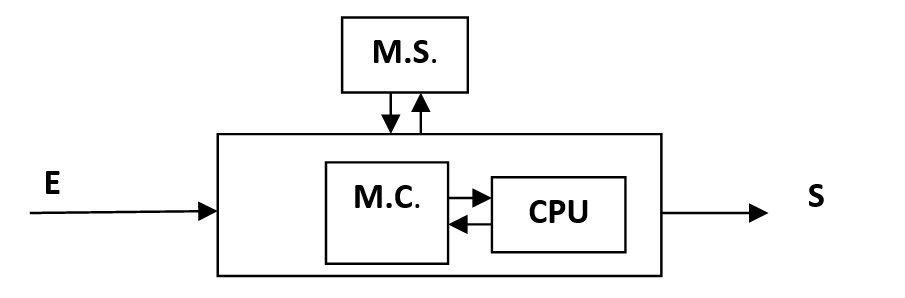
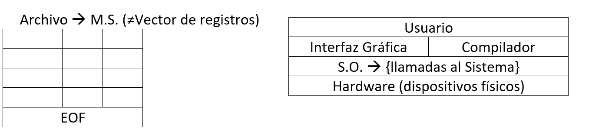
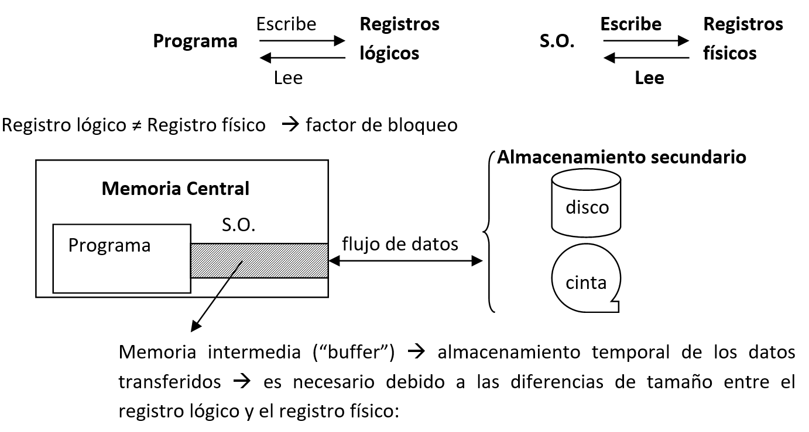
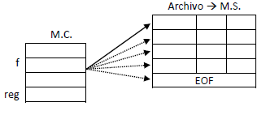
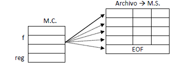
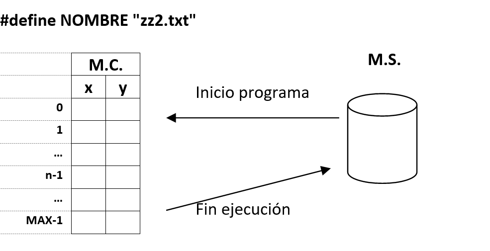

<link rel="stylesheet" type="text/css" href="../Inicio/estilo.css" media="screen" />

# Sintaxis de C. Archivos con organización secuencial: Archivos de texto. Archivos binarios)


## Temporización

4 horas (1.5 Presenciales + 2.5 No presenciales)

## Seguimiento

[Enlace a autoevaluación](../Seguimientotrabajos.md)

## Objetivos

-	Conocer la sintaxis de C para la manipulación de estructuras de datos en memoria secundaria (archivos): apertura (para lectura y para escritura), lectura y escritura de componentes, cierre. Diferenciar entre archivos de texto y archivos binarios. 
-	Implementar programas modulares en lenguaje de programación C. Identificar y corregir errores sintácticos que surgen durante la codificación.
-	Resolver problemas sencillos con archivos de texto/binarios, aplicando las operaciones básicas sobre los mismos (añadir componentes detrás del último y lectura secuencial de todos los componentes). Intercambiar información entre diferentes aplicaciones a través de archivos de texto/binarios.
-	Conocer los algoritmos básicos de clasificación y fusión externas. Aplicarlos a la resolución (diseño e implementación) de sub-problemas de clasificación por diferentes criterios con datos almacenados en archivos con organización secuencial y a la comparación de los componentes de diferentes archivos con diferentes objetivos. 
-	Diseñar  e implementar programas que resuelven problemas de ingeniería usando operaciones abstractas sobre tipos abstractos de datos: representar el modelo de información mediante una combinación de estructuras de datos y construir operaciones complejas mediante técnicas de diseño modular y programación estructurada.
-	Probar con datos operacionales la correctitud de los módulos y programas desarrollados e identificar y corregir los errores lógicos que surjan.


## Competencias a desarrollar

- [X]	RD1: Poseer y comprender conocimientos
- [X]	RD2: Aplicación de conocimientos
- [X]	UAL1: Conocimientos básicos de la profesión
- [X]	UAL3: Capacidad para resolver problemas
- [X]	UAL6: Trabajo en equipo
- [X]	FB3: Conocimientos básicos sobre el uso y programación de los ordenadores, sistemas operativos, bases de datos y programas informáticos con aplicación en la ingeniería.


## Tareas a realizar

Desarrollar los seis programas propuestos en esta ficha de trabajo y presentar un informe según modelo que se adjunta (ejercicios 1 y 2  archivos de texto, ejercicios 3 a 6  archivos binarios).

## Plan de trabajo

**Archivos de texto**: explicación de la sintaxis en C por parte del profesor, y/o lectura individual de la misma por parte del alumno y codificación y prueba del ejemplo incluido en esta ficha.	15 mn

**Ejercicios 1 y 2**: implementación en C de las modificaciones propuestas en el ejercicio y prueba de los programas resultantes.	45 mn

**Archivos binarios**: explicación de la sintaxis en C por parte del profesor, y/o lectura individual de la misma por parte del alumno y codificación y prueba del ejemplo incluido en esta ficha.	15 mn

**Ejercicios 3 y 4**: diseño, implementación en C y prueba de los programas correspondientes.	45 mn

**Ejercicios 5 y 6**: diseño, implementación en C y prueba de los programas correspondientes.	90 mn

**Reunión del equipo base**: elaboración conjunta de la documentación a presentar según modelo adjunto así como de la respuesta a las cuestiones planteadas en el mismo.	30 mn


## Sintaxis de C: archivos con organización secuencial
Configuración Hardware de un sistema informático:





Memoria Central:
-	V: Pequeño tiempo de acceso. La CPU solo procesa instrucciones y datos en MC.
-	I: No persistente y limitada en tamaño -> M.S. (discos, memorias USB,...)

Memoria Secundaria:
-	V: Persistente y con mayor capacidad de almacenamiento.
- 	I: Tiempo de acceso mayor. Los datos de M.S. hay que cargarlos (por partes) en M.C. para poder procesarlos.

Estructuración de la información en Memoria Secundaria:
- 	Nivel físico: bits (bytes)
- 	Nivel lógico:
    -	S.O.: archivos -> Soporte de M.S.={Archivos} + Operaciones para manipularlos
    -	Usuario:  Archivo={Registros Lógicos}         R.L.={Campos}



**Clave o identificativo**: campo(s) que identifica cada componente del archivo

**Registro físico (bloque)**: mínima unidad de almacenamiento en M.S. y de transferencia de datos entre M.C. y M.S. gestionada por parte del S.O.





**Tipos de soportes de memoria secundaria**: secuenciales y direccionables

**Métodos de acceso**:
- 	Acceso directo o aleatorio
- 	Acceso secuencial

**Organizaciones de Archivos** (según métodos de acceso a la información):
- 	Secuencial
- 	Directa o aleatoria
- 	Indexada
  
**Organización Secuencial**:
Archivo es una sucesión de componentes almacenados consecutivamente sobre el medio físico

 Archivo -> MS

| | | |
|--|--|--|
| | | |
| | | |
| |EOF | |
		

Operaciones permitidas:
-	Añadir componentes detrás del último.
-	Lectura secuencial de todos los componentes de 1 en 1, empezando por el primero y siguiendo el orden físico de almacenamiento.

Procesamiento de archivos con organización secuencial:
```
Tipos    tipo_archivo: archivo_s de tipo_componente
              tipo_componente: registro de
                  campo1: tipo1
                  campo2: tipo2
                  . . . . .
                  campoN: tipoN
              fin_registro
Var       f: tipo_archivo
             reg: tipo_componente
```

Operaciones básicas sobre archivos:
-	Crear(f, "nombre_físico")
-	Abrir(f, modo,"nombre_físico")             modo: L, E
- 	Escribir_a(f,reg)
-	Leer_a(f,reg)             ->            función fda(f)
-	Cerrar(f)
-	Borrar("nombre_físico")
-	Renombrar("nombre_nuevo", "nombre_antiguo")

Ejemplo: crear archivo y añadir componentes:
```
Crear(f, "nombre")
Abrir(f,E, "nombre")
{preparar registro reg}
Escribir_a(f,reg)
{preparar registro reg}
Escribir_a(f,reg)
. . . . .
Cerrar(f)
```




Ejemplo: leer componentes de un archivo:

```
Abrir(f,L, "nombre")
Leer_a(f,reg)
Si(no fda(f))
Entonces {procesar reg}
Fin_si
. . . . .
Cerrar(f)
```



Procesamiento secuencial de todos los componentes del archivo:
```
Abrir(f,L, "nombre")
Leer_a(f,reg)
Mientras(no fda(f)) Hacer
   {procesar reg}
   Leer_a(f,reg)
Fin_mientras
Cerrar(f)
```
#### Archivos de texto en C:

| | |
|------|--|
|#include <stdio.h>	 |
|FILE *f;|	Declaración de variables de archivo.|
|f=fopen("nombre_físico","r");	|Apertura para leer.|
|f=fopen("nombre_físico","w");	|Creación + apertura para escribir.|
|f=fopen("nombre_físico","a");	|Apertura para escritura (+ creación).|
|fprintf(f, "cad_control",lista expresiones);|	Escritura en el archivo de texto.|
|fscanf(f, "cad_control",lista variables);|	Lectura del archivo de texto.|
|fclose(f);|	Cierre del archivo.|
|feof(f)|	Función que comprueba el final del archivo.|


### Ejemplo de lectura y escritura en un archivo de texto.
Codificación  &ensp;&ensp;&ensp;  [leerTemperaturas.c](https://github.com/MaterialesProgramacion/ProblemasProgramacion/blob/master/Archivos/lecturaArchTexto.c)


## Ejercicios a desarrollar

### **Ejercicio 1.** Mostrar en archivo

Modificar el programa construido en el ejercicio 5 de la sesión de Trabajo en Equipo Cooperativo 5 (u otro cualquiera), de manera que los resultados que se presentan en pantalla sean simultáneamente almacenados en un archivo de texto con el mismo formato.

Nota: deberá añadir las siguientes instrucciones al código fuente del correspondiente programa:

```c
…
#define NOMBRE "zz.txt"                  // Nombre del archivo fisico
…
int main(){
   FILE *f;                             // Variable de archivo
   …
   f=fopen(NOMBRE, "w");                // Apertura del archivo en modo escritura (se sobre-escribe el archivo en caso de que exista otro con el mismo nombre)
   …
   printf("…");                        
   fprintf(f,"…");                     // Grabación en archivo de texto con el mismo formato que la escritura en pantalla
   …
   fclose(f);                          // Cierre del archivo
   return 0;
```

**Datos de prueba**

````
n=1                       n=2
  *                       *
                          * *
  
````

````
n=3                       n=4
     *                    * 
   * * *                  * *
     *                    * * *
                          * * * *
````

 
```
n=5                       n=6
     *                    *
   * * *                  * *
 * * * * *                * * *
   * * *                  * * * *
     *                    * * * * *
                          * * * * * *
```

Comprobar que se han grabado los datos en el archivo de texto “zz.txt” de su directorio de trabajo, cargando el mismo en el editor del IDE (o con cualquier otro editor de textos).

### **Ejercicio 2.**  Lectura de datos
Modificar el programa construido en el ejercicio del Trabajo Individual 10, de manera que al inicializar la ejecución del mismo, justo antes de presentar el menú de opciones por primera vez, lea todos los puntos experimentales almacenados en un archivo de texto (un punto por línea, separando las variables x e y por al menos un espacio en blanco) y los cargue en la(s) variable(s) correspondientes, controlando el nº de puntos leídos. Al finalizar la ejecución del programa, volver a grabar todos los puntos experimentales en el mismo archivo (destruyendo el original), almacenando un punto por línea y separando las variables x e y por al menos un espacio en blanco.



```c
void inicializar_vector(tipo_vector vx, tipo_vector vy, int *n);
/* función que lee los datos del archivo de texto y los carga en  */
/* estructuras de datos en memoria central, devolviendo            */
/* además el número de puntos leidos (0 si no existe el archivo) */ 
void grabar_archivo(tipo_vector vx, tipo_vector vy, int n);
/* función que graba las estructuras de datos de memoria central      */
/* en un archivo de texto en memoria secundaria, sobre-escribiendo */
/* dicho archivo en caso de que exista                                                        */
```

Nota: si todavía no ha construido el programa del TI 10, puede utilizar para hacer este ejercicio el ejemplo del Sistema de Partículas que encontrará en la ficha 8 de Trabajo en Equipo.


**Datos de prueba**

Opción menú	 | Datos de entrada|	Resultados
|---|---|--|
|Insertar puntos	|
||x = 100|
||y = 100	|
||x = 300|
||y = 300	|
||x = 200|
||y = 200	
|Imprimir puntos	||	Listado de puntos:
|||   1.- (100.00,100.00)
||| 2.- (300.00,300.00)
||| 3.- (200.00,200.00)
|Finalizar programa	

Comprobar que se han grabado los datos en el archivo de texto correspondiente, cargando en un editor de textos. Añadir una nueva línea al archivo que incluya el punto experimental (400,400), grabar los cambios y volver a ejecutar el programa:

Opción menú	 | Datos de entrada|	Resultados
|---|---|--|
|Imprimir puntos	||	Listado de puntos:
|||1.- (100.00,100.00)
|||2.- (300.00,300.00)
|||3.- (200.00,200.00)
|||4.- (400.00,400.00)
|Finalizar programa		


## Resumen sintaxis archivos binarios

### Archivos de texto:

- Características:
  -	La información se almacena en memoria secundaria en su representación textual (ASCII).
  -	Formato estándar: portabilidad a todos los sistemas informáticos.
  -	Formato legible e intercambiable entre diferentes aplicaciones (editores de texto,...).
-	Inconvenientes:
    -	Ineficiencia en memoria: los archivos de texto ocupan mayor cantidad de espacio en el almacenamiento secundario.
    -	Ineficiencia en tiempo de procesamiento: la lectura/escritura de información numérica requiere la transformación de la representación textual a representación interna (o viceversa).

### Archivos binarios:
-	Características:
    -	La información se almacena en memoria secundaria en su representación interna binaria: ASCII para datos textuales, complemento a 2 para datos enteros e IEEE754 para datos reales.
    -	Eficiencia en memoria: los archivos binarios ocupan en general menor cantidad de espacio en el almacenamiento secundario.
    -	Eficiencia en tiempo de procesamiento: la lectura/escritura de información numérica es rápida (no se requiere la transformación a representación interna porque se almacena en dicha representación).

-	Inconvenientes:
    -	Formato no totalmente estándar:
    -	Los enteros se representan en algunos sistemas con 2 bytes y en otros con 4 bytes,... 
    -	Las cadenas de caracteres pueden tener una representación diferente en memoria dependiendo del lenguaje de programación (semi-estáticas, de longitud variable, ASCII/Unicode,…).
    -	Diferente formato de almacenamiento en MC de datos de más de 1 byte ("big endian" vs "little endian").
    -	Algunos compiladores pueden dejar huecos de memoria en algunas estructuras de datos entre los diferentes campos de datos: para mejorar el rendimiento del procesador de 32/64 bits, el compilador intenta alinear los campos de las estructuras de datos y las variables en posiciones múltiplos del tamaño de la palabra (4/8 bytes).
    -	Formato no legible directamente. Necesidad de conocer con exactitud la estructura interna del archivo para poder procesarlo.

### Implementación en C de archivos binarios con organización secuencial.**


**Declaración de tipo de dato archivo secuencial**

*Pseudo-código*
```
	Tipo de dato
     tipo_archivo: archivo_s de
                        tipo_componente
     tipo_componente: registro de 
         campo1: tipo1
         campo2: tipo2
         . . . .
         campoN: tipoN
     fin_registro	
```
*En C*
```c
typedef struct{
      tipo1 campo1;
      tipo2 campo2;
       . . . . 
       tipoN campoN;
   } tipo_componente;
/* En C todos los archivos son de tipo puntero a FILE, por lo que no hay que definir nuevas tipologías de datos */
```

**Declaración de variables de tipo archivo**

*Pseudo-código*
```
VAR
    var_archivo: tipo_archivo	
```

*En C*

```c  
#include <stdio.h>

     FILE *var_archivo;
```

**Creación**

*Pseudo-código* ```Crear(var_archivo, nombre_físico)```

*En C*

```c 
var_archivo=fopen("nombre_físico", "wb");
```

**Apertura**
*Pseudo-código* 

```
Abrir(var_archivo, modo, nombrefísico)
   { Modo= L para Lectura    }
   {              E para Escritura  }	
```  

*En C*

```c 
/*-----Apertura para lectura-----*/
var_archivo=fopen("nombre_físico", "rb");

/*-----Apertura para escritura-----*/
var_archivo=fopen("nombre_físico","ab");

/* Si hay errores en la apertura fopen devuelve NULL */
```

**Operaciones sobre el registro actual**
*Pseudo-código* 

```
Escribir_a (var_archivo, var_registro)
{permitida en apertura para escritura}
Leer_a (var_archivo, var_registro)
{permitida en apertura para lectura}

{Nota: var_registro está declarada de tipo_componente }	
```
*En C*

```c
fwrite(&var_registro,sizeof(tipo_componente),1, var_archivo);

fread (&var_registro,sizeof(tipo_componente),1,
 var_archivo);
/* fread devuelve una cuenta pequeña (posiblemente 0) si la posición actual del archivo está sobre la marca fin de archivo: antes de procesar los datos leídos por fread, comprobar previamente que no es el fin del archivo */
```

**Fin de archivo**

*Pseudo-código* ```fda(var_archivo)```*En C*  ```c feof(var_archivo)```

**Cierre**

*Pseudo-código* ```Cerrar(var_archivo)``` *En C*  ```cfclose(var_archivo);```

**Borrado**
*Pseudo-código* ```Borrar(nombre_físico)``` *En C*  ```c
remove("nombre_físico");```


**Renombrar**
*Pseudo-código* ```Renombrar(nombre_nuevo, n_antiguo)``` *En C*  ```c  rename("nombre_ant", "nombre_nuevo");```


Nota: para garantizar una mayor portabilidad de los programas y de los archivos binarios, es recomendable que en lugar de leer/grabar en el archivo una estructura de datos completa de una vez con fread/fwrite, utilice en su lugar una función que vaya leyendo/grabando uno a uno los componentes de dicha estructura de datos:
```c
fread(&reg,sizeof(reg),1,f);	
```

```c
void leer_archivo_reg(FILE *f,tipo_reg *reg){
  fread(&reg->campo1,sizeof(reg->campo1),1,f);
  fread(&reg->campo2,sizeof(reg->campo2),1,f);
  ...
  fread(&reg->campoN,sizeof(reg->campoN),1,f);
}
```

```c
fwrite(&reg,sizeof(reg),1,f);
```

```c
void grabar_archivo_reg(FILE *f,tipo_reg reg){
   fwrite(&reg.campo1,sizeof(reg.campo1),1,f);
   fwrite(&reg.campo2,sizeof(reg.campo2),1,f);
   ...
   fwrite(&reg.campoN,sizeof(reg.campoN),1,f);
}
```

## Ejemplo de lectura y escritura en un archivo binario


Codificación  &ensp;&ensp;&ensp;  [temperaturabin.c](https://github.com/MaterialesProgramacion/ProblemasProgramacion/blob/master/Archivos/temperatbinario.c)


## Ejercicio 3	

> Implementar un programa en C que imprima en pantalla el contenido de un archivo binario, haciendo una pausa tras  escribir cada registro del mismo, continuando la impresión tras pulsar cualquier tecla y permitiendo la finalización del mismo al pulsar la tecla F. Dicha función debe aceptar como parámetro de entrada el nombre físico del archivo binario representado mediante una cadena de hasta 50 caracteres. La estructura del archivo binario es la siguiente:
```
Const	MAX=20
tipos	tipo_arch_pol: archivo_s de tipo_poligono		
	tipo_poligono: registro de 			
		n: entero	(2 bytes)			
		v: tipo_v_p;			
	Fin_registro;
tipo_v_p: vector[1..MAX] de tipo_punto2d
tipo_punto2d: registro de
    x,y: real (simple precisión)
  Fin_registro						
```
Nota: implementar también en C los tipos de datos necesarios.


**Datos de Prueba**

Archivo de datos de polígonos:	polígono.bin

```
Poligono 1: Numero de vertices: 4
	Vertice 1: (0.00,0.00)
	Vertice 2: (10.00,0.00)
	Vertice 3: (10.00,10.00)
	Vertice 4: (0.00,10.00)

Poligono 2: Numero de vertices: 3
	Vertice 1: (-5.00,-5.00)
	Vertice 2: (5.00,-5.00)
	Vertice 3: (0.00,5.00)

Poligono 3: Numero de vertices: 6
	Vertice 1: (0.00,-5.00)
	Vertice 2: (5.00,0.00)
	Vertice 3: (5.00,5.00)
	Vertice 4: (0.00,10.00)
	Vertice 5: (-5.00,5.00)
	Vertice 6: (-5.00,0.00)

Poligono 4: Numero de vertices: 4
	Vertice 1: (5.00,0.00)
	Vertice 2: (0.00,5.00)
	Vertice 3: (-5.00,0.00)
	Vertice 4: (0.00,-5.00)
```

## Ejercicio 4	

> Implementar un programa en C que convierta un archivo binario en un archivo de texto, escribiendo cada registro del mismo en una línea separada. Dicha función debe aceptar como parámetros de entrada los nombres físicos de los dos archivos (binario y texto) representados mediante cadenas de hasta 50 caracteres. La estructura del archivo binario es la siguiente:

```
  tipos	tipo_arch_alumno: archivo_s de tipo_alumno	 
    tipo_alumno: registro de 			    
          nombre: cadena50			    
          cali: tipo_calificación;			
    Fin_registro			

  tipo_calificación: registro de
      asig: cadena50
      nota: real (simple precisión)
  Fin_registro
  cadena50: cadena[51]
```


**Datos de Prueba**

Archivo de calificaciones de alumnos:	notas.bin


Nota: a continuación se ilustra el contenido del archivo de texto correspondiente, donde se han imprimido las cadenas de caracteres correspondientes al nombre del alumno y de la asignatura en campos de tamaño 30 (imprimiendo solo los primeros 30 caracteres de las mismas) en lugar de 50 por razones de visualización en este listado de datos de prueba.

```
García García, José            Fundamentos de Informática          4.97
García García, José            Métodos Numéricos                   5.03
García García, José            Fundamentos de Tecnología Eléc      3.50
Martínez Martínez, Periquillo  Fundamentos de Matemáticas          6.60
Martínez Martínez, Periquillo  Fundamentos de Informática          8.88
Matínez Martínez, Periquillo   Expresión Gráfica                   9.90
Rodríguez Rodríguez, Eustaquio Fundamentos de Informática          7.70
Rodríguez Rodríguez, Eustaquio Métodos Numéricos                   5.00
Sánchez Sánchez, Pepillo       Fundamentos de Informática          4.99
Sánchez Sánchez, Pepillo       Fundamentos de Matemáticas          3.30
```

## Ejercicio 5	

> Modificar el programa construido para el ejercicio 2 de la sesión de Trabajo en Equipo 11, de manera que al iniciar la ejecución del mismo, justo antes de presentar el menú de opciones por primera vez, lea todos los datos almacenados en un archivo binario y los cargue en una estructura de datos (vector de registros), controlando el nº de alumnos registrados así como el nº de exámenes parciales evaluados. Al finalizar la ejecución del programa, se volverán a grabar los datos de todos los alumnos registrados en el mismo archivo (incluidos los parciales aun no evaluados, almacenando –2 en la nota correspondiente).

**Datos de Prueba**

Máximo alumnos: 4
Nº exámenes parciales: 2

|Opción menú	|Datos de entrada|	Resultados|
|---|---|---|
|Inserción alumno	|aa  aaa  aaa| |	
| |	bb  bbb  bbb	|
|| 	dd  ddd  ddd	|
||	bb bbb  bbb	|Ya está registrado ese alumno.
||	cc  ccc  ccc	
|Listado calificaciones|||
|||	Apellidos y nombre
|||	aaa  aaa, aa
|||bbb  bbb, bb
|||ddd  ddd, dd
|||ccc  ccc, cc
|Inserción alumno		|No se pueden registrar mas alumnos|
|Insertar calificación parcial|	Examen parcial nº 1|
||	aaa  aaa, aa: 1
||	bbb  bbb, bb: 2
||	ddd  ddd, dd: 4
||	ccc  ccc, cc: -1	
|Listado calificaciones		||Apellidos y nombre  Nota 1
|||	aaa  aaa, aa aa               1.00
|||	bbb  bbb, bb                   2.00
|||	ddd  ddd, dd                   4.00
|||	ccc  ccc, cc
|Finalizar programa		

Volver a ejecutar el programa para comprobar que los datos se graban y se leen de forma correcta en el archivo binario:

|Opción menú	|Datos de entrada|	Resultados|
|---|---|---|
|Listado calificaciones		|Apellidos y nombre  Nota 1
|||	aaa  aaa, aa aa               1.00
|||	bbb  bbb, bb                   2.00
|||	ddd  ddd, dd                   4.00
|||	ccc  ccc, cc
|Insertar calificación parcial|	Examen parcial nº 2
|| aaa  aaa, aa: 5
|| bbb  bbb, bb: 6
|| ddd  ddd, dd: 8
|| ccc  ccc, cc: 7	
Listado calificaciones		||Apellidos y nombre  Nota1 Nota2
|||	aaa  aaa, aa aa              1.00    5.00
|||	bbb  bbb, bb                  2.00    6.00
|||	ddd  ddd, dd                   4.00   8.00
|||	ccc  ccc, cc                                 7.00
|Clasificación: listado por nombre	||	Apellidos y nombre  Nota1 Nota2
|||	aaa  aaa, aa aa              1.00    5.00
|||	bbb  bbb, bb                  2.00    6.00
|||	ccc  ccc, cc                                 7.00
|||	ddd  ddd, dd                   4.00   8.00
|Clasificación: listado por nota media|| 		Apellidos y no. Nota1 Nota2  Media
||| ddd  ddd, dd         4.00   8.00     6.00
|||bbb  bbb, bb         2.00    6.00    4.00
|||aaa  aaa, aa aa     1.00    5.00    3.00
|||ccc  ccc, cc                        7.00
|Consulta|		|Apellidos y nombre  Nota1 Nota2
||Alumno: cc ccc ccc|ccc  ccc, cc                                 7.00 |	
||Alumno: ee	|No se encuentra registrado
|Calificación final||		Apellidos y nombre  Nota Final|
||| aaa  aaa, aa aa                     3.00
||| bbb  bbb, bb                         4.00
||| ddd  ddd, dd                         6.00
|Finalizar programa		|


## Ejercicio 6
> Considerar un archivo binario que contiene un conjunto de medidas registradas por un conjunto de 10 sensores que monitorizan una cadena de producción a lo largo del tiempo, y que tiene la siguiente estructura:
```
Fecha:		Día:		entero de 2 bytes (1..31)
		Mes:		entero de 2 bytes (1..12)
		Año:		entero de 2 bytes
Tiempo:	Hora:		entero de 2 bytes (0..23)
		Minuto:	entero de 2 bytes (0..59)
		Segundo:	entero de 2 bytes (0..59)
Sensores:	Sensor 1:	real (simple precisión)
		. . .
		Sensor 10:	real (simple precisión)

```

Construir un programa que realice lo siguiente:
  -	Si el sensor nº 5 representa la temperatura de una caldera, calcular el valor máximo, mínimo y medio de dicha temperatura, así como su desviación estándar. 
  -	Calcular e imprimir en pantalla el coeficiente de correlación r entre las variables representadas por los sensores 5 y 7.

  r=   n*∑(xi*yi) – (∑xi)* (∑yi)   /	  [(n*∑(xi2)- (∑xi)2)* (n*∑(yi2)- (∑yi)2)]1/2

  - Ajustar las medidas de los sensores 3 y 5 a una línea recta mediante el método de mínimos cuadrados:


y = a + b * x  (y --- sensor 3 x -- sensor 5)


r= n*∑(xi*yi) – (∑xi)* (∑yi) / [(n*∑(xi2)- (∑xi)2)* (n*∑(yi2)- (∑yi)2)]1/2


**Datos de prueba**

Archivo de medidas de sensores:	sensor.dat
-	Sensor nº 5
	Valor máximo:		1114.6
	Valor mínimo:		  501.0
	Media aritmética:	  812.4
	Desviación estándar:	  104.3
-	Coeficiente de correlación entre sensores 5 y 7:  r=-0.0014
-	Recta de regresión entre sensores 3 y 5: 
     	y=812.38-0.07x
      r=-0.0007
