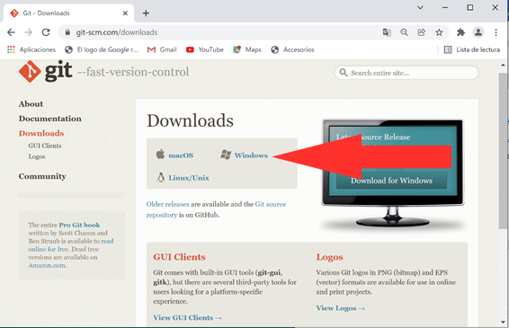

# PASOS PARA LA INICIALIZACIÓN DEL TRABAJO DESDE EL EQUIPO PERSONAL


Con el entorno en local tenemos más "controlado" el código, pero es necesario realizar la instalación de un conjunto de herramientas adicionales al propio Visual Studio

## Git para el control de versiones (https://git-scm.com/downloads)
 


### 1.	Descarga del paquete

Página de descarga:  https://git-scm.com/downloads 

Seleccionar S.O. y la descarga empieza automáticamente. Ejemplo de instalación para S.O. Windows:





### 2.	Instalación de Git

Tras completarse la descarga, abrir la carpeta “Descargas”, seleccionar la aplicación Git-2.34.1-64-bit.exe y ejecutarla como administrador seleccionando todas las opciones por defecto (excepto la selección el editor):


Para el editor usado por Git por defecto, se puede seleccionar el block de notas (notepad):


### 3.	Comprobación final

Abrir una consola ejecutando la aplicación “Símbolo del sistema”:


Ejecutar la orden git --versión:


##  Compilador de C. Por ejemplo, MinGW (https://sourceforge.net/projects/mingw/) , TDM-GCC (https://jmeubank.github.io/tdm-gcc/) o cualquier otro.

### 1.	Descarga del paquete

Página de descarga: https://www.mingw-w64.org/ 


-	Seleccionar el hiper-enlance Downloads en el menú lateral de la izquierda:


-	Desplazarse hacia abajo en la página y localizar en la sección Pre-built toolchains and packages el paquete MingW-W64 builds. Al seleccionarlo empezará automáticamente la descarga del paquete.


### 2.	Instalación de MinGW

-	Tras completarse la descarga, abrir la carpeta “Descargas”, seleccionar la aplicación mingw-w64-install y ejecutarla como administrador:


### 3.	Añadir la ruta de la carpeta que contiene el compilador a la variable de entorno PATH

- Con el explorador de archivos, ir al directorio donde se ha instalado MinGW y buscar la carpeta “bin” dentro de la carpeta “mingw32” (ejemplo: C:\Program Files (x86)\mingw-w64\i686-8.1.0-posix-dwarf-rt_v6-rev0\mingw32\bin) y copiar la ruta (Ctrl+C):


-	Al lado del botón de inicio, buscar y ejecutar la aplicación “Editar las variables de entorno del sistema (Panel de control)”:


- 	En la ventana de “Propiedades del sistema”, dentro de la pestaña “Opciones avanzadas”, pulsar el botón “Variables de entorno…”:


-	En la sub-ventana inferior (“Variables del sistema”), seleccionar la variable del sistema PATH y pulsar el botón “Editar”:


-	Pulsar el botón Nuevo para incorporar una nueva ruta y pegar (Ctrl+V) la ruta “bin” de MinGW copiada anteriormente:


### 4.	Comprobación final

- Abrir una consola ejecutando la aplicación “Símbolo del sistema”:


- Ejecutar la orden 
```
gcc --versión
```


## Visual Studio Code (https://code.visualstudio.com/download) y extensiones
- Extensiones de Visual Studio Code para C  se localizan en el menu extensiones utilizando como búsqueda "C". Se recomienda instalar dos de ellas (C/C++ Extension Pack) y (C/C++ Compile Run)
	- Si bien no son obligatorias son recomendables una extensión para visualizar y editar los archivos Markdown y PDF


## 1.	Descarga del paquete
Visual Studio Code es un editor de código fuente ligero pero potente que se ejecuta en el escritorio y está disponible para los S.O. Windows, macOS y Linux. Incorpora el soporte para los lenguajes JavaScript, TypeScript y Node.js, pero también admite una gran cantidad de extensiones para otros lenguajes (C++, C#, Java, Python, PHP, Go) y soportes de ejecución (.NET y Unity).
Página de descarga: https://code.visualstudio.com/ 
 
 
 
-	Seleccionar el hiper-enlance Download en la parte superior derecha y en la nueva página de descarga tras seleccionar el S.O. comienza a descargarse automáticamente el instalador. Ejemplo de instalación para S.O. Windows (System Installer 64 bits):
 

 

  
 

## 2.	Instalación de Visual Studio Code

-	Tras completarse la descarga, abrir la carpeta “Descargas”, seleccionar la aplicación VSCodeSetup-x64-1.62.3.exe y ejecutarla como administrador:
 
 
 

-	Aceptar el acuerdo de licencia y seleccionar todas las opciones por defecto:
 


 
 
 
 

  
 

 
 

## 3.	Instalar extensiones para desarrollar aplicaciones en lenguaje de programación C/C++

-	Comprobar que se ha instalado un compilador ejecutable de C/C++, y que su ubicación (ruta) se ha incorporado a la variable de entorno del sistema PATH (ver el documento Instalación de MinGW):
 
 

-	Ejecutar la aplicación Visual Studio Code (doble pulsación sobre el icono de acceso directo que tenemos en el escritorio de Windows:
 
 

 
-	Pulsar sobre el icono Extensiones de la barra de actividad situada en la parte izquierda de la ventana, buscar e instalar las siguientes extensiones:


 
 


     *	C/C++ Extension Pack
     *	C/C++ Compile Run 

Ejemplo /Instalación de C/C++ Compile Run):

1.	Buscar la extensión (escribiendo en la ventana de búsqueda las primeras letras de la misma)
2.	Una vez localizada, seleccionarla y pulsar sobre el botón Instalar
 

  
 

Tambien se puede utilizar "code runer"
4.	Instalar otras extensiones para trabajar con repositorios remotos en GitHub

-	Pulsar sobre el icono Extensiones de la barra de actividad situada en la parte izquierda de la ventana, buscar e instalar las siguientes extensiones:
-	GitHub Pull/Requests and Issues
-	GitHub Repositories
-	Markdown All in One
-	Markdown Preview Enhanced
-	PDF preview
-	Spanish Language Pack for Visual Studio Code


## Es necesario la utilzación de la nube (Github) para compartir el código, con lo que hace falta tener una cuenta en github. 


El siguiente video muestra como trabajar en modo local con C.

https://www.youtube.com/watch?v=qQT-6WufAEE

o

https://www.youtube.com/watch?v=v3ENcQpoA5A

