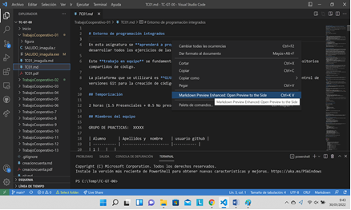

<link rel="stylesheet" type="text/css" href="Inicio/estilo.css" media="screen" />

# Breve tutorial de sintaxis de MarkDown

## **1.- Introducción**

MarkDown es un lenguaje de marcado que se utiliza para escribir documentos formateados usando cualquier editor de texto común, y que permite mediante un conversor adecuado transformar el texto plano a HTML, PDF ó RTF. Ejemplo de documento escrito en MarkDown mediante el editor de VSCode y previsualización del mismo con la extensión MarkDown Preview Enhanced: en la ventana de edición del archivo .md pulsar el botón derecho del ratón, y seleccionar la opción correspondiente del menú contextual:




Se abrirá una nueva ventana de edición con la previsualización del documento .md:


## **2.- Sintaxis básica**
### **2.1. Elementos de bloque**

____________________________________

**Formato**	   Nuevo párrafo

**Acciones a realizar**     Separar texto con línea en blanco (pulsar Intro dos veces al final del párrafo)

**Texto MarkDown**
```
Párrafo 1.

Párrafo2.
```
**Pre-visualización**

Párrafo 1.

Párrafo2.	 
________________________________________
________________________________________

**Formato** Dobles líneas en blanco	

**Acciones a realizar** No soportado (se convierten en una al procesarse)

**Texto MarkDown**
```
Párrafo 1.


Párrafo 2.
```
**Pre-visualización**

Párrafo 1.

Párrafo 2.
________________________________________

________________________________________

**Formato** Encabezados

**Acciones a realizar** 	Un carácter # por cada nivel de encabezado (hasta 6 niveles)

**Texto MarkDown**
```
# Encabezado 1
## Encabezado 2
### Encabezado 3
#### Encabezado 4
##### Encabezado 5
###### Encabezado 6

.
```
**Pre-visualización**
# Encabezado 1
## Encabezado 2
### Encabezado 3
#### Encabezado 4
##### Encabezado 5
###### Encabezado 6

________________________________________
________________________________________

**Formato** Encabezados (dos niveles)

**Acciones a realizar** Subrayar encabezados con = para el primer nivel y – para el segundo nivel

**Texto MarkDown**
```
Encabezado 1
=
Encabezado 2
-

```
**Pre-visualización**

Encabezado 1
=
Encabezado 2
-

________________________________________

________________________________________

**Formato** Listas de elementos no numerados

**Acciones a realizar** Utilizar *, - ó + delante de cada elemento.

**Texto MarkDown**
```
* Elemento 1
* Elemento 2
* Elemento 3
* Elemento 4
* Elemento 5

```
**Pre-visualización**
* Elemento 1
* Elemento 2
* Elemento 3
* Elemento 4
* Elemento 5

________________________________________

________________________________________

**Formato** Listas anidadas de elementos no numerados

**Acciones a realizar** Escribir cuatro espacios en blanco delante del símbolo de la lista por cada nivel de anidamiento

**Texto MarkDown**
```
* Elemento 1
    * Elemento 1-1
    * Elemento 1-2
        * Elemento 1-2-1
        * Elemento 1-2-2
* Elemento 2
* Elemento 3

```
**Pre-visualización**

* Elemento 1
    * Elemento 1-1
    * Elemento 1-2
        * Elemento 1-2-1
        * Elemento 1-2-2
* Elemento 2
* Elemento 3


________________________________________

________________________________________

**Formato**  Listas ordenadas

**Acciones a realizar** Escribir el número y un punto delante de cada elemento. También se pueden ordenar con letras minúsculas (a., b., …), mayúsculas (A), B),..) ó números romanos (i.,.. ó I),..).

**Texto MarkDown**
```
1. Elemento 1
    * Elemento 1-1
    * Elemento 1-2
        1. Elemento 1
        2. Elemento 2
2. Elemento 2
3. Elemento 3

```
**Pre-visualización**

1. Elemento 1
    * Elemento 1-1
    * Elemento 1-2
        1. Elemento 1
        2. Elemento 2
2. Elemento 2
3. Elemento 3

________________________________________

________________________________________

**Formato** Bloque de texto en una caja rectangular	

**Acciones a realizar** 
Delimitarlo por dos líneas con 3  caracteres ~ cada una 

**Texto MarkDown**
```
Texto
~~~
Bloque de texto.
~~~
Texto
```
**Pre-visualización**

Texto
~~~
Bloque de texto.
~~~
Texto
________________________________________

________________________________________

**Formato** Líneas horizontales	


**Acciones a realizar**Escribir en una línea tres * ó tres _ 	

**Texto MarkDown**
```
Texto
***
Texto
___

```
**Pre-visualización**
Texto
***
Texto
___

________________________________________
________________________________________

**Formato** Tablas

**Acciones a realizar** 	Utilizar el siguiente código, añadiendo/quitando las filas y columnas pertinentes, y/o formateando el texto de cada celda a izq/der/centro:

**Texto MarkDown**
```
| Col1 | | | | |
|:---:|---|---|---|---|
| Fil1 | | | | |
| Fil2 | | | | |
```
**Pre-visualización**

| Col1 | | | | |
|:---:|---|---|---|---|
| Fil1 | | | | |
| Fil2 | | | | |
________________________________________


### **2.- Elementos de línea**


**Formato** Texto en cursiva y/o negrita

**Acciones a realizar** Envolver el texto entre dos * ó dos _ al principio y al final

**Texto MarkDown**
```
Texto normal.
*Texto cursiva*
**Texto en negrita**
Texto normal
***Texto cur+neg***
Texto normal

```
**Pre-visualización**

Texto normal

*Texto cursiva*

**Texto en negrita**

Texto normal

***Texto cur+neg***

Texto normal

________________________________________
________________________________________

**Formato** Superíndices y sub-índices		


**Acciones a realizar**  Rodear el texto con ^ para el superíndice y ~ para el sibíndice

**Texto MarkDown**
```
Superíndices:
        F=m*a^2^
Subíndices:
        H~2~O	 

O bien usar las etiquetas 
        F=m*a<sup>2</sup> 
        H<sub>2</sub>O
```
**Pre-visualización**

Superíndices:

F=m*a<sup>2</sup> 

Subíndices:

H<sub>2</sub>O

________________________________________

________________________________________

**Formato** Texto tachado	


**Acciones a realizar** Envolver el texto entre dos ~ al principio y al final	

**Texto MarkDown**
```
Texto normal
~~Texto tachado~~	 
```
**Pre-visualización**
Texto normal
~~Texto tachado~~	

________________________________________

________________________________________

**Formato** Fórmulas matemáticas

**Acciones a realizar** 	Funciones matemáticas delimitadas por $	

**Texto MarkDown**
```
Fracción: $\frac{1}{n}$
Potencia: $x^3$
Raíz cuad.: $\sqrt{x}$	 

```
**Pre-visualización**

Fracción: $\frac{1}{n}$

Potencia: $x^3$

Raíz cuad.: $\sqrt{x}$	 

________________________________________

________________________________________

**Formato** Link o enlace en línea	


**Acciones a realizar** Escribir texto del enlace entre [], seguido del URL del enlace entre ()	Ejemplo de enlace:


**Texto MarkDown**
```
[GitHub]( https://github.com/)
```
**Pre-visualización**

[GitHub]( https://github.com/)
________________________________________
________________________________________

**Formato** Link ó enlace como referencia	


**Acciones a realizar**  Escribir texto del enlace entre [], seguido del nombre de la referencia entre (). 
En otro lugar del documento, escribir la referencia entre () seguida de : y del URL del enlace	Ejemplo de enlace:

**Texto MarkDown**
```
[GitHub](Ref1)
Al final del documento:
(Ref1): https://github.com/
```
**Pre-visualización**

[GitHub](Ref1)
Al final del documento:
(Ref1): https://github.com/

________________________________________
________________________________________

**Formato** Imágenes	


**Acciones a realizar**Escribir ! seguido del texto alternativo (por si la imagen no se carga) entre [], seguido de la ruta de la imagen y el título que aparece al posicionar el ratón en la imagen, todo ello entre ()	Ejemplo Imagen:


**Texto MarkDown**
```

```
**Pre-visualización**


________________________________________
________________________________________


### **3. Otros elementos.**

________________________________________

**Formato** Links automáticos	

**Acciones a realizar** Se encierran entre <>	Texto normal.
	 
**Texto MarkDown**
```
<https://github.com/>
```
**Pre-visualización**

<https://github.com/>

________________________________________
________________________________________

**Formato** Omitir MarkDown

**Acciones a realizar** 	Se precede el carácter con \ y no tienen efecto ninguno de los caracteres siguientes: \   ` * _ { } [ ] ( ) # + - . !

**Texto MarkDown**
```
**Negrita**
\*\*Negrita**

# Título
\# Título
```
**Pre-visualización**


**Negrita**
\*\*Negrita**

# Título
\# Título


_______________________________


	 


